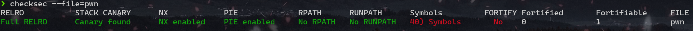
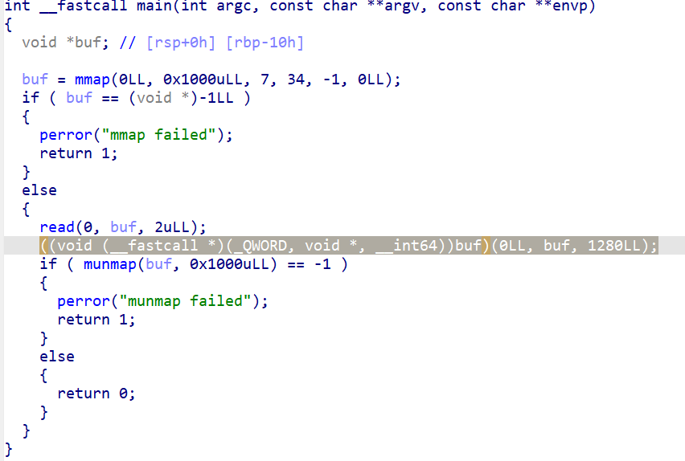
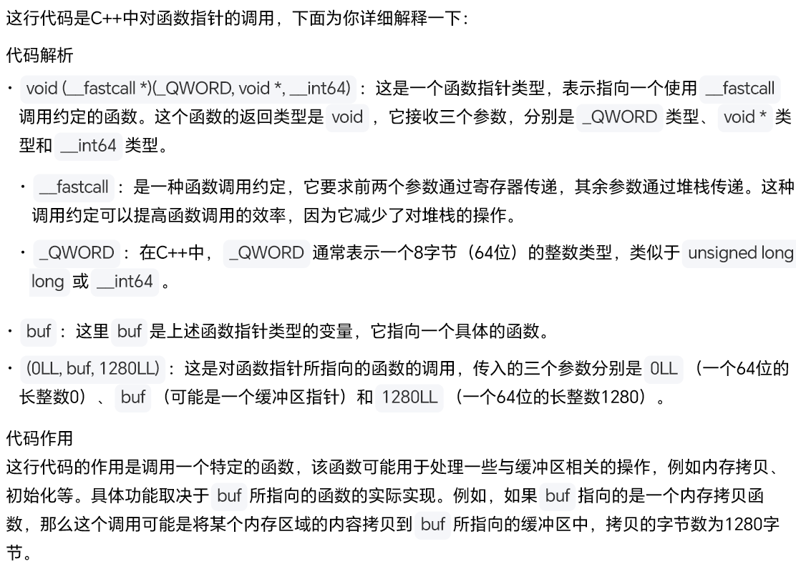
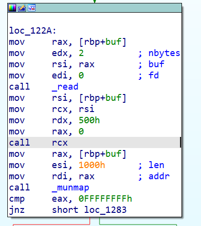
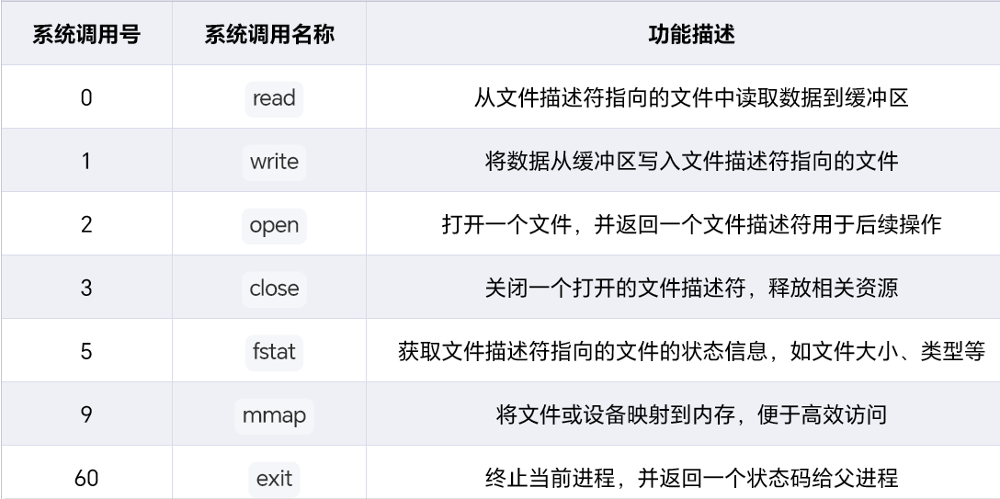

# Basectf pwn方向“shellcode_level1”

根据题目提示，还是shellcode,仔细观察一下先



开启了pie保护和canary保护



read只允许读入两个字节长度，而下面出现了一串很长的看不懂的东西`((void (__fastcall *)(_QWORD, void *, __int64))buf)(0LL, buf, 1280LL);`

我是扔给ai看去了，这么说



总之呢就是一个调用的过程，取决于buf怎么写

所以这一段呢就是，如果mmap函数开辟空间争取却，就会向buf里读入两个字节，然后把buf空间里的内容当作函数执行。

那很自然可以想到，将写shellcode到buf里执行就好了。但是pie保护的开启，导致我们直接找buf地址并写入shellcode不太行

那怎么写入呢，检查一下汇编代码（没思路就去扒扒汇编码）



在`read(0,buf,2ull)`之后，有向寄存器赋值的汇编代码，并且会调用rcx寄存器里面的内容的操作，那是不是可以向rcx里写一个函数，然后如果这个函数的功能是向buf里读取内容，是不是就可以写shellcode进去了。

有这个函数嘛，字长仅两位的话的确没有，但还有另一个函数`syscall`系统调用函数，并且`rax=0`,`rdx=500h`,`rsi=[buf]`，完美符合要求，所以exp就很好构造了

```python
from pwn import *
context.arch = 'amd64'
p = process('./pwn')
p.send(asm('syscall'))
p.send(b'a'*0x2+asm(shellcraft.sh()))
p.interactive()
```

## syscall

系统调用是操作系统提供给用户程序的一种接口。当用户程序需要操作系统内核的服务时，就会通过系统调用进入内核模式。例如，当一个应用程序需要读取文件内容时，它会发起一个读文件的系统调用。这就好比用户程序是“顾客”，操作系统内核是“服务员”，系统调用就是“点菜”的过程，用户程序告诉内核它需要什么服务。



且`syscall`函数系统调用号的参数所在寄存器为rax，在这里为0，说明其实调用了read函数

## read

`ssize_t read(int fd, void *buf, size_t count);`

- fd：文件描述符，存放寄存器为rdi
- buf:数据化冲区指针（这里mmap已经申请很大一块可读可写可执行的内存了），存放在rsi寄存器中
- count:要读取的字节数：存放在rdx寄存器中

再对照上面的汇编码看看，此时的调用变为了`read(0,buf,0x500)`可以直接写入