# 汇编速通

by Maple

## 机器级代码

机器级编程，两种抽象比较重要

1. 第一种是由指令集体系结构或指令集架构（Instruction Set Architecture，ISA）来定义机器级程序的格式和行为，它定义了处理器状态、指令的格式，以及每条指令对状态的影响。
2. 第二种是机器级程序使用的内存地址是虚拟地址，提供的内存模型看上去是一个非常大的**字节**数组。

*以上不重要*

## 数据格式

Intel 用术语“字（word）”表示 16 位数据类型，称 32 位数为“双字（double words）”，称 64 位数为“四字（quad words）”。

| 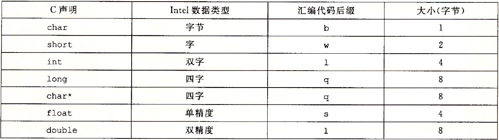                 |
| ------------------------------------------------------------ |
| 图 3-1 C 语言数据类型在 x86-64 中的大小。在 64 位机器中，指针长 8 字节 |

如上图所示，大多数 GCC 生成的汇编代码指令都有一个字符的后缀，表明操作数的大小。例如，数据传送指令有四个变种：`movb`（传送字节）、`movw`（传送字）、`movl`（传送双字）和 `movq`（传送四字）。注意，汇编代码也使用后缀 `l` 来表示 4 字节整数和 8 字节双精度浮点数。这不会产生歧义，因为**浮点数使用的是一组完全不同的指令和寄存器**。

## 信息访问⭐

一个 x86-64 的中央处理单元（CPU）包含一组 16 个存储 64 位值的通用目的寄存器，这些寄存器用来存储整数数据和指针。

| 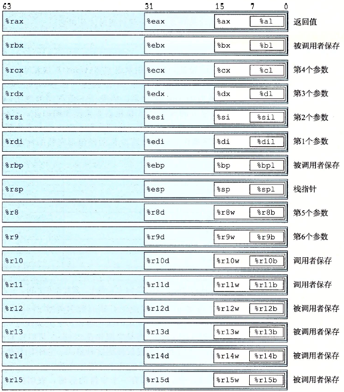 |
| ------------------------------------------------------------ |
| 图 3-2 整数寄存器                                            |

指令可以对这 16 个寄存器的低位字节中存放的不同大小的数据进行操作。

### 操作数指示符

大多数指令有一个或多个操作数（operand），指示出执行一个操作中要使用的源数据值，以及放置结果的目的位置。源数据值可以以常数形式给出，或是从寄存器或内存中读出。结果可以存放在寄存器或内存中。

| 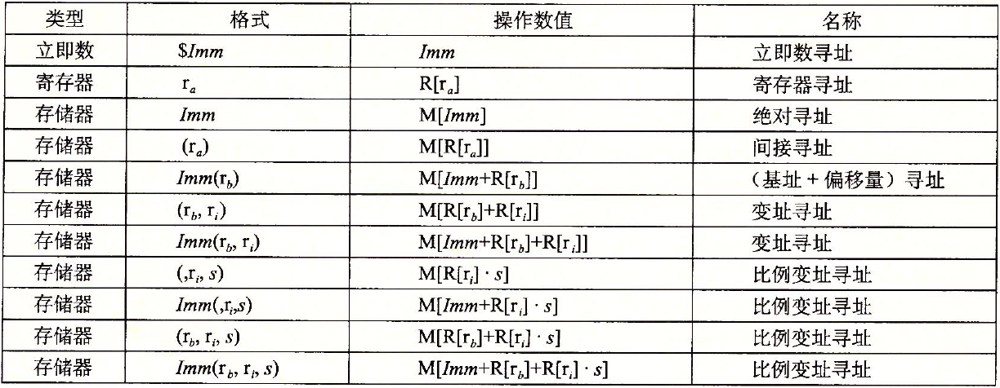 |
| ------------------------------------------------------------ |
| 图 3-3 操作数格式。**比例因子 `s` 必须是 1、2、4 或者 8**。  |

地址计算的练习

| 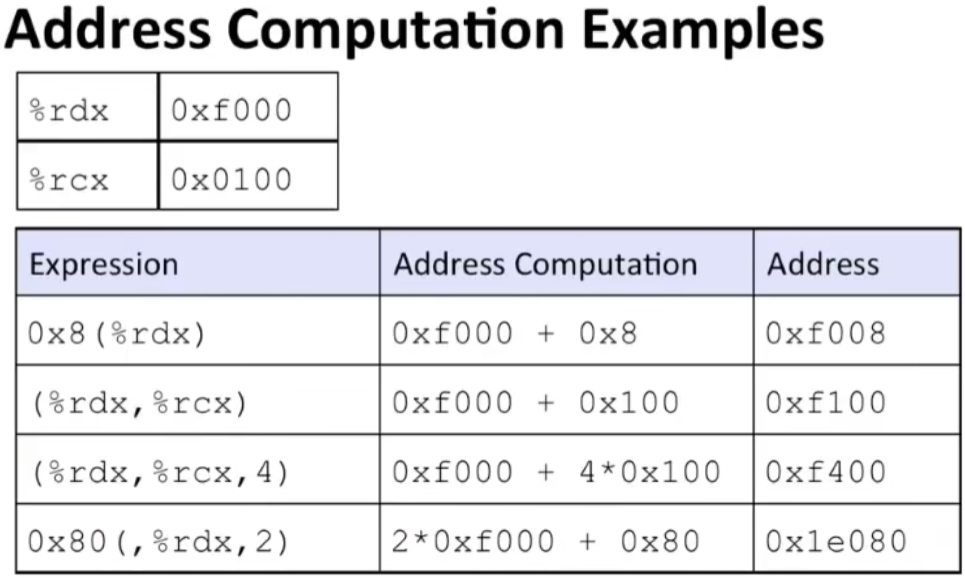 |
| -------------------------------------------- |
|                                              |

### 数据传送指令

`mov` 类指令把数据从源位置**复制**到目的位置，不做任何变化。

| 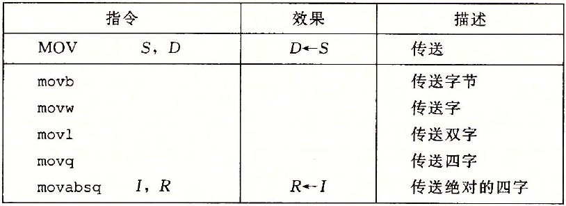 |
| ------------------------------------------------------------ |
| 图 3-4 简单的数据传送指令                                    |

x86-64 加了一条限制，传送指令的两个操作数不能都指向内存位置。将一个值从一个内存位置复制到另一个内存位置需要两条指令：第一条指令将源值加载到寄存器中，第二条将该寄存器值写入目的位置。

### 举例

```c
long exchange (long *xp, long y)
{
    long x = *xp;
    *xp = y;
    return x;
}
```

`gcc -og exchange exchange.c`

```assembly
.long exchange (long *xp, long y)
.xp in %rdi, y in %rsi
exchange:
	movq	(%rdi), %rax	将xp赋值给x，然后作为返回值
	movq	%rsi, (%rdi)	将y存储在xp中
	ret						返回
```

### 压入和弹出栈数据

| 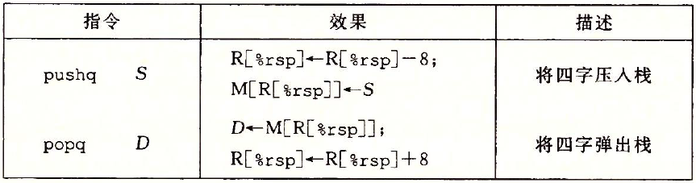 |
| ------------------------------------------------------------ |
| 图 3-8 入栈和出栈指令                                        |

`pushq` 和 `popq` 指令都只有一个操作数：压入的数据源和弹出的数据目的。

将一个四字值压入栈中，首先要将栈指针（栈指针 `%rsp` 保存着栈顶元素的地址）减 8，然后将值写到新的栈顶地址。在 x86-64 中，栈向低地址方向增长，所以压栈是减小栈指针（寄存器 `%rsp`）的值，并将数据存放到内存中，而出栈是从内存中读数据，并增加栈指针的值。

无论如何，`%rsp` 指向的地址总是栈顶。

## 算数和逻辑操作

**源在前，目的地在后**

下图这些操作被分为四组：加载有效地址、一元操作、二元操作和移位。

| 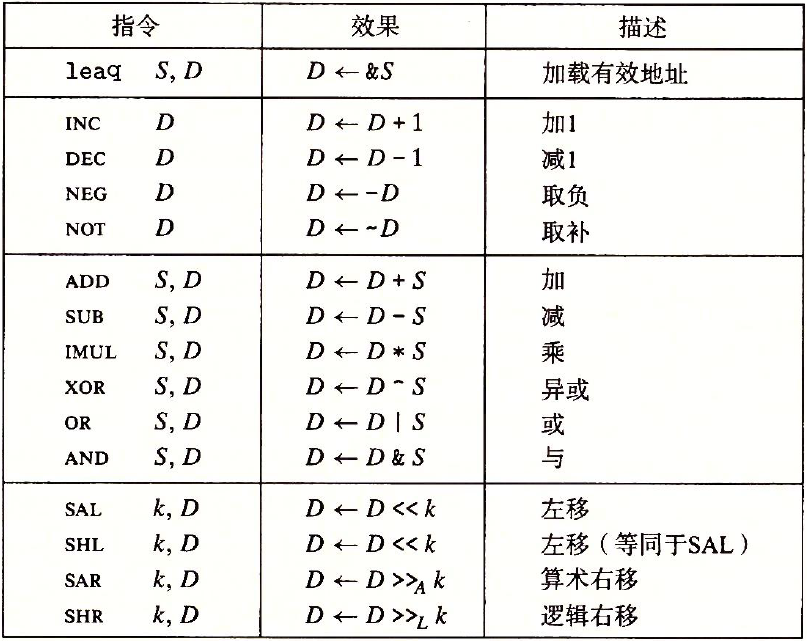 |
| ------------------------------------------------------------ |
| 图 3-10 整数算术操作。**注意：ATT 格式的汇编代码中，操作数的顺序与直觉相反**。 |

### 举例

```c
long arith (long x, long y, long z)
{
    long t1 = x + y;
    long t2 = z + t1;
    long t3 = x + 4;
    long t4 = y * 48;
    long t5 = t3 + t4;
    long rval = t2 * t5;
    return raval;
}
```

```assembly
.x in %rdi, y in %rsi, z in %rdx, t1、t2、rval in %rax, t4 in %rdx, t5 in %rcx
arith:
	leaq	(%rdi, %rsi), %rax		;t1 = x + y
	addq	%rdx, %rax				;t2 = z + t1
	leaq	(%rsi, %rsi, 2), %rdx	;t4 = y+y*2 => t4 = 3*y
	salq 	$4, %rdx				;t4<<4 => t4*=16
									;加在一起就是t4 = y*48
	leaq	4(%rdi, %rdx), %rcx		;t5 = 4 + x + t4
	imulq	%rcx, %rax				;rval*=t5
	ret
```

### 加载有效地址`leaq`

加载有效地址（load effective address）指令 `leaq` 实际上是 `movq` 指令的变形，**它的第一个操作数将有效地址写入到目的操作数**。**目的操作数必须是一个寄存器**。

### 特殊的算数操作

x86-64 指令集对 128 位（16 字节）数的操作提供有限的支持。延续字（2 字节）、双字（4 字节）和四字（8 字节）的命名惯例，Intel 把 16 字节的数称为八字（oct word）。

| 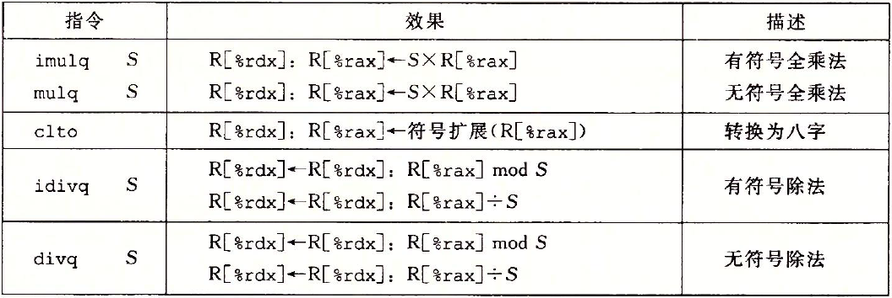 |
| ------------------------------------------------------------ |
| 图 3-12 特殊的算术操作。一对寄存器 `%rdx` 和 `%rax` 组成一个 128 位的八字 |

## 控制

机器代码提供两种基本的低级机制来实现有条件的行为：测试数据值，然后根据测试的结果来改变控制流或者数据流。

### 条件码

除了整数寄存器，CPU 还维护着一组单个位的条件码（condition code）寄存器。

最常用的条件码有：

- CF：进位标志。最近的操作使最高位产生了进位，可用来检查无符号操作的溢出。
- ZF：零标志。最近的操作得出的结果为 0。
- SF：符号标志。最近的操作得到的结果为负数。
- OF：溢出标志。最近的操作导致一个补码溢出，正溢出或负溢出。

`leaq` 指令不改变任何条件码，它是用来进行地址计算的，**除此之外**，图 3-10中列出的所有指令都会设置条件码。还有两类指令，它们只设置条件码而不改变任何其他寄存器，如下图所示：

| 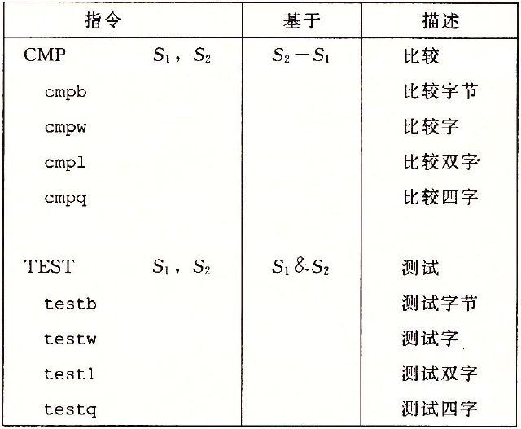 |
| ------------------------------------------------------------ |
| 图 3-13 比较和测试指令。这些指令不修改任何寄存器的值，只设置条件码 |

### 访问条件码

| 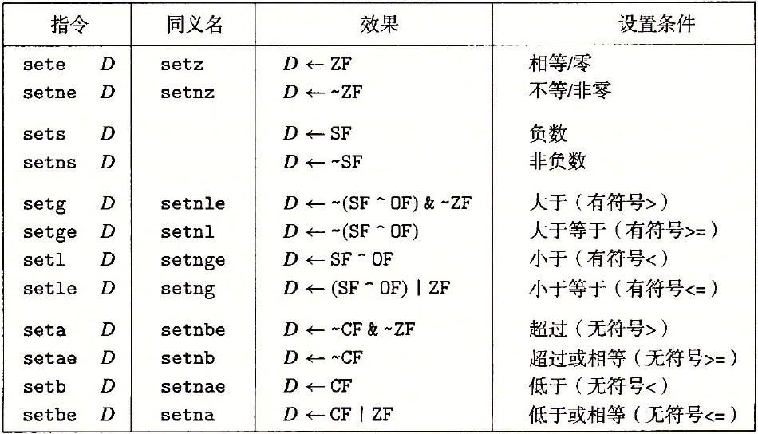 |
| -------------------------------------------- |
| 图 3-14 `SET` 指令                           |

某些底层的机器指令可能有多个名字，称之为“同义名（synonym）”。例如，`setg`（表示“设置大于”）和 `setnle`（表示“设置不小于等于”）指的就是同一条机器指令，编译器和反汇编器会随意决定使用哪个名字。

### 跳转指令

类似于`goto`代码

考虑下面的汇编代码序列：

```
  movq $0,%rax	; Set %rax to 0
  jmp .L1	; Goto .L1
  movq (%rax),%rdx	; Null pointer dereference (skipped)
.L1:
  popq %rdx  ; Jump target
```

指令 `jmp .L1` 会导致程序跳过 `movq` 指令，而从 `popq` 指令开始继续执行。

在产生目标代码文件时，汇编器会确定所有带标号指令的地址，并将跳转目标（目的指令的地址）编码为跳转指令的一部分。

| 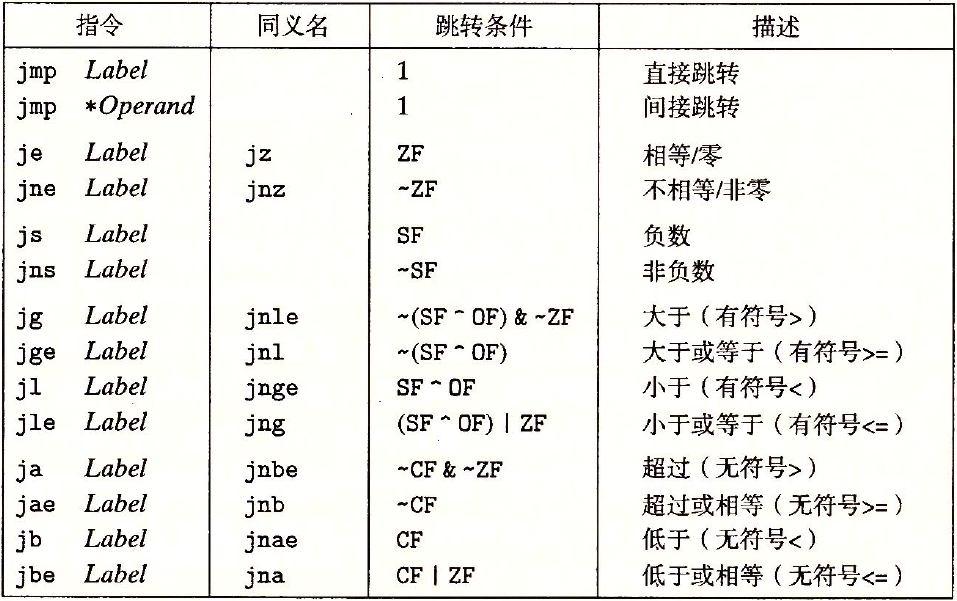 |
| -------------------------------------------- |
| 图 3-15 `jump` 指令                          |

### 举例

```c
long lt_cnt = 0;
long ge_cnt = 0;

long absdiff_se (long x, long y)
{
    long result;
    if (x < y)
    {
        lt_cnt++;
        result = y-x;
    }
    else
    {
        gc_cnt++;
        result = x-y;
	}
    return result;
}
```

```assembly
.long absdiff_se (long x, long y)
.x in %rdi, y in %rsi
absdidd_se:
	cmpq	%rsi, %rdi			;比较x:y
	jge		.L2					;如果x>=y，跳转到L2处
	addq	$1, lt_cnt(%rip)	;lt_cnt++
    movq	%rsi, %rax			;result = y
    subq	%rdi, %rax			;result-=x;
.L2:
	addq	$1,ge_cnt(%rip)		;gd_cnt++
	movq	%rdi, %rax
	subq	%rsi, %rax
	ret
```

### 循环

其实和判断是一样的，goto回循环开头

### switch

`switch`（开关）语句可以根据一个**整数索引值**进行多重分支（multiway branching），在处理具有多种可能结果的测试时，这种语句特别有用。通过使用跳转表（jump table）这种数据结构使得实现。

使用跳转表的优点是执行开关语句的时间与开关情况的数量无关。GCC 根据开关情况的数量和开关情况值的稀疏程度来翻译开关语句，当开关情况数量比较多（例如 4 个以上），并且值的范围跨度比较小时，就会使用跳转表。

| 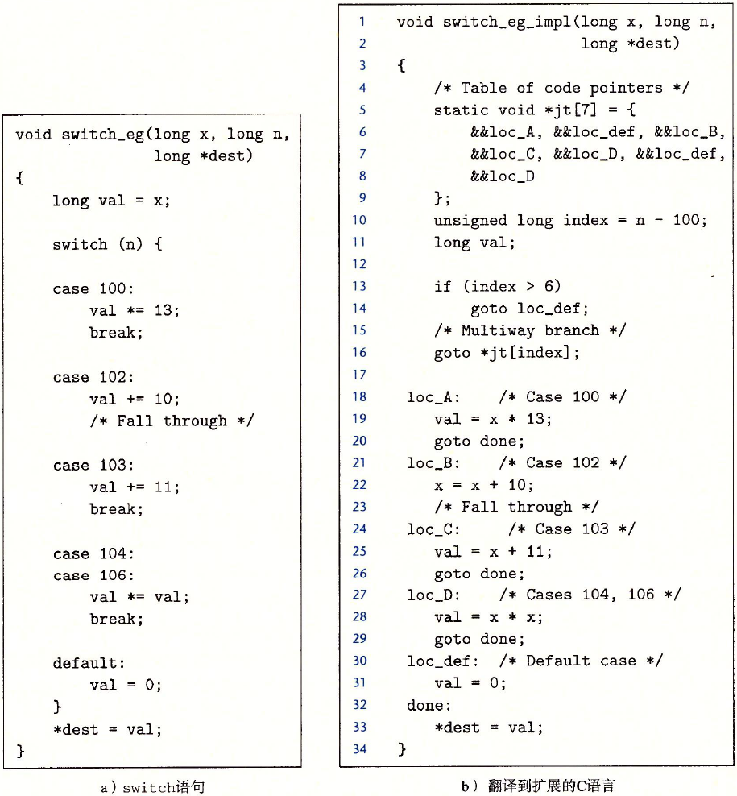                 |
| ------------------------------------------------------------ |
| 图 3-22 `switch` 语句示例以及翻译到扩展的 C 语言。 该翻译给出了跳转表 `jt` 的结构，以及如何访问它。作为对 C 语言的扩展，GCC 支持这样的表。 |
| 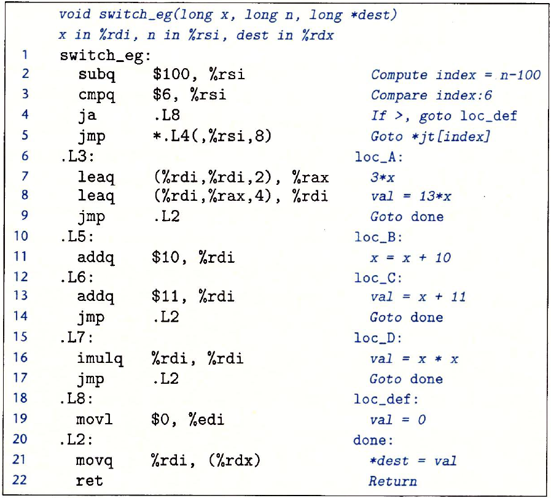                 |
| 上图 `switch` 语句示例的汇编代码                             |
| 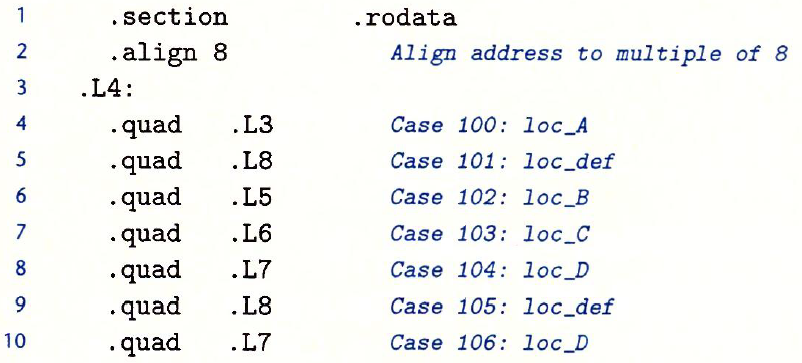 |
| 在汇编代码中，跳转表用上述声明表示                           |

## 过程

**假设**过程 `P` 调用过程 `Q`，`Q` 执行后返回到 `P`。这些动作包括下面一个或多个机制：

- 传递控制。在进入过程 `Q` 的时候，程序计数器必须被设置为 `Q` 的代码的起始地址，然后在返回时，要把程序计数器设置为 `P` 中调用 `Q` 后面那条指令的地址。
- 传递数据。`P` 必须能够向 `Q` 提供一个或多个参数，`Q` 必须能够向 `P` 返回一个值。
- 分配和释放内存。在开始时，`Q` 可能需要为局部变量分配空间，而在返回前，又必须释放这些存储空间。

### 运行时栈

C 语言过程调用机制的一个关键特性（大多数其他语言也是如此）在于使用了栈数据结构提供的后进先出的内存管理原则。程序可以用栈来管理它的过程所需要的存储空间，栈和程序寄存器存放着传递控制和数据、分配内存所需要的信息。

将栈指针（`%rsp`）减小一个适当的量可以为没有指定初始值的数据在栈上分配空间，类似地，可以通过增加栈指针来释放空间。

| 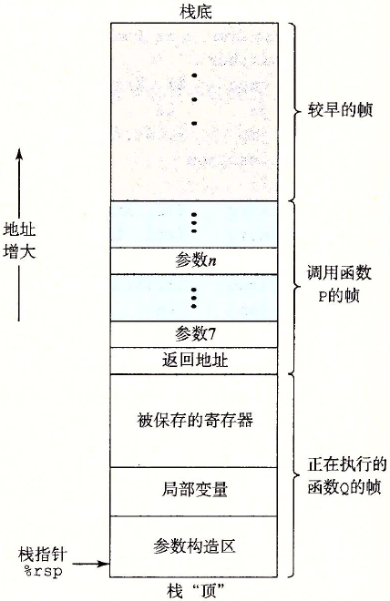 |
| ------------------------------------------------------------ |
| 图 3-25 通用的栈帧结构                                       |

当 x86-64 过程需要的存储空间超出寄存器能够存放的大小时，就会在栈上分配空间，这个部分称为过程的栈帧（stack frame）。

通过寄存器，过程 `P` 可以传递最多 6 个整数值（也就是指针和整数），但是如果 `Q` 需要更多的参数，`P` 可以在调用 `Q` 之前在自己的栈帧里存储好这些参数。

### 数据传送

x86-64 中，可以通过寄存器最多传递 6 个整型（整数和指针）参数。寄存器的使用是**有特殊顺序的**，寄存器使用的名字取决于要传递的数据类型的大小，如下图所示：

| 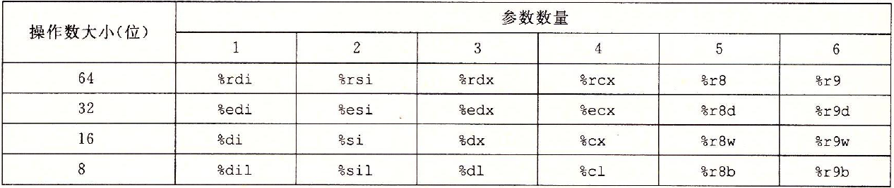 |
| ------------------------------------------------------------ |
| 图 3-28 传递函数参数的寄存器。寄存器是按照特殊顺序来使用的，而使用的名字是根据参数的大小来确定的 |

会根据参数在参数列表中的顺序为它们分配寄存器，可以通过 64 位寄存器适当的部分访问小于 64 位的参数。例如，如果第一个参数是 32 位的，那么可以用 `%edi` 来访问它。

如果一个函数有大于 6 个整型参数，超出 6 个的部分就要通过栈来传递。通过栈传递参数时，所有的数据大小都向 8 的倍数对齐。

## 数组分配与访问

略

## 异质的数据结构

就是`struct`、`union`这样子的数据结构

略