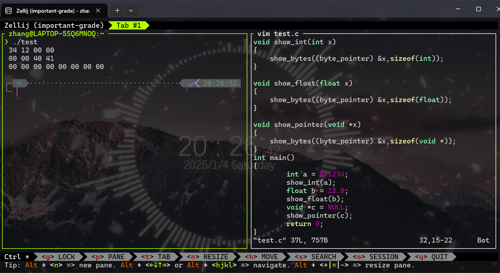

# 2 信息的表示和处理

## 2.1 信息存储

### 2.1.2 字数据大小

可以在计算机上通过 **-m32** 编译，编译后可以在32和64位计算机上运行

```
linux> gcc -m32 prog.c
```

为了避免以来“典型”大小不同C99引入了新的数据类型，数据大小固定`int32_t`和`int64_t`，分别为4字节和8字节

### 2.1.3 寻址和字节顺序

**小端序** 在内存中按照从最低有效字节到最高有效字节的顺序存储对象
|0x100 | 0x101 | 0x102 | 0x103 |
|:----:|:----:|:----:|:----:|
| 67    |  45   |   23  |  01 |

**大端序** 在内存中按照从最高有效字节到最低有效字节的顺序存储对象
| 0x100 | 0x101 | 0x102 | 0x103 |
|:----:|:----:|:----:|:----:|
| 01    |  23   |  45   |  67 |

*对于0x1234567的int型数值的存储*

字节顺序比较重要的情况会出现在编写规避正常的类型系统的程序时，尤其在c语言中，可以通过强制类型转化（cast）或联合（union）来允许以一种数据欸行引用一个对象，这在系统级编程中有用甚至必需

```c
#include<stdio.h>
typedef unsigned char * byte_pointer;

void show_bytes(byte_pointer start,size_t len)//输入为一个字节序列的地址，它用一个字节指针和一个字节数来表示
{
    size_t i;//size_t表示数据结构大小的首选数据类型
    for(i = 0;i<len;i++)
    {
        printf("%.2x",start[i]);//打印出每个以16进制表示的字节
    }
    printf("\n");
}

void show_int(int x)
{
    show_bytes((byte_pointer) &x,sizeof(int));
}

void show_float(float x)
{
    show_bytes((byte_pointer) &x,sizeof(float));
}

void show_pointer(void *x)
{
    show_bytes((byte_pointer) &x,sizeof(void *));
}
//打印程序对象的字节表示，这段代码使用强制类型转换来规避类型系统，很容易定义针对其他数据类型的类似函数
```

这些函数传递给show_bytes一个指向它们参数x的指针&x,且这个指针被强制类型转换为`unsigned char *`

这种强制类型转换告诉编译器，程序应该把这个指针看成指向一个字节序列，而不是一个指向一个原始数据类型的对象，然后这个指针会被看成是对象使用的最低字节地址



*结果如上*

### 2.1.4 表示字符串

十进制数字x的ASCLL码正好是0x3x,终止字节的十六进制表示为0x00

在使用ASCLL码作为字符的任何系统上都将得到相同结果，与字节顺序和字大小规则无关

```c
const char *s = "abcdef";
show_bytes((byte_pointer) s,strlen(s));
```

输出结果为`61 62 63 64 65 66`,需要注意strlen不计数结束符

### 2.1.6 布尔代数简介

**位向量** 固定长度为w、由0和1组成的串，而位向量的运算可以定义为参数的每个对应元素之间的运算
    二进制数的每一位可以对应集合中的一个元素，如果该位为1，则表示该元素在集合中存在；如果该位为0，则表示该元素不存在
    a=[01101001]表示集合A={0.3.5.6}     b=[01010101]表示集合B={0.2.4.6}
    使用编码集合的方法，`|`和`&`表示集合的并和交，~表示集合的补
    例如：a&b=[01000001]，而A交B={0.6}

### 2.1.7 c语言中的位级运算

**掩码** 一个位模式，表示从一个字中选出的位的集合
    掩码0xFF(最低的8位为1)表示一个字的低位字节，位级运算x&0xFF生成一个由x的最低有效字节组成的值，而其他的字节被置为0
    比如若x = 0x89ABCDEF,最终表达式将得到0x000000EF.

### 2.1.8 c语言中的逻辑运算符

&&和||如果第一个参数求值就可以确定表达式的结果，那么逻辑运算符就不会对第二个参数求值

`a&&5/a`不会导致被0除,`p&&*p++`不会导致间接引用空指针

### 2.1.9 c语言中的移位运算

`x<<k`意为x向左移动k位，丢弃最高的k位，并在右端补k个0
`x>>k`意为向右移动k位，但是存在两种移位模式：逻辑右移，算术右移
    **逻辑右移**：在左端补k个0
    **算数右移**：取决于最高位是0/1，补齐最高位的数字
        所有有符号数都是算数右移，无符号数都是逻辑右移
*若移动的k很大，会移动 k mod w*

## 2.2 整数表示

### 2.2.3 补码编码

注意-1和UMax有同样的位表示——一个全1的串

#### stdint.h

ISO C99标准在这个文件中引入了`int64_t`和`int32_t`这个整数类型类

这个文件定义了一组数据类型，声明形如`intN_t`(有符号N位数据)和`uintN_t`(无符号N位数据)

这些数据类型对应着一组宏，定义了每个N的值对应的最小和最大值，这些宏的名字形如`INTN_MIN` `INTN_MAX` `UINTN_MAX`

确定宽度类型的带个是打印需要用宏，以与系统相关的方式拓展为格式串，举个例子
    x、y的类型是int32_t,uint64_t,想要打印他们的值
    printf("x = % " PRId32 ", y = % " PRIu64 "\n",x,y);
    编译为64位程序时，宏 PRId32 展开成字符串“d”，宏字符串 PRId64 展开成字符串 “lu”，当c预处理器遇到仅用空格（或其它空白字符）分隔的一个字符串常量序列时，就把它们串联起来，所以变为了
    printf("x = %d,y = %lu\n",x,y);

### 2.2.4 有符号数和无符号数之间的转换

C语言支持在各种不同的数字数据类型之间做强制类型转换

```c
short int v = -12345;
unsigned short uv = (unsigned) v;
printf("v = %d,uv = %u\n",v,uv);
```

在使用补码的机器上会产生结果：`v = -12345,uv = 53191`

```c
unsigned u = 4294967295u; //UMax
int tu = (int) u;
printf("u = %u,tu = %d\n",u,tu);
```

在使用补码的机器上会产生结果：`u = 429496725,tu = -1`

**可以看到强制转换的结果保持位值不变，只是改变了解释这些位的方式**。

### 2.2.5 C语言中的有符号数和无符号数

当一种类型的表达式被赋值给另外一种类型的变量时，转换是隐式发生的


```c
int x = -1;
unsigned u = 2147483648 /* 2 to the 31st */

printf(" x = %u = %d\n",x,x);
printf(" u = %u = %d\n",u,u);
```

在一个32位机器上运行结果应该是

```c
x = 4294967295 = -1
u = 2147483648 = -2147483648
```

当执行一个运算时，如果他的一个运算数是有符号的而另一个是无符号的，那么c语言会隐式地将有符号参数强制类型转换为无符号数，并假设这两个数都是非负的

典型问题：`- 1<0u`<=>`4294967295u<0u`,导致出错

### 2.2.6 拓展一个数字的位表示

**零拓展**；将一个无符号数转换为一个更大的数据类型，只需要在表示的开头添加0

**符号拓展**：将一个补码数字转换为一个更大的数据类型，在表示中添加最高有效位的值

```c
short sx = -12345; //-12345
unsigned short usx = sx; //53191
int x = sx; //-12345
unsigned ux = usx; //53191

printf("sx = %d:\t",sx);
show_bytes((bytes_pointer) &sx,sizeof(short));
printf("usx = %d:\t",usx);
show_bytes((bytes_pointer) &usx,sizeof(unsigned short));
printf("x = %d:\t",x);
show_bytes((bytes_pointer) &x,sizeof(int));
printf("ux = %d:\t",ux);
show_bytes((bytes_pointer) &ux,sizeof(unsigned int));
```

输出结果(32位大端序)：

```c
sx = -12345:    cf c7
usx = 53191:    cf c7
x = -12345: ff ff cf c7
ux = 53191: 00 00 cf c7
```

```c
short sx = -12345;
unsigned uy = sx;

printf("uy = %d:\t",uy);
show_bytes((bytes_pointer) &uy,sizeof(unsigned));
```

输出为:`uy = 4294954951:    ff ff cf c7`,说明short转换为unsigned时,要先改变大小,再完成从有符号到无符号的转换

### 2.2.7 截断数字

不用额外的位来拓展一个数值，而是减少表示一个数字的位数

```c
int x = 53191;
short sx = (short)x;    //-12345
int y = sx; //-12345
```

将x强制类型转换位short时，我们就将32位的int截断为了16位的short int。这个16位的位模式就是-12345的补码表示。当我们将他强制类型转换为一个int时，符号拓展把高16位设置为1，从而生成-12345的32位补码表示

**截断一个数字可能会改变它的值——溢出的一种形式**

