# 程序的机器级表示

## 3.2 程序编码

`linux> gcc -Og -o p p1.c p2.c`

**编译选项`-Og`**:告诉编译器使用会生成符合原始C代码整体结构的机器代码的优化等级

实际上，gcc命令调用了一整套程序，将源代码转化为可执行代码，将源代码转化成可执行代码。首先，C预处理器扩展源代码，插入所有用`#include`命令指定的文件，并扩展所有用`#define`声明指定的宏。

其次，编译器产生两个源文件的汇编代码，名字分别为`p1.s`和`p2.s`。

接下来，汇编器会将汇编代码转化成二进制目标代码文件`p1.o`和`p2.o`。目标代码是机器代码的一种形式，它包含所有指令的二进制表示，但是还没有填入全局值的地址

最后，连接器将两个目标代码文件与实现库函数（如printf）的代码合并，并产生最终的可执行代码文件p（由命令行指示符`-o p`指定的）

### 3.2.1 机器级代码

**指令集体系架构**或**指令集架构（ISA）**：定义机器级程序的格式和行为，它定义了处理器状态、指令的格式，以及每条指令对状态的影响。处理器的硬件并发的执行许多指令，但是可以采取措施保证整体行为与ISA指定的顺序执行的行为完全一致

机器级程序使用的内存地址是虚拟地址，提供的内存模型看上去是一个非常大的字节数组。存储器系统的实际实现是将多个硬件存储器的操作系统软件组合起来。

- **程序计数器**（通常称为PC，在x86-64中用%rip表示）：给出将要执行的下一条指令在内存中的地址
- 整数**寄存器**文件包含16个命名的位置，分别存储64位的值。这些寄存器可以存储地址（对应C语言的指针）或整数结构。有的寄存器被用来记录某些重要的程序状态，而其它的寄存器用来保存临时数据，例如过程的参数和局部变量，以及函数的返回值。
- 条件吗寄存器保存着最近执行的算数或逻辑指令的状态信息。他们用来实现控制或数据流中的条件变化，比如说用来实现if和while语句
- 一组向量寄存器可以存放一个或多个整数或浮点数值

机器代码只是简单的将内存看成一个很大的、按字节寻址的数组

较典型的程序只会访问几兆字节或几千兆字节的数据。操作系统负责管理虚拟地址空间，将虚拟地址翻译成实际处理器内存中的物理地址

### 3.2.2 代码示例

假设存在c语言代码文件`mstore.c`，包含如下的函数定义

```c
long mult2(long,long);

void multstore(long x,long y,long *dest)
{
    long t = mult2(x,y);
    *dest = t;
}
```

在命令行上使用`- S`选项，就能看到c语言编译器产生的汇编代码

`linux> gcc -Og -S mstore.c`

这会使GCC运行编译器，产生一个汇编文件`mstore.s`，但是不做其它进一步工作（通常情况下，它还会继续调用汇编器产生目标代码文件）

```assembly
mulstore:
    pushq   %rbx
    movq    %rdx,%rbx
    call    mult2
    movq    %rax,(%rbx)
    popq    %rbx
    ret
```

上面代码中，每个缩进去的行都对应于一条机器指令。比如，`pushq`指令表示应该将寄存器`%rbx`压入栈中。

如果按照`- c`命令行选项，GCC会编译并汇编该代码

`linux> gcc -Og -c mstore.c`

这就会产生目标代码文件`mstore.o`，它是二进制格式的，所以无法直接查看。1368字节的文件`mstore.o`中有一段14字节的序列，它的16进制表示为

`53 48 89 d3 e8 00 00 00 00 48 89 03 5b c3`

这就是上面列出的汇编指令对应的目标代码

综上，我们可以发现，机器执行的程序只是一个字节序列，它是对一系列指令的编码。

要查看机器代码文件的内容，带-d命令行的标志程序OBJDUMP可以充当这个角色

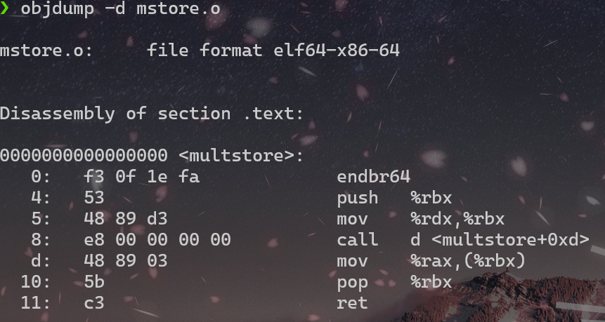

我们可以看到按照前面给出的字节顺序排列的14个16进制字节值，它们分成了若干组，每组1~5个字节。每组字节都已一条指令，右边是等价的汇编语言

一些关于机器代码和它的反汇编表示的特性：

- x86-64的指令长度从1到15字节不等。常用指令以及操作数较少的指令所需的字节数少
- 设计指令格式的方式是，从某个给定位置开始，可以将字节唯一解码成机器指令。例如，只有指令`pushq %rbx`是以字节值53开头的
- 反汇编器只是基于机器代码文件中的字节序列来确定汇编代码。它不需要访问该层徐的源代码或汇编代码
- 反汇编使用的命名规则与GCC生成的汇编代码使用的有些细微差别

生成实际可执行的代码需要对一组目标代码文件运行连接器，而这一组目标代码文件中必须包含有一个main函数

#### *如何展示程序的字节表示*

要展示程序的二进制目标代码，用反汇编器确定该过程的代码长度14字节。然后，在文件mstore.o上运行GDB，输入命令

`(gdb) x/14xb multstore`

这条命令告诉GDB显示（简写为'x'）从函数multstore所处地址开始的14个十六进制格式表示（也简写为x）的字节（简写为b）

### 3.2.3 关于格式的注解

使用`- S`生成mstore.s文件然后查看，完整内容如下

```assembly
 .file   "mstore.c"
        .text
        .globl  multstore
        .type   multstore, @function
multstore:
.LFB0:
        .cfi_startproc
        endbr64
        pushq   %rbx
        .cfi_def_cfa_offset 16
        .cfi_offset 3, -16
        movq    %rdx, %rbx
        call    mult2@PLT
        movq    %rax, (%rbx)
        popq    %rbx
        .cfi_def_cfa_offset 8
        ret
        .cfi_endproc
.LFE0:
        .size   multstore, .-multstore
        .ident  "GCC: (Ubuntu 11.4.0-1ubuntu1~22.04) 11.4.0"
        .section        .note.GNU-stack,"",@progbits
```

注意，所有以`.`开头的行都是指导汇编器和连接器工作的伪指令。这些行通常可以忽略。而为了更清楚地说明汇编代码，利用另一种格式编写

```assembly
void multstore(long x,long y,long *dest)
x in %rdi, y in %rsi, dest in %rdx
multstore:
    pushq   %rbx            Save %rbx
    movq    %rdx,%rbx       Copy dest to %rbx
    call    mult2           Call mult2(x,y)
    movq    %rax,(%rbx)     Store result at *dest
    popq    %rbx            Restore %rbx
    ret                     Return
```

## 3.3 数据格式

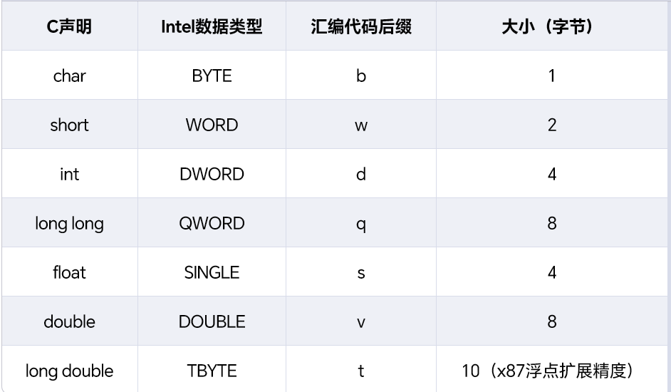

## 3.4 访问信息

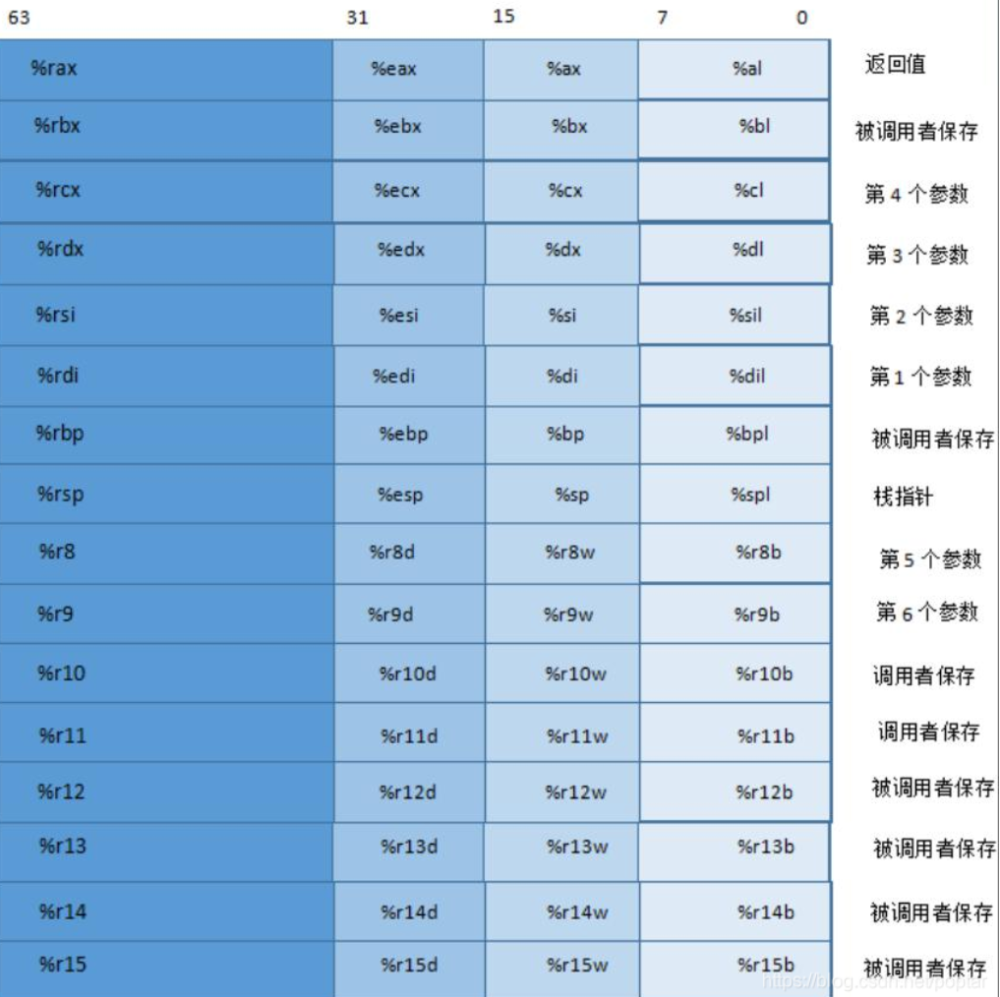

### 3.4.1 操作数指示符

x86-64支持多种操作数格式，源数据值可以以常数形势给出，或是从寄存器或内存中读出。结果可以放在寄存器或内存中

- **立即数**：用来表示常熟值。在ATT格式的汇编代码中，立即数的书写方式是"$"后面跟一个用标准C表示法白哦是的整数，例如$-577。
- **寄存器**：它表示某个寄存器的内容，16个寄存器的低位1字节、2字节、4字节或8字节中的一个作为操作数，这些字节数分别对应于8位、16位、32位或64位
- **内存引用**：它会根据计算出来的地址（*有效地址*）访问某个内存位置。


### 3.4.2 数据传送指令

#### MOV类

这些指令把数据从源位置复制到目的为宗旨，不做任何变化。MOV类由4条指令组成：`movb`,`movw`,`movl`,`movq`。这些指令都执行同样的操作；主要区别在于它们操作的数据大小不同，分别是1、2、4、8字节

源操作数指定的值是一个立即数，存储在寄存器中或者内存中。目的操作数指定一个位置，要么是一个寄存器，要么是一个内存地址。x86-64加了一条限制，传送指令的两个操作数不能都指向内存位置。将一个之从一个内存位置复制大哦另一个内存位置需要两条指令——第一条指令将源值加载到寄存器中，第二条指令将该寄存器值写入目的位置。

大多数情况中，MOV指令只会更i性能目的操作指定的那些寄存器字节或内存位置。粗话了movl指令以寄存器作为目的时，它会把该寄存器的高位4字节设置为0

此外还有两类数据移动指令，在将较小的源值复制到较大的目的时使用，这些指令都是把数据从源（寄存器或内存内）复制到目的寄存器

#### `movz`

把目的中剩余的字节填充为0

- `movzbw`:将做了零扩展的字节传送到字
- `movzbl`:将做了零扩展的字节传送到双字
- ......

注意不存在把四字节源值零扩展为8字节的指令，这样的数据传送应该用以寄存器为目的的movl指令来实现。这一技术利用的属性是，生成4字节值并以寄存器作为目的的指令会把高4字节置为0.对于64位目标，所有三种源类型都有对应的符号拓展传送，而只有两种较小得源类型有零扩展传送

#### `movs`

把目的中剩余的字节符号扩展，将源操作的最高位进行复制

- `movsbw`:将做了符号扩展的字节传送到字
- ......
- `cltq`:把`%eax`符号扩展到`%rax`

### 3.4.4 压入和弹出栈数据

最后两个数据传送操作可以将数据压入程序栈中，以及从程序栈中弹出数据。栈是一种数据结构，可以添加或者删除值，不过需要遵循“后进先出”的原则。通过push操作把数据压入栈中，通过pop操作删除数据

它有一个属性：弹出的值永远是最近被压入而且仍然在栈中的值。

x86-64中，栈向下增长，这样一来，栈顶元素的地址是所有栈中元素地址中最低的。

***栈指针%rsp保存着栈顶元素的地址***.

`pushq`将数据压入到栈上，而且`popq`指令是弹出数据。这些指令都只有一个操作数——压入栈中的数据源和弹出的数据目的(四字)

将一个四字值压入栈中，首先要先将栈指针减八，然后将值写道新的栈顶地址。因此`pushq %rbp`的行为等价于

```assembly
subq $8,%rsp        下降栈指针
movq %rbp,(%rsp)    将%rbp存在栈上
```

它们的区别是在机器代码中pushq指令编码为1个字节，而上面那两条指令一共为8个字节

弹出一个四字的操作包括从栈顶位置读出数据，然后将栈指针加8。因此`popq %rbp`等价于

```assembly
movq (%rsp),%rax        从栈中读出rax的值
addq $8,%rsp            增加栈指针
```

## 3.5 算数和逻辑操作

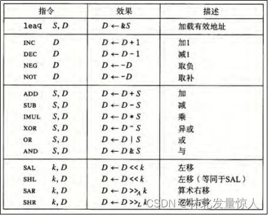

### 3.5.1 加载有效地址

*加载有效地址*指令`leaq`实际上是`movq`指令的变形。它的指令形式式从内存读数据到寄存器，但实际上根本没有引用内存。

它的第一个操作数是将有效地址写入到目的操作数，而不是从指定的位置读入数据，**目的操作数必须是一个寄存器**

```c
long long scale(long x, long y, long z)
{
    long t = x + 4*y + 12*z;
    return t;
}
```

编译后`leaq`指令的实现算术运算

```asm
long scale(long x, long y, long z)
x in %rdi,y in %rsi,z in %rdx

scale：
    leaq    (%rdi,%rsi,4),%rax      x + 4*y
    leaq    (%rdx,%rdx,2),%rdx      z + 2*z = 3*z
    leaq    (%rax,%rdx,4),%rax      (x + 4*y) + 4*(3*z) = x + 4*y + 12*z
    ret
```

### 3.5.2 一元和二元操作

第二组中的操作是一元操作，只有一个操作数，既是源又是目的。这个操作数可以是一个寄存器，也可以是一个内存位置

第三组是二元操作，其最终，第二个操作数既是源又是目的，第一个操作数可以是立即数、寄存器或是内存位置；第二个操作数可以是寄存器或是内存位置

*当第二个数为内存地址时，处理器必须从内存中读出值，执行操作，再把结果写回内存*.

### 3.5.3 移位操作

最后一组是移位操作，先给出移位量，然后第二项给出的是要移位的数。可以进行算数和逻辑右移。移位量可以是一个立即数，或者放在单字节寄存器%cl中

移位量是由%cl寄存器的低m位决定的，这里 *2^m=w* ,高位会被忽略。所以若%cl的十六进制值为0xFF时，指令salb会移7位，salw会移15位，sall会移31位

## 3.6 控制

目前我们只考虑了直线代码的行为，也就是指令条接着一条顺序地执行（顺序结构）

机器代码提供两种基本地敌机机制来实现有条件地行为：测试数据值，然后根据测试地结果来改变控制流或者数据流

### 3.6.1 条件码

除了整数寄存器，CPU还维护着一组单个位地条件码（condition code）寄存器，它们描述了最近的算数或逻辑操作地属性，可以检测这些寄存器来执行条件分支指令。

- CF：进位标志.最近的操作使最高位产生了进位。可以用来检查无符号操作的溢出
- ZF：零标志。最近的操作得出的结果是0
- SF：符号标志。最近的操作得到的结果为负数
- OF：溢出标志。最近的操作导致一个补码溢出——正溢出或负溢出

比如说，假设我们用一条ADD指令完成等价于C表达式 t = a + b的功能，这里变量a、b和t都是整型的。然后根据下面的C表达式来设置条件码

```t
CF  (unsigned) t < (unsigned) a     无符号溢出
ZF  (t == 0)                        零
SF  (t<0)                           负数
OF  (a<0==b<0) && (t<0!=a<0)        有符号溢出
```

- `leaq`指令不会改变任何的条件码，因为它是用来进行地址计算的。
- 除此之外，之前`算数和逻辑操作`图表中的所有指令都会设置条件码。
- 对于移位操作，进位标志将设置为最后一个被移出的位，而溢出标志设置为0。
- INC和DEC指令会设置溢出和零标志，但是不会改变进位标志

还有两类指令只设置条件码而不改变任何其它寄存器

| 指令 | 基于 | 描述 |
|-------|-------|-------|
| `cmpb` S1,S2 | S2-S1 | 比较字节 |
| `testb` S1,S2 | S1&S2 | 测试 |

- CMP指令根据两个操作数之差来设置条件码。除了不改变寄存器的值以外，其它行为和SUB是一样的。如果两个操作数相等，这些指令会将零标志设置为1
- TEST指令的行为和AND指令一样。典型用法为：两个操作数是一样的（例如，test %rax,%rax来检查%rax是负数、零还是正数），或其中的一个操作数是一个掩码，用来指示哪些位应该被测试

### 3.6.2 访问条件码

条件码通常不会直接读取，常用的使用方法有3种

- 可以根据条件码的某种组合，将一个字节设置为0或者1
- 可以条件跳转到程序的某个其它部分
- 可以有条件的传送数据

`SET`指令根据条件码的组合，将某一个字节设置为 0 或者 1 。指令名字后面的后缀指明了他们的功效和需要考虑的条件码组合的不同

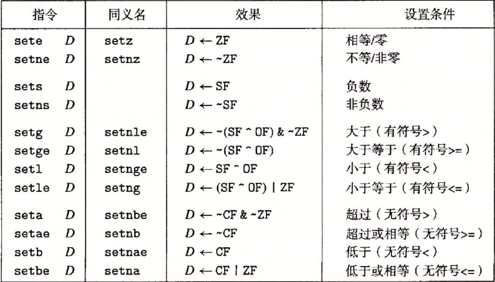

SET指令的操作数是8个单字节寄存器之一，或是存储一个字节的存储器位置，然后将这个字节设置为 0 或 1。下面看一个典型的计算C语言表达式 x > y 的指令序列。

```c
int gt(int a, int b)
{
    return a < b;
}
```

对应的汇编指令

```assembly
int comp(data_t a,data_t b)
a in %rdi,b in %rsi
cmpq    %rsi,%rdi       # Compare a : b
setl    %al             # Set low-byte of %eax to 0 or 1
movzbl  %al, %eax       # Set remaining bytes of %eax to 0
ret
```

注意`cmpq`指令的比较顺序。虽然参数列出的顺序是先%rsi(b)再是%rdi(a),但实际上比较的是a和b。以及，`movzbl`指令会将`%eax`的高3个字节清零，还会把整个寄存器%rax的高四个字节都清零

注意机器代码如何区分有符号和无符号值是很重要的

### 3.6.3 跳转指令

*jump*指令会导致执行切换到程序中一个全新的位置。再汇编代码中，这些跳转的目的地通常用一个标号表明

```asm
  movq $0,%rax          Set %rax to 0
  jmp .L                Goto .L1
  movq (%rax),%rdx      Null pointer dereference (skipped)
.L1:
  popq %rdx             ump target
```

这里`jmp .L1`指令会使程序跳过`movq`指令，从`popq`指令继续执行

在产生目标代码文件时，汇编器会确定所有带标号指令的地址，并将跳转目标（目的指令的地址）编码为跳转指令的一部分


### 3.6.4 跳转指令的编码

在汇编代码中，跳转目标用符号标号书写。汇编器，以及后来的链接器，会产生跳转目标的适当编码。

跳转指令有几种不同的编码，但是最常用的都是PC相对的（PC-relative）。

也就是说，它们会将目标指令的地址与紧跟在跳转指令后面那条指令的地址之间的差作为编码。这些地址偏移量可以编码为1、2或4个字节。

第二种编码方式是给出绝对地址，用4个字节直接指定目标，汇编器和链接器会选择适当的跳转目的编码

当执行PC相对寻址的时候，程序计数器的值是跳转指令后面的那条指令的地址，而不是跳转指令本身的地址

### 3.6.5 用条件控制来实现条件分支

将条件表达式和语句从 C 语言翻译成机器代码，最常用的方式是结合有条件和无条件跳转。（另一种方式在 3.6.6 节中会看到，有写条件可以用数据的条件转移实现，而不是用控制的条件转移实现）。

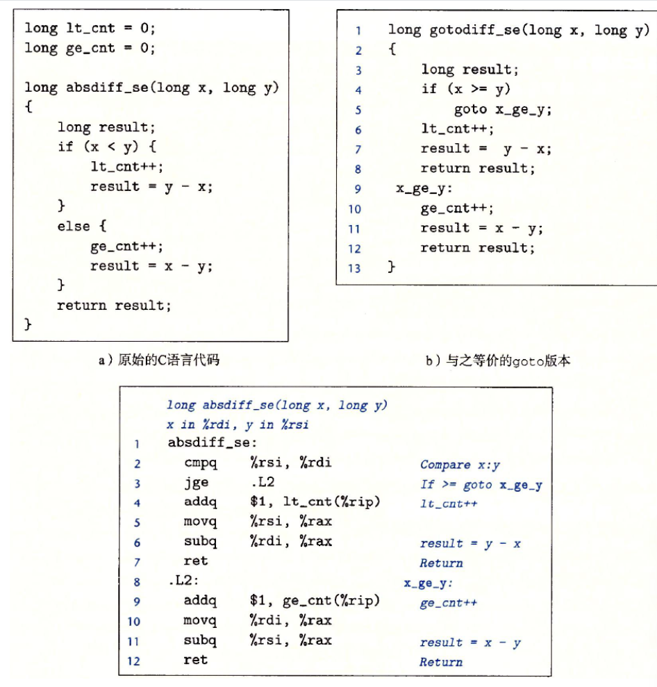

a） C过程`absdiff_se`包含一个if-else语句

b） C过程`gotodiff_se`模拟了`goto`代码的控制

c）给出了产生的汇编代码

### 3.6.6 用条件传送来实现条件分支

实现条件操作的传统方法是通过使用控制的条件转移。当条件满足时，程序沿着一条执行路径执行，而当条件不满足时，就走另一条路径。这种机制简单而通用，但是在现代处理器上，它可能会非常低效

一种替代的策略是使用数据的条件转移。这种方法计算一个条件操作的两种结果，然后再根据条件是否满足从中选取一个。只有在一些受限制的情况这种，这种策略才可行，但是如果可行，就可以用一条简单的条件传送指令来实现它，条件传送指令更符合现代处理器的性能特性。

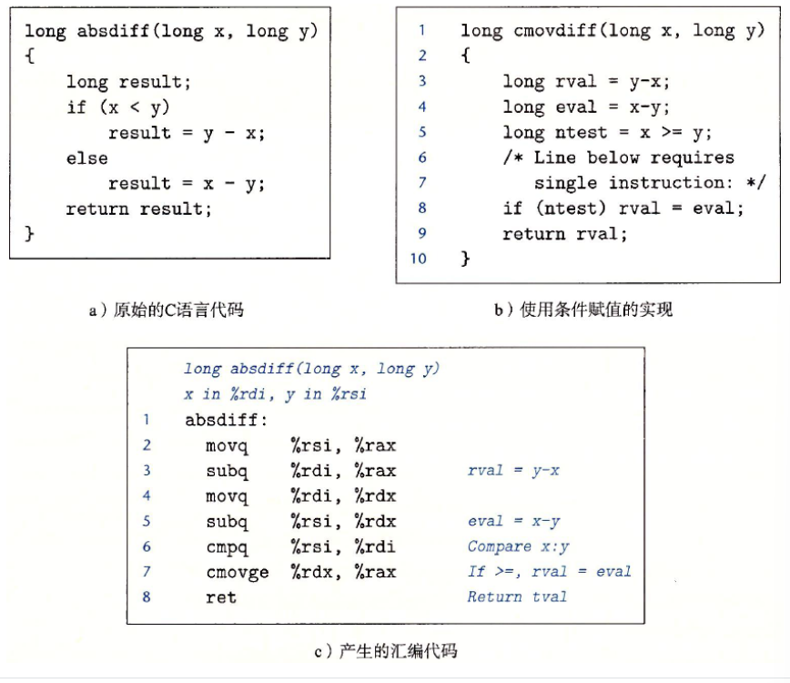

a） C函数`absdiff`包含一个条件表达式

b） C函数`cmovdiff`模拟汇编代码操作

c） 给出产生的汇编代码

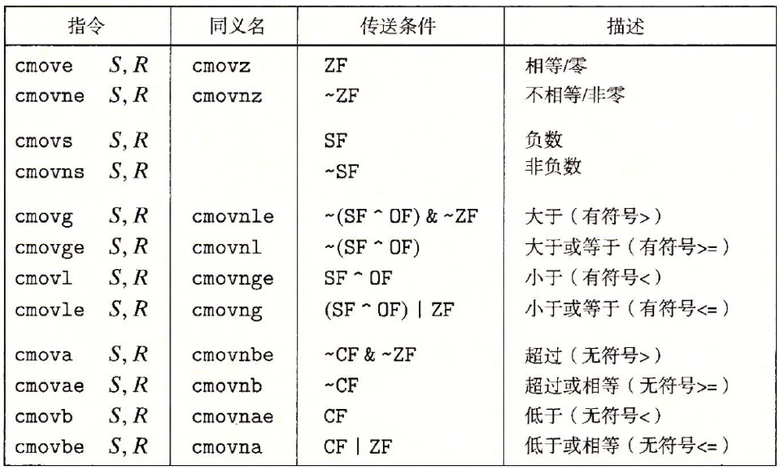

当条件满足时，指令把源值`s`复制到目的`R`。

同条件跳转不同，处理器无需预测测试结果就可以执行条件传送。处理器只是读源值（可能是内存中），检查条件码，然后要么更新目的寄存器，要么保持不变。

**为了理解如何通过条件数据传输来实现条件操作，考虑下面的条件表达式和赋值的通用形式**

```c
v = test-expr ? then-expr : else-expr;
```

用条件控制转移的标准方法来编译这个表达式会得到如下形式

```c
	if (!test-expr)
    	goto false;
	v = then-expr;
	goto done;
flase:
	v = else-expr;
done:
```

这段代码包含两个代码序列：一个对then-expr求值，另一个对else-expr求值。条件跳转和无条件跳转结合起来使用是为了保证只有一个序列执行

基于条件传送的代码，会对then-expr和else-expr都求值，最终值的选择基于对test-expr的求值，可以用下面的抽象代码描述

```c
v = then-expr;
ve = else-expr;
if (!t) v = ve
```

这个序列中的最后一条语句是用条件传送实现的——只有当测试条件t不满足时，ve的值才会被复制到v中

**注意**：不是所有的条件表达式都可以用条件传送来编译。如果两个表达式中的任意一个可能产生错误条件或者副作用，就会导致非法的行为

**作为说明，考虑下面的C函数**

```c
long cread(long *xp)
{
	return (xp ? *xp : 0);
}
```

这段代码似乎很适合被编译成使用条件传送，理由是：当指针为空时，将结果设置为0。于是，想当然的有了如下汇编代码（以下是错误演示）

```assembly
.long cread(long *xp)
.xp in %rdi
cread:
  movq (%rdi),%rax ; v = *xp
  testq %rdi,%rdi ; Test x
  movl $0,%edx ; Set ve = 0
  cmove %rdx, %rax; ; If x==0, v = ve
  ret ; Return v
```

不过，这个实现是非法的，因为即使当测试为假时，`movq`指令（第二行）对于xp的简介引用还是发生了，导致一个间接引用空指针的错误。所以必须用分支代码来编译这段代码

编译环境为`gcc (Ubuntu 11.4.0-1ubuntu1~22.04) 11.4.0`,编译指令为`gcc -Og -S test.c`

```assembly
cread:
.LFB0:
        .cfi_startproc
        endbr64
        testq   %rdi, %rdi
        je      .L3
        movq    (%rdi), %rax
        ret
.L3:
        movl    $0, %eax
        ret
        .cfi_endproc
```

使用条件传送也不总是会提高代码的效率。例如，如果 `then-expr` 或者 `else-expr` 的求值需要大量的计算，那么当相对应的条件不满足时，这些工作就白费了。编译器必须考虑浪费的计算和由于分支预测错误所造成的性能处罚之间的相对性能

总的来说，条件数据传送提供了一种条件控制转移来实现条件操作的替代策略。它们只能用于非常受限制的情况，但是这些情况还是相当常见的，而且与现代处理器的运行方式更契合。

### 3.6.7 循环

C 语言提供了多种循环结构，即 `do-while`、`while` 和 `for`。汇编中没有相应的指令存在，可以用条件测试和跳转组合起来实现循环效果。GCC 和其他汇编器产生的循环代码主要基于两种基本的循环模式。

1. `do-while`循环

`do-while`语句的通用形式如下;

```c
do
    body-statement
    while (test-expr)
```

这种通用形式可以被翻译为如下所示的条件和`goto`语句

```c
loop:
	body-statement
    t = test-expr;
	if (t)
        goto loop;
```

每次循环，程序会执行循环体里的语句，然后执行测试表达式。如果测试为真，就回去再执行一次循环

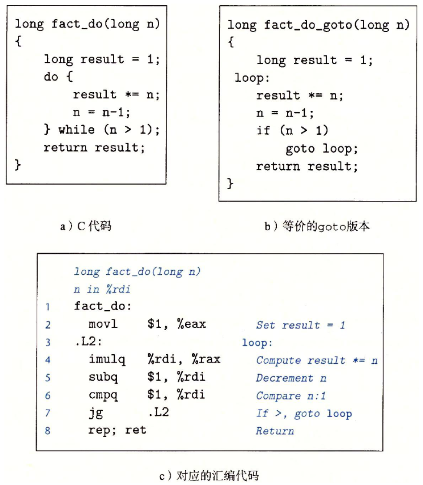

2. `while`循环

`while`语句的通用形式如下：

```c
while (test-expr)
    body-statement
```

第一种翻译方法，称之为跳转到中间，它执行一个无条件跳转跳到循环结尾处的测试，以此来执行初始的测试。翻译为`goto`代码如下

```c
	goto test;
loop:
	body-statement
test:
	t = test-expr;
	if (t)
        goto loop;

```

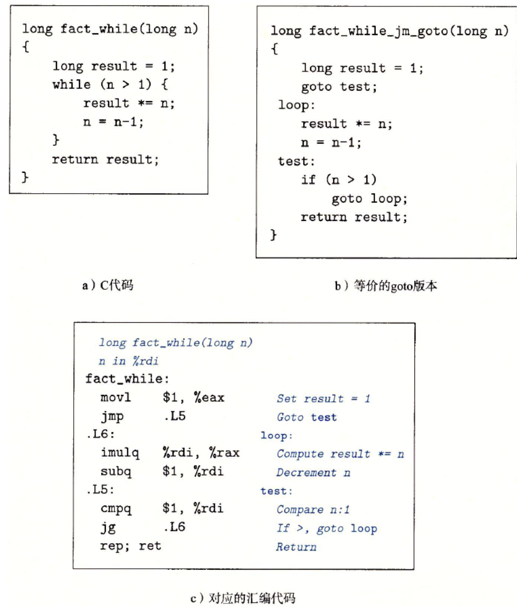

第二种翻译方法称为`guarded-do`，首先用条件分支，如果初始条件不成立就跳过循环，将代码变换为`do-while`循环，较高等级优化编译可能会这样转化

```c
t = test-expr;
if (!t)
    goto done;
do
    body-statement
    while (test-expr);
done:
```

翻译为goto代码如下：

```c
t = test-expr;
if (!t)
    goto done;
loop:
	body-statement
    t = test-expr;
	if (t)
        goto loop;
done:
```

利用这种实现策略，编译器可以优化初始测试的内容，例如认为测试条件总是满足

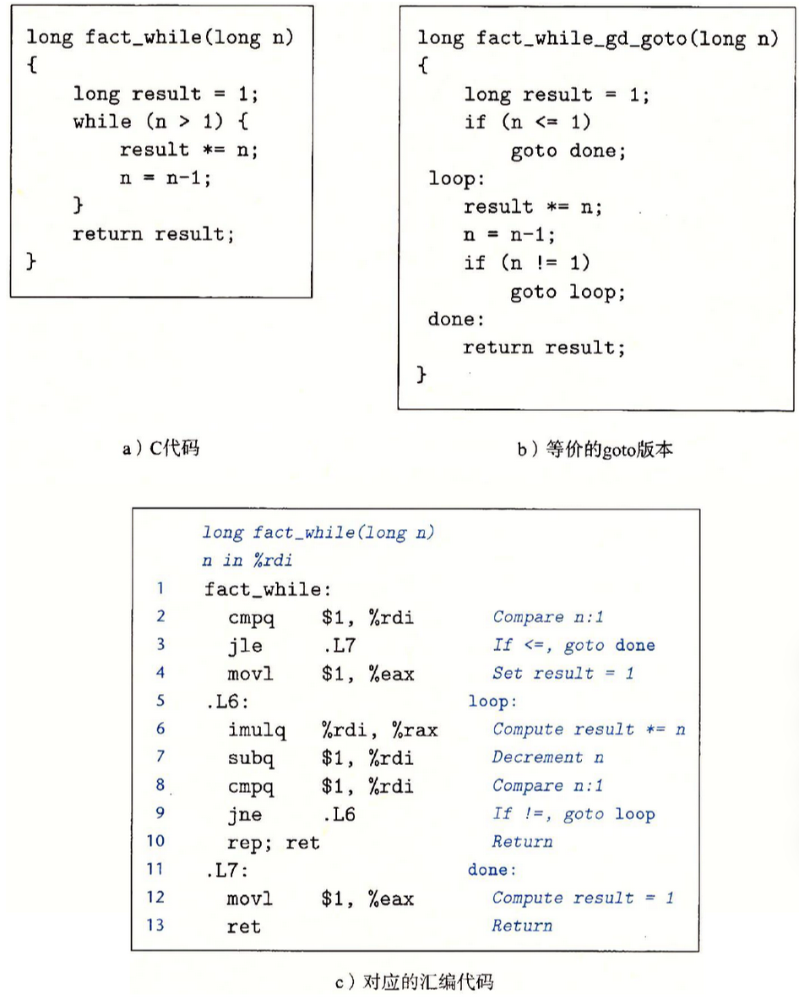

3. `for`循环

`for`循环产生的代码是while循环的两种翻译之一，取决于优化等级

4. **小结**

综上所述，C 语言中三种形式的所有的循环：`do-while`、`while` 和 `for`，都可以用一种简单的策略来翻译，产生包含一个或多个条件分支的代码。控制的条件转移提供了将循环翻译成机器代码的基本机制。

### 3.6.8 `switch`语句

`switch`语句可以根据一个**整数索引值**进行多重分支，在处理具有多种可能结果的测试时，这种语句特别有用。通过使用跳转表这种数据结构可以实现

​	跳转表是一个数组，表项i是一个代码段的地址，这个代码段实现当开关索引值等于i是程序应该采取的动作

使用跳转表的优点是执行开关语句的时间与开关情况的数量无关。GCC根据开关情况的数量和开关情况值得系数程度来翻译开关语句，当开关情况数量比较多（例如4个以上），并且值得范围跨度比较小时，就会使用跳转表

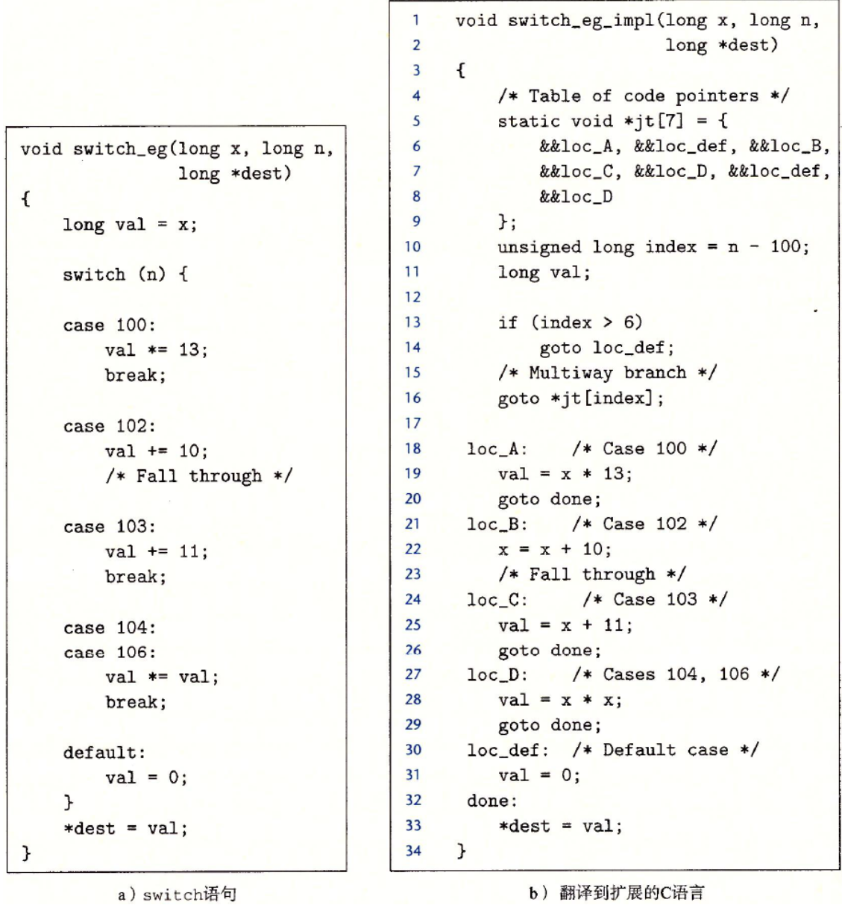

该翻译给出了跳转表`jt`的结构，以及如何访问它。作为对C语言的扩展，GCC支持这样的表。

原始的C代码有针对值100、102-104和106的情况，但是变量开关n可以是任意整数。编译器首先将n减去100，把取值范围移到0到6之间，创建一个新的程序变量，在我们的C版本中称为index。补码表示的负数会映射成无符号表示的大正数，利用这一事实，将index看作无符号值，从而进一步简化了分支的可能性。因此可以通过测试index是否大于6来判定index是否在0~6范围之外

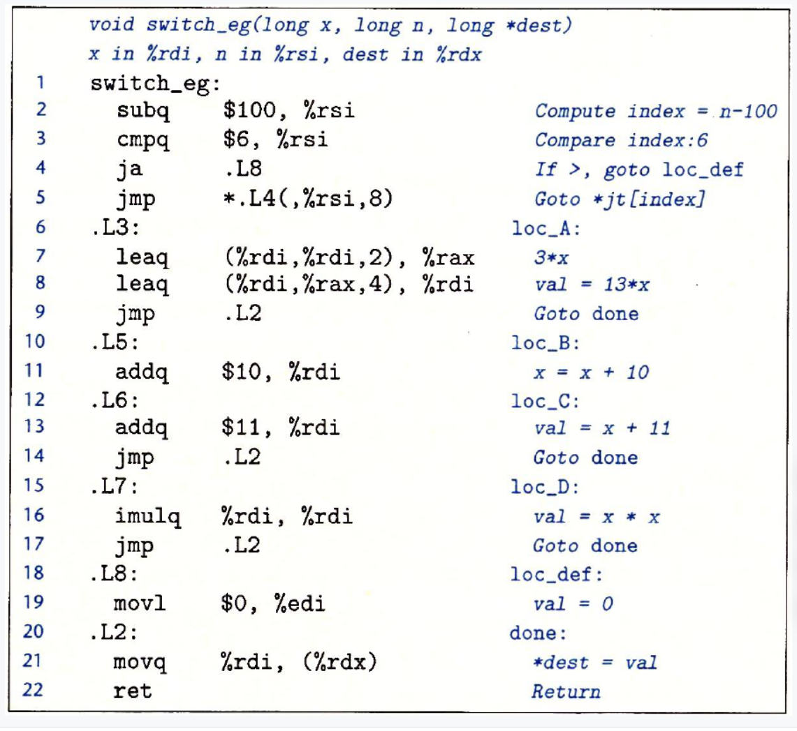

执行switch语句的关键步骤是通过跳转表来访问代码的位置，在C代码中是第16行，一条`goto`语句引用了跳转表`jt`。GCC支持计算`goto`，是对C语言的扩展。在我们的汇编代码版本中，类似的操作是在第5行，`jmp`指令的操作数有前缀`'*'`，表明这是一个间接跳转，操作数指定一个内存位置，索引由寄存器`%rsi`给出，这个寄存器保存着index的值

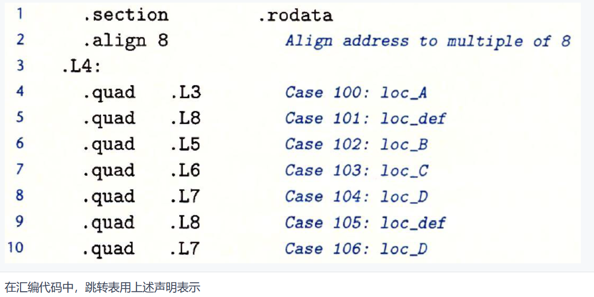

执行 `switch` 语句的关键步骤是通过跳转表来访问代码位置，使用跳转表是一种非常有效的实现多重分支的方法。甚至当 `switch` 语句有上百种情况的时候，也可以只用一次跳转表访问去处理。

## 3.7 过程

过程是软件中一种很重要的抽象。它提供了一种封装代码的方式，用一组指定的参数和一个可选的返回值实现了某种功能。然后可以在程序不同的地方调用这个函数。不同编程语言中，过程的形式多样：函数（function）、方法（method）、子例程（subroutine）、处理函数（handler）等等，但是它们有一些共有的特性

**为讨论方便，假设**过程`P`调用过程`Q`，`Q` 执行后返回到 `P`。这些动作包括下面一个或多个机制：

- 传递控制。在进入过程 `Q` 的时候，程序计数器必须被设置为 `Q` 的代码的起始地址，然后在返回时，要把程序计数器设置为 `P` 中调用 `Q` 后面那条指令的地址。
- 传递数据。`P` 必须能够向 `Q` 提供一个或多个参数，`Q` 必须能够向 `P` 返回一个值。
- 分配和释放内存。在开始时，`Q` 可能需要为局部变量分配空间，而在返回前，又必须释放这些存储空间。

### 3.7.1 运行时栈

C语言过程调用机制的一个关键特性（大多数语言也是如此）在于使用了栈数据结构提供的后进显出的内存管理原则。

如3.4.4所讲，x86-64的栈向低地址方向增长，而栈指针`%rsp`指向栈顶元素。可以用`pushq`和`popq`指令将数据存入栈中或是从栈中取出。将栈指针减小一个适当的量可以为没有指定初始值的是数据在栈上分配空间。类似的，可以通过增加栈指针来释放空间。

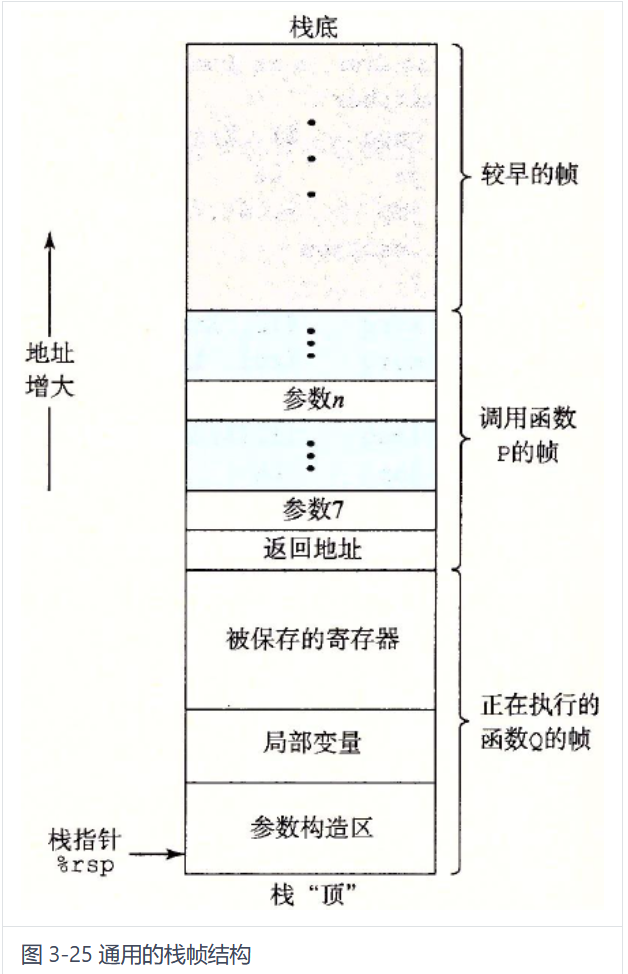

当x86-64过程需要的存储空间超过寄存器能够存放的大小时，就会在栈上分配空间。这个部分称为过程的栈帧（stack frame）

图3-25给出了运行时栈的通用结构，包括把它划分为栈帧。当前正在执行的过程的帧总是正在栈顶。

> 当过程P调用Q时，会把返回地址压入栈中，指明当Q返回时，要从P程序的哪个位置继续执行。我们把这个返回地址当作P栈帧的一部分，因为它存放的是与P相关的状态。
>
> Q的代码会扩展当前栈的边界，分配它的栈帧所需的空间。在这个空间中，它可以是保存寄存器的值，分配局部变量空间，为它调用的过程设置参数。

大多数过程的栈帧是定长的。通过寄存器，过程P可以传递最多六个整数值（也就是指针和整数），但是如果Q需要更多的参数，P可以在调用Q之前在自己的栈帧中存储好这些参数

### 3.7.2 转移控制

将控制从函数P转移到函数Q只需要简单地把程序计数器（PC）设置为Q的代码地起始位置。不过，当稍后从Q返回的时候，处理器必须记录好它所需要继续P的执行的代码占位置。在x86-64机器中，这个信息是用指令`call Q`调用过程Q来记录的。

该指令会把地址A压入栈中。并将PC设置为Q的起始地址。压入的地址A被称为返回地址，是紧跟在`call`指令后面的那条指令的地址。对应的指令`ret`会从栈中弹出地址A，并把PC设置为A

**总之，`call`指令只有一个目标，即指明被调用过程起始的指令地址**

### 3.7.3 数据传送

x86-64中，可以通过寄存器最多传递6个整数（整数和指针）参数。寄存器的使用是有特殊顺序的，寄存器使用的名字取决于要传递的数据类型的大小，如下图所示：

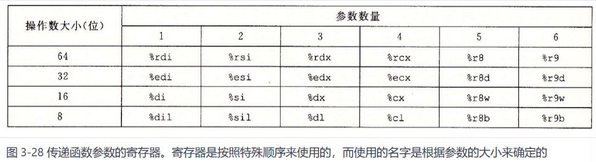

会根据参数在参数列表中的顺序为它们分配寄存器，可以通过64位寄存器适当的部分访问小于64位的参数。例如，如果第一个参数是32位的，那么可以用`%edi`来访问

如果一个函数有大于6个整型参数，超出6个的部分就要通过栈来传递。

> 假设过程：调用Q，有n个整型参数，且n>6.那么P的代码分配的栈帧必须要能容纳7到n号参数的存储空间，如图3-25所示。要把参数1~6复制到对应的寄存器，把参数7~n放到栈上，而参数7位于栈顶。**通过栈传递参数时，所有数据大小都向8的倍数对齐**。参数到位以后，程序就可以执行`call`命令将控制转移到过程Q了。过程Q可以通过寄存器访问参数，有必要的话也可以通过栈访问。相应的，如果Q也调用了某个有超过6个参数的函数，他也需要在自己的栈帧中为超出6个部分的参数分配空间

### 3.7.4 栈上的局部存储

局部数据必须存放在内存中，常见的情况包括：

- 寄存器不足够存放所有本地数据
- 对一个局部变量使用地址运算符`&`，因此必须能够为它产生一个地址
- 某些局部变量时数组或结构，因此必须能够通过数组或结构引用被访问到

运行时栈提供了一种简单的、在需要时分配、函数完成时释放局部存储的机制。

### 3.7.5 寄存器中的局部存储空间

寄存器时唯一被所有过程共享的资源。虽然在给定时刻只有一个过程时活动的，但仍然必须确保当一个过程（调用者）调用另一个过程（被调用者）时，被调用者不会覆盖调用者稍后会使用的寄存器值。

根据惯例，寄存器 `%rbx`、`%rbp` 和 `%r12~%r15` 被划分为被调用者保存寄存器。

> 当过程P调用过程Q时，Q必须保存在这些寄存器的值，保证它们的值在Q返回到P时与Q被调用时是一样的。
>
> 过程Q保存一个寄存器的值不变，要么就是根本不去改变它，要么就是把原始值压入栈中，改变寄存器的值，然后在返回前从栈中弹出旧值。
>
> 压入寄存器的值会在栈帧中创建标号为“被保存的寄存器”的一部分，如3-25所示。

所有其它寄存器，除了栈指针`%rsp`，都分类为调用者保存寄存器。这就意味着任何函数都能修改它们。

### 3.7.6 递归过程

每个过程调用在栈中都有它自己的私有空间，因此多个未完成调用的局部变量不会相互影响。此外，栈的原则很自然的就提供了适当的策略，当过程被调用时分配局部存储，当返回时释放存储。

递归调用一个函数本身与调用其他函数是一样的。栈提供了一种机制，每次函数调用都有它自己私有的状态信息（保存的返回位置和被调用者保存寄存器的值）、存储空间。如果需要它还可以提供局部变量存储。栈分配和释放的规则很自然地就与函数调用-返回地顺序匹配。这种实现函数调用和返回地方法甚至对更复杂地情况也使用

## 3.8 数组分配和访问

C语言中的数组是一种将标量数据聚集成更大数据类型的方式。C语言的一个不同寻常的特点是可以产生指向数组中元素的指针，并对这些指针进行运算。在机器代码中，这些指针会被翻译成地址计算

### 3.8.1 基本原则

作为示例，看看下面这样的声明

```c
char A[12];
char *B[8];
int  C[6];
double *D[5];
```

这些声明会产生带下列参数的数组

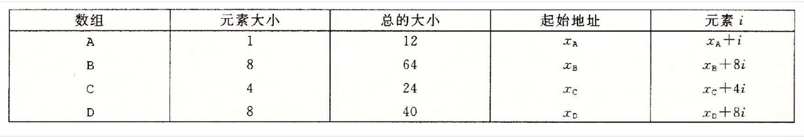

x86-64的内存引用指令可以用来简化数组访问

> 假设E是一个int型的数据，而我们想计算E[i]，在此，E的地址存放在寄存器`%rdx`中，而i存放在寄存器`%rcx`中，然后指令
>
> `movl	(%rdx, %rcx, 4)， %eax`
>
> 会执行地址计算*Xe+4 i*,并将结果存放到寄存器`%eax`中。**允许伸缩因子1、2、4和8覆盖了所有基本简单数据类型的大小**

### 3.8.2 指针运算

C语言允许对指针进行预算，而计算出来的值会根据该指针引用的数据类型的大小进行伸缩。

> 也就是说，如果p是一个指向类型为T的数据的指针，p的值为x<sub>p</sub>+`L·i`，这里L是数据类型T的大小

可以对数组和指针应用数组下标操作。数组引用 `A[i]` 等同于表达式 `*(A+1)`，它计算第 `i` 个数组元素的地址，然后访问这个内存位置。

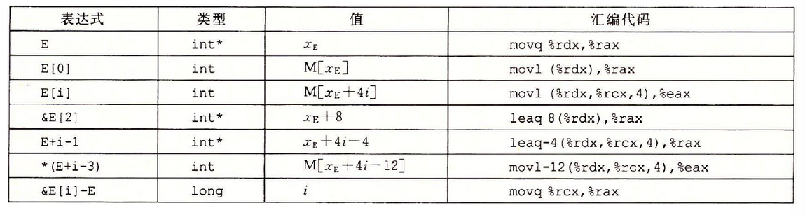

这些例子中，可以看到返回数组值的操作类型为int，因此涉及4字节操作（例如`movl`）和寄存器（`%ebx`)。

### 3.8.3 嵌套的数组

当创建数组的数组时，数组分配和引用的一般原则也是成立的。

> 声明 `int A[5][3];` 等价于 `typedef int row3_t[3]; row3_t A[5];`。
>
> 数据类型 `row3_t` 被定义为一个 3 个整数的数组，数组 `A` 包含 5 个这样的元素，每个元素需要 12 个字节来存储 3 个整数，整个数组的大小就是 `4*5*3=60` 字节。

数组元素在内存中按照**“行优先”**的策略，将 `A` 看作一个有 5 个元素的数组，每个元素都是 3 个 `int` 的数组。

### 3.8.4 定长数组

主要介绍了`O1`优化，不详说

### 3.8.5 变长数组

`ISO C99`引入了一种功能，允许数组的维度是表达式，在数组被分配的时候才计算出来

在变长版本的C版本中，我们可以将一个数组声明如下：`int A[expr1][expr2]`，遇到这个声明时，通过对表达式`expr1`和`expr2`求值来确定数组的维度

## 3.9 异质的数据结构

C语言提供了两种将不同类型的对象组合到一起创建数据类型的机制：`结构(struct)`，用关键字struct来声明，将多个对象集合到一个单位中：`联合(union)`，用关键字union来声明，允许用几种不同的类型来引用一个对象

### 3.9.1 结构

C语言的`struct`声明创建一个数据类型，将可能不同类型的对象聚合到一个对象中。用名字来引用结构的各个组成部分。类似于数组的实现，**结构的所有组成部分都存放在内存中一段连续的区域内**，而指向结构的指针就是结构第一个字节的地址。

编译器维护关于每个结构类型的信息，指示每个字段（field）的字节偏移。它以这些偏移作为内存引用指令中的位移，从而产生对结构元素的引用。

### 3.9.2 联合

联合提供了一种方式，能够规避C语言的类型系统，允许以多种类型来引用一个对象。它们式用不用的字段来引用相同的内存块。

在一些上下文中，联合十分有用。但是，它也能引起一些讨厌的错误，因为它们绕过了C语言类型系统提供的安全措施。一种应用情况是，我们事先知道对一个数据结构中的两个不同字段的使用式互斥的，那么将这两个字段声明为联合的一部分，而不是结构的一部分，会减小分配空间的总量

一个联合的总的大小等于它最大字段的大小。

**联合还可以用来访问不同数据类型的位模式。**

假设我们使用简单的强制类型转化将一个double类型的值d转换为`unsigned int`类型的`u`

```c
unsigned long u = (unsigned long) d;
```

值u会是d的整数表示。除了d的值为0.0的情况外，u的位表示会与d的很不一样

再看下面这段代码，从一个`double`产生一个`unsigned long`类型的值

```c
unsigned long double2bits (double d)
{
    union 
    {
        double d;
        unsigned long u;
	} temp;
    temp.d = d;
    return temp.u;
};
```

在这段代码中，我们以一种数据类型来存储联合中的参数，又以另一种数据类型来访问它。结果会是u具有和d一样的位表示，包括符号位字段、指数和尾数

**当用联合来将各种不同大小的数据类型结合到一起时，字节顺序问题就变得很重要了**

假设我们写了一个过程，它以两个4字节的unsigned的位模式，创建一个8字节的double：

```c
double uu2double (unsigned word0, unsigned word1)
{
    union
    {
        double d;
        unsigned u[2];
	}temp;
    
    temp.u[0] = word0;
    temp.u[1] = word1;
    return temp.d;
}
```

在x86-64这样的小端法机器上，参数word0是d的低位4个字节，而word1是高位4个字节。在大端法机器上，这两个参数的角色正好相反。

### 3.9.3 数据对齐

许多计算机系统对基本数据类型的合法地址做出了一些限制，要求某种类型对象的地址必须是某个值`K`(通常是`2`、`4`、`8`)的倍数。这种对齐限制简化了形成处理器和内存系统之间接口的硬件设计

> 例如，假设一个处理器总是从内存中取出8个字节，则地址必须为8的倍数。如果我们能保证将所有double类型数据的地址对齐成8的倍数，那么就可以用一个内存操作来读或者写值了。否则我们可能需要执行两次内存访问，因为对象可能被分放在两个8字节内存块中

无论数据是否对齐，x86-64硬件都能正确工作。不过，Intel 还是建议要对齐数据以提高内存系统的性能。对齐原则是任何 `K` 字节的基本对象的地址必须是 `K` 的倍数，这条原则会得到如下对齐：

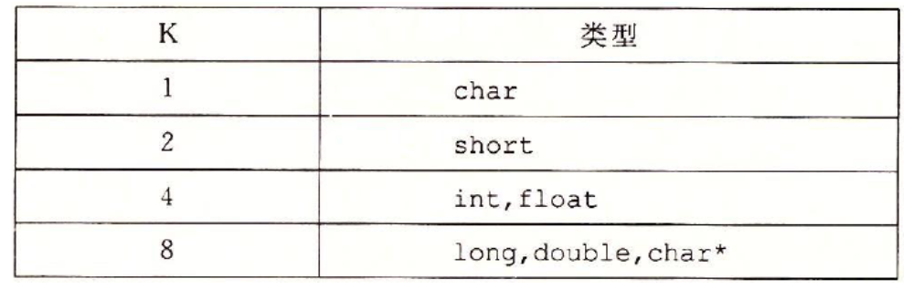

确保每种数据类型都是按照指定方式来组织和分配，即每种类型的对象都满足它的对齐限制，就可以保证实施对齐。

**编译器在汇编代码中放入命令，指明全局数据所需的对齐**

例如3.6.8节开始的跳转表的汇编代码声明在第2行包含下面这样的命令

```assembly
.align 8
```

这就保证了它后面的数据（在此是跳转表的开始）的起始地址是8的倍数。因为每个表项长8个字节，后面的元素都会遵守8字节对齐的限制

**对于包含结构的代码，编译器可能需要在字段的分配中插入间隙，以保证每个结构元素都满足它的对齐要求**

比如下面的结构声明：

```c
struct S1
{
    int i;
    char c;
    int j;
}
```

假设编译器用最小的9字节分配，画出图来是这样的：

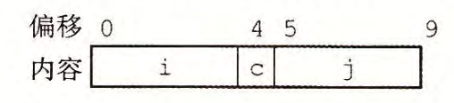

它是不可能满足字段i（偏移为0）和j（偏移为5）的4字节对齐要求的。取而代之的是，编译器在字段c和j之间加入了一个3字节的间隙（蓝色阴影表示）

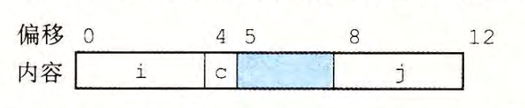

结果，j的偏移量是8，而整个结构的大小是12字节。

此外编译器必须保证任何`struct S1 *`的类型的指针p都满足4字节对齐。用我们前面的符号，设指针p的值为x<sub>p</sub>,那么，x<sub>p</sub>必须是4的倍数。这就保证了 p -> i (地址x<sub>p</sub>)和 p -> j(地址x<sub>p</sub>+8)都满足它们的4字节对齐要求。

## 3.10 在机器级程序中将控制和数据结合起来


到目前为止，我们已经分别讨论机器级代码如何实现程序的控制部分和如何实现不同的数据结构。

在本节中，我们会看看数据和控制如何交互。

- 首先深审视一下指针，它是C编程语言中最重要的概念之一，但是许多程序员对它的理解都非常浅显 。
- 我们复习符号调试器 GDB 的使用，用它仔细检查机器级程序的详细运行。
- 接下来，看看理解机器级程序如何帮助我们研究缓冲区溢出，这是现实世界许多系统中一种很重要的安全漏洞。
- 最后，查看机器级程序如何实现函数要求的栈空间大小在每次执行时都可能不同的情况。

### 3.10.1 理解指针

略

### 3.10.2 应用：使用GDB调试器

GNU的调试器GDB提供了许多有用的特性，支持机器级程序的运行时评估的分析


### 3.10.3 内存越界引用和缓冲区溢出

我们已经看到，C对于数组引用不进行任何边界检查，而且局部变量和状态信息（例如保存的寄存器值和返回地址）都存放在栈中。这两种情况结合到一起就能导致严重的程序错误，对越界的数组元素的写操作会破坏存储在栈中的状态信息。当程序使用这个被破坏的状态，试图重新加载寄存器或执行`ret`指令时，就会出现很严重的错误

一种特别常见的状态破坏称为**缓冲区溢出**。通常，在栈中分配某个字符数组来保存一个字符串，但是字符串的长度超出了为数组分配的空间。下面这个程序示例就说明了这个问题

```c
/*Implementation of library function gets()*/
char *gets(char *s)
{
    int c;
    char *dest = s;
    while ((c = getchar()) != '\n' && c != EOF)
        *dest++ = c;
    if (c == EOF && dest == s)
        /* no characers read*/
        return NULL;
    *dest++ = '\0';	/* Terminate string*/
    return s;
}
/* read input line and write it back */
void echo()
{
    char buf[8];/* way too small!*/
    gets(buf);
    puts(buf);
}
```

前面的代码给出了库函数`gets`的一个实现，用来说明这个函数的严重问题。它从标准输入读入一行，在遇到一个回车换行字符或某个错误时停止。它将这个字符串复制到参数s指明的位置，并在字符串结尾加上`null`的字符。在函数`echo`中，我们使用了`gets`，这个函数只是简单的从标准读入中读入一行，再把它回送到标准输出。

`gets`的问题是它没办法确定是否为保存整个字符串分配了足够的空间。在`echo`示例中，我们故意将缓冲区设置的非常小——只有8字节长。任何超过7个字符的字符串都将导致写越界

检查GCC为`echo`产生的汇编代码，看看栈是如何组织的：

```assembly
echo:
	subq	$24, %rsp		Allocate 24 bytes on stack
	movq	%rsp, %rdi		Compute buf as %rsp
	call	gets			Call gets
	movq	%rsp, %rdi		Compute buf as %rsp
	call	puts			Call puts
	addq	$24, %rsp		Deallocate stack space
	ret						Return 
```

该程序将栈指针减去了24（L2），在栈上分配了24个字节。字符数组`buf`位于栈顶，可以看到，`%rsp`被复制到`%rdi`作为调用`gets`和`puts`的参数。这个调用的参数和存储的返回指针之间的16字节是未被使用的。只要用户输入不超过7个字符，`gets`返回的字符串（包括结尾的null)就能够放进为`buf`分配的空间里。不过，长一些的字符串就会导致`gets`覆盖栈上存储的某些信息。随着字符串变长，下面的信息会被破坏：

| 输入的字符数量 | 附加的被破坏的状态 |
| :------------: | :----------------: |
|      0~7       |         无         |
|      9~23      |  未被使用的栈空间  |
|     24~31      |      返回地址      |
|      32+       | caller中保存的状态 |

字符串到23个字符之前都没有严重的后果，但是超过以后，返回指针的值以及更多可能的保存状态会被破坏，那么`ret`指令会导致程序跳转到一个完全意想不到的位置

### 3.10.4 对抗缓冲区溢出攻击

1. **栈随机化**

程序开始时，在栈上分配一段0~n字节之间的随机大小的空间，例如，使用分配函数`alloca`在栈上分配指定字节数量的空间。程序不使用这段空间，但是它会导致程序每次执行时后续的栈位置发生了变化。

下面的代码是一种确定**典型的**栈地址的方法：

```c
int main()
{
    long local;
    printf("local at %p\n", &local);
    return 0;
}
```

这段代码只是简单地打印出`main`中局部变量的地址。在32位`linux`上运行这段代码10000次，这个地址的变化范围为`0xff7fc59c`到`0xffffd09c`,范围大约是2<sup>23</sup>.而64位`linux`上，范围大小大约是2<sup>32</sup>.

在`linux`中，栈随机化是更大的一类技术中的一种，这类技术叫做**地址空间布局随机化（ASLR）**。采用ASLR，每次运行时程序的不同部分，包括程序代码、库代码、栈、全局变量和堆数据，都会被加载到内存的不同区域。这就意味着在一台机器上运行一个程序，与在其他机器上运行同样的程序，他们的映射地址大相径庭

然而，一个执著的攻击者总是能够用蛮力克服随机化，他可以反复地用不同的地址进行攻击。一种常见的把戏就是在实际的攻击代码前插入很长一段的 `nop`(读作 "no op",` no operatioin `的缩写）指令。执行这种指令除了对程序计数器加一，使之指向下一条指令之外，没有任何的效果。只要攻击者能够猜中这段序列中的某个地址，程序就会经过这个序列，到达攻击代码。这个序列常用的术语是“空操作雪橇 (`nop sled`)" , 意思是程序会“滑过“这个序列。如果我们建立一个 256 个字节的 `nop sled`, 那么枚举 215 = 32 768 个起始地址，就能破解n~223的随机化，这对于一个顽固的攻击者来说，是完全可行的。

2. **栈破坏检测**

计算机的第二道防线是能够检测到何时栈已经被破坏。我们看到，破坏通常发生在当超越局部缓冲区的边界时。在 C 语言中，没有可靠的方法来防止对数组的越界写。但是，我们能够在发生了越界写的时候，在造成任何有害结果之前，尝试检测到它。


如图所示，在栈帧中任何局部缓冲区与栈状态之间存储一个特殊的canary(金丝雀)，这个值是在程序运行时随机产生的，因此，攻击者没简单的办法能够知道它是什么。在恢复寄存器状态和从函数返回之前，程序检查这个金丝雀值是否被该函数的某个操作或者该函数调用的某个函数的某个操作改变了。如果是的，那么程序异常终止

例如当开启栈溢出保护时，可以得到echo的汇编代码

```assembly
echo:
	subq	$24, %rsp		Allocate 24 bytes on stack
	movq	%fs:40, %rax	Retrieve canary
	movq	%rax, 8(%rsp)	Store on stack
	xorl	%eax, %eax		Zero out register
	movq	%rsp, %rdi		Compute buf as %rsp
	call	gets			Call gets
	movq	%rsp, %rdi		Compute buf as %rsp
	call	puts			Call puts
	movq	8(%rsp), %rax	Retrive canary
	xorq	%fs:40, %rax	Compare to stored value
	je		.L9				if =, goto ok
	call	__stack_chk_fail
.L9:
	addq	$24, %rsp		Deallocate stack space
	ret						Return 
```

这个版本的函数从内存中读出一个值（第3行），再把它存放在栈中相对于`%rsp`偏移量为8的地方。指令参数`%fs:40`指明金丝雀值使用*段寻址*从内存中读入的，段寻址可以追溯到80286的寻址，而在现代系统上运行的程序已经很少见到了。将金丝雀放在一个特殊的段中，标记为“只读“。

3. **限制可执行代码区域**

最后一招是消除攻击者向系统中插入可执行代码的能力。一种方法是限制哪些内存区域能够存放可执行代码。

在典型的程序中，只有保存编译器产生的代码的那部分内存才需要是可执行的。其他部分可以被限制为只允许读和写。正如第 9 章中会看到的，虚拟内存空间在逻辑上被分成了页 (page), 典型的每页是 2048 或者 4096 个字节。硬件支持多种形式的内存保护，能够指明用户程序和操作系统内核所允许的访问形式。许多系统允许控制 三 种访问形式：读（从内存读数据）、写（存储数据到内存）和执行（将内存的内容看作机器级代码）。

以前， x86 体系结构将读和执行访问控制合并成一个 1 位的标志，这样任何被标记为可读的页也都是可执行的。栈必须是既可读又可写的，因而栈上的字节也都是可执行的。已经实现的很多机制，能够限制一些页是可读但是不可执行的，然而这些机制通常会带来严重的性能损失。

最近， AMD 为它的 64 位处理器的内存保护引入了 "NX" (No-Execute, 不执行）位，将读和执行访问模式分开， Intel 也跟进了。有了这个特性，栈可以被标记为可读和可写，但是不可执行，而检查页是否可执行由硬件来完成，效率上没有损失。

有些类型的程序要求动态产生和执行代码的能力。例如，”即时 (just-in-time)" 编译技术为解释语言（例如 Java) 编写的程序动态地产生代码，以提高执行性能。是否能够将可执行代码限制在由编译器在创建原始程序时产生的那个部分中，取决千语言和操作系统。

### 3.10.5 支持变长栈帧

目前为止，我们检查的各种函数的机器级代码都有一个共同点：编译器能够预先确定需要为栈帧分配多少空间。

但是有些函数需要的局部存储是变长的。例如，当函数调用`alloca`时就会发生这种情况，该函数可以在栈上分配任意字节数量的存储。当代码声明一个局部变长数组的时候，也会发生这种情况

为了管理变长栈帧，x86-64代码使用寄存器`%rbp`作为*帧指针（基指针）*，

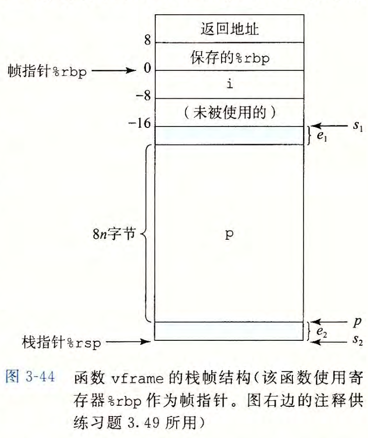

可以看到代码必须把`%rbp`之前的值保存到栈中，因为它时一个被调用者保存寄存器。然后在函数的整个执行过程中，都使得`%rbp`指向那个时刻栈的位置，然后用固定长度的局部变量（例如i）相对于`%rbp`的偏移量来引用它们

## 3.11 浮点代码

处理器的*浮点体系结构*包括多个方面，会影响浮点数操作的程序如何被映射到机器上，包括：

- 如何存储和访问浮点数值。通常时通过某种寄存器方式完成
- 对浮点数据操作的指令
- 对函数传递浮点数参数和从函数返回浮点数结果的规则
- 函数调用过程中保存寄存器的规则——例如，一些寄存器被指定为调用者保存，而其他的被指定为被调用者保存

MM 寄存器是 64 位的，XMM 是 128 位的，而 YMM 是 256 位的。所以，每个 YMM 寄存器可以存放 8 个 32 位值，或 4 个 64 位值，这些值可以是整数，也可以是浮点数。

x86-64 浮点数是基于 SSE 或 AVX 的，包括传递过程参数和返回值的规则。

**书本中的讲述基于 AVX2**，即 AVX 的第二个版本。

和整数操作一样，注意书本表述中使用的 ATT 格式不同于文档中使用的 Intel 格式。特别地，**这两种版本中列出指令操作数的顺序是不同的**。

如图 3-45 所示，AVX 浮点体系结构允许数据存储在 16 个 YMM 寄存器中，它们的名字为 `%ymm0 ~ %ymm15`，每个 YMM 寄存器都是 256 位（32 字节）。当对标量数据操作时，这些寄存器只保存浮点数，而且只使用低 32 位（对于 `float`）或 64 位（对于 `double`）。汇编代码用寄存器的 SSE XMM 寄存器名字 `%xmm0 ~ %xmm15` 来引用它们，每个 XMM 寄存器都是对应的 YMM 寄存器的低 128 位（16 字节）。

| 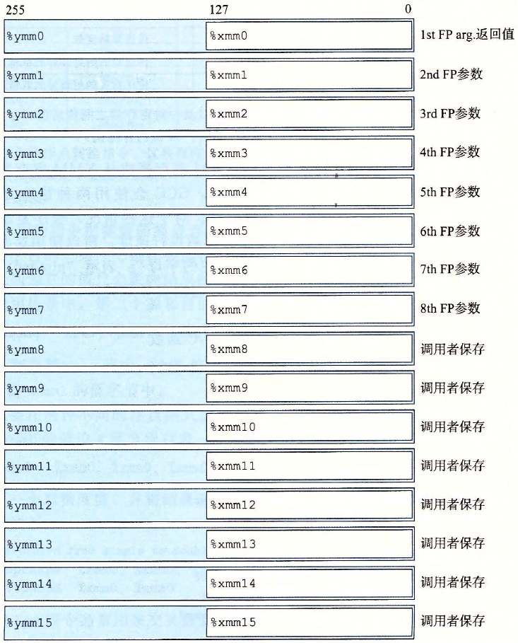 |
| ------------------------------------------------------------ |
| 图3-45 媒体寄存器                                            |

### 3.11.1 浮点数传送和转换操作

图 3-46 给出了一组在内存和 XMM 寄存器之间以及从一个 XMM 寄存器到另一个不做任何转换的传送浮点数的指令。数据要么保存在内存中（由表中的 `M32` 和 `M64` 指明），要么保存在 XMM 寄存器中（在表中用 X 表示）。无论数据对齐与否，这些指令都能正确执行，不过代码优化规则建议 32 位内存数据满足 4 字节对齐，64 位数据满足 8 字节对齐。

| 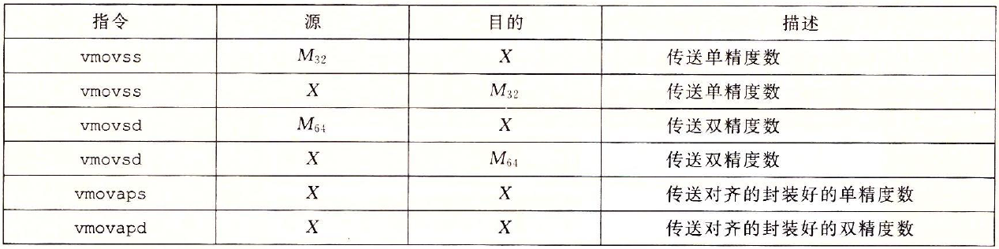 |
| ------------------------------------------------------------ |
| 图 3-46 浮点传送指令，这些操作在内存和寄存器之间以及一对寄存器之间传送值 |

上图中，指令名字中的字母 `a` 表示 `aligned`（对齐的）。当用于读写内存时，如果地址不满足 16 字节对齐，它们会导致异常。在两个寄存器之间传送数据，绝不会出现错误对齐的状况。

图 3-47 和图 3-48 给出了在浮点数和整数数据类型之间以及不同浮点格式之间进行转换的指令集合。

| 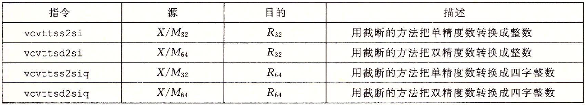 |
| ------------------------------------------------------------ |
| 图 3-47 双操作数浮点转换指令，这些操作将浮点数转换成整数     |

| 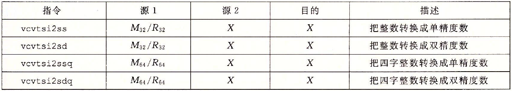 |
| ------------------------------------------------------------ |
| 图 3-48 三操作数浮点转换指令，将第一个源的数据类型转换成目的的数据类型，第二个源值对结果的低位字节没有影响 |

### 3.11.2 过程中的浮点代码

当函数包含指针、整数和浮点数混合的参数时，指针和整数通过通用寄存器传递，而浮点值通过 XMM 寄存器传递。也就是说，参数到寄存器的映射取决于它们的类型和排列的顺序。

下面是一些例子：

- `double f1(int x, double y, long z);`

  这个函数会把 `x` 存放在 `%rdi` 中，`y` 存放在 `%xmm0` 中，而 `z` 存放在 `%rsi` 中。

- `double f2(double y, int x, long z);`

  这个函数的寄存器分配与函数 `f1` 相同。

- `double f1(float x, double *y, long *z);`

  这个函数会将 `x` 放在 `%xmm0` 中，`y` 放在 `%rdi` 中，而 `z` 放在 `%rsi` 中。

### 3.11.3 浮点运算操作

图 3-49 描述了一组执行算术运算的标量 AVX2 浮点指令。每条指令有一个或两个源操作数 `S1` 或 `S2`，和一个目的操作数 `D`。第一个源操作数 `S1` 可以是一个 XMM 寄存器或一个内存位置，第二个源操作数以及目的操作数都必须是 XMM 寄存器。结果存放在目的寄存器。

| 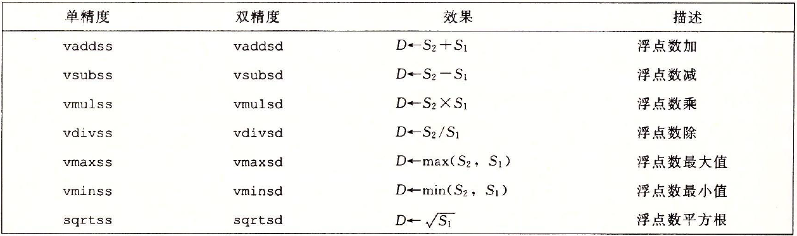 |
| ------------------------------------------------------------ |
| 图 3-49 标量浮点算术运算                                     |

### 3.11.4 定义和使用浮点常数

和整数运算操作不同，AVX 浮点操作不能以立即数值作为操作数。相反，编译器必须为所有的常量值分配和初始化存储空间，然后代码在把这些值从内存读入。

### 3.11.5 在浮点代码中使用位级操作

图 3-50 展示了一些指令，这些操作都作用于封装好的数据，即它们更新整个目的 XMM 寄存器，对两个源寄存器的所有位都实施指定的位级操作。

| 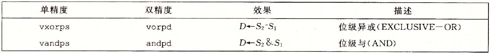 |
| ------------------------------------------------------------ |
| 图 3-50 对封装数据的位级操作                                 |

上图中的这些指令对一个 XMM 寄存器中的所有 128 位进行布尔操作。

### 3.11.6 浮点比较操作

AVX2 提供了两条用于比较浮点数值的指令：

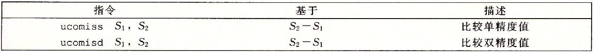

参数 `S2` 必须在 XMM 寄存器中，而 `S1` 可以在 XMM 寄存器中，也可以在内存中。

浮点比较指令会设置三个条件码：零标志位 `ZF`、进位标志位 `CF` 和奇偶标志位 `PF`。条件码的设置条件如下：

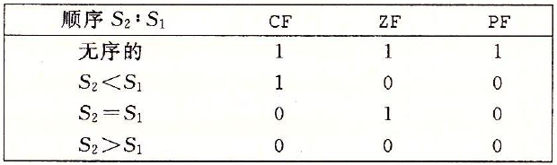

当任一操作数为 `NaN` 时，就会出现无序的情况。

### 3.11.7 对浮点代码的观察结论

可以看到，用AVX2为浮点数上的操作产生的机器代码风格类似于为整数上的操作产生的代码风格。它们都使用一组寄存器来保存和操作数据值，也都使用这些寄存器来传递函数参数

处理不同的数据类型以及对包含混合数据类型的表达式求值的规则有许多复杂之处，同时AVX2代码包括许多比只执行整数运算的函数更加不同的指令和格式。AVX2还有能力在封装好的数据上执行并行操作，使计算执行的更快。

## 3.12 小结

本章我们了解了什么

- C语言提供的抽象层下面的东西，以了解机器编程
- 过让编译器产生机器级程序的汇编代码表示，我们了解了编译器和它的优化能力，以及机器、数据类型和指令集
  - 在第5章，我们会看到，当编写能有效映射到机器上的程序时，了解编译器的特性会有所帮助
- 我们还更完整地了解了程序如何将数据存储在不同的内存区域中
  - 在第12章会看到许多这样的例子，应用程序员需要知道一个程序变量是在运行时栈中，是在某个动态分配的数据结构中，还是全局程序数据的一部分
  - 理解程序如何映射到机器上，会让理解这些存储类型之间的区别容易一些

- 机器级程序和它们的汇编代码表示，与C程序的差别很大；各种数据类型之间的差别很小。程序是以指令序列来表示的，每条指令都完成一个单独的操作
- 编译器必须使用多条指令来产生和操作各种数据结构，以及实现像条件、循环和过程这样的控制结构
- 我们看到C语言中缺乏边界检查，使得许多程序容易出现缓冲区溢出

> 我们只分析了C到x86-64的映射，但是大多数内容对其他语言和机器组合来说也是类似的。例如，编译C++与编译C就非常相似。实际上，C++的早期实现就只是简单地执行了从C++到C的源到源的转换，并对结果运行C编译器，产生目标代码。C++的对象用结构来表示，类似千C的struct。C++的方法是用指向实现方法的代码的指针来表示的。相比而言，Java的实现方式完全不同。Java的目标代码是一种特殊的二进制表示，称为Java宇节代码。这种代码可以看成是虚拟机的机器级程序。正如它的名字暗示的那样，这种机器并不是直接用硬件实现的，而是用软件解释器处理字节代码，模拟虚拟机的行为。另外，有一种称为及时编译的方法，动态地将字节代码序列翻译成机器指令。当代码要执行多次时（例如在循环中），这种方法执行起来更快。用字节代码作为程序的低级表示，优点是相同的代码可以在许多不同的机器上执行，而在本章谈到的机器代码只能在x86-64机器上运行
